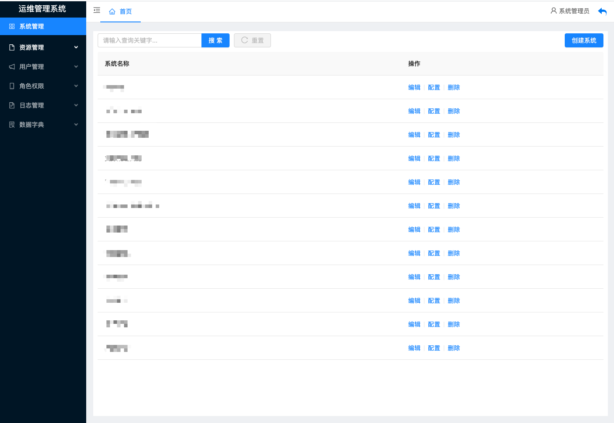
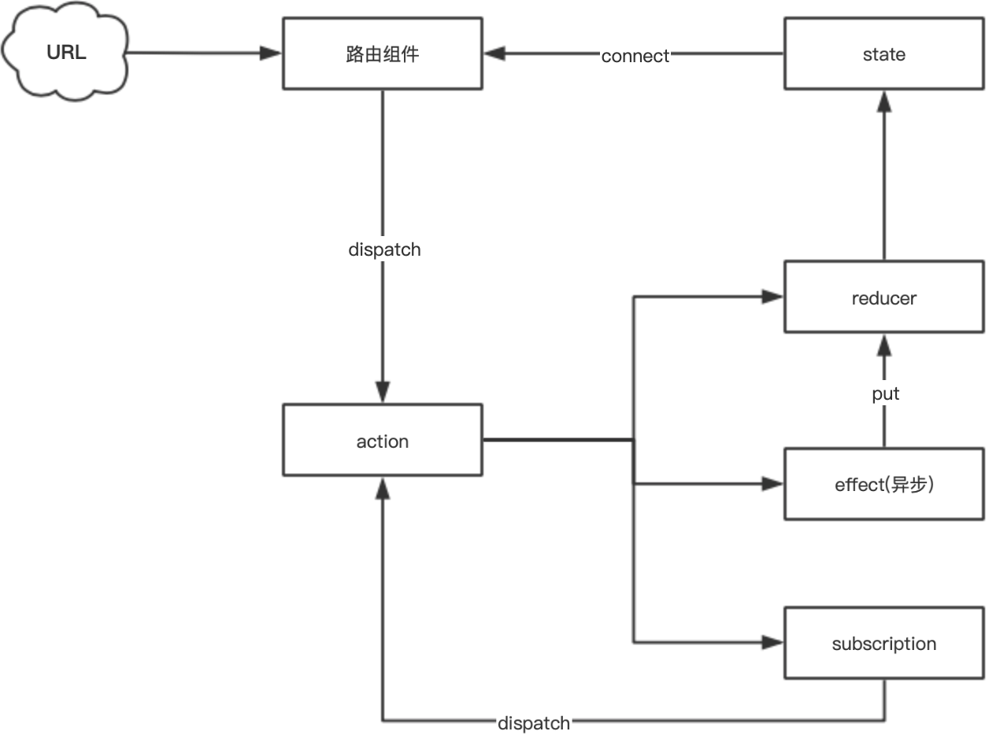

# React 后台运维管理系统开发指南

## 0. 前言

由于公司产品上的技术栈主要是 Vue 全家桶，而运维管理系统由于历史原因一直使用的 React 技术栈。如果新增的需求是通用功能，那么就可以找到原来负责这个产品的开发人员。但是当需要在某个项目上进行定制开发时，就不得不该项目的开发人员亲自上阵。如果以前没有接触过 React 的开发，很可能不知道从哪里开始入手，不限于以下的一些疑问：

- 这个项目的技术栈是怎样的？每个技术负责的作用？
- 项目的结构怎样划分的？这个项目的开发规范是怎样的？
- 数据状态如何处理？路由如何设置？组件如何编写？
- 这个项目怎么搭建的？后续如何更新维护，在此基础上迭代优化？

接下来，纳撸多将一一解答。

文章大纲

1. 项目简介
2. 基础搭建
3. 功能开发，以一个公告管理模块为例。

## 1. 项目简介

### 1.0 功能模块



- 登录/注销
- 页面模块
  - 系统管理
  - 资源管理
  - 用户管理
  - 角色权限
  - 日志管理
  - 数据字典

### 1.1 技术栈

- webpack 3.x，配置由 create-react-app 生成。

- react 16.0.0 、react-dom
  
- dva，dva 首先是一个基于 [redux](https://github.com/reduxjs/redux) 和 [redux-saga](https://github.com/redux-saga/redux-saga) 的数据流方案，然后为了简化开发体验，dva 还额外内置了 [react-router](https://github.com/ReactTraining/react-router) 和 [fetch](https://github.com/github/fetch)，把 react 全家桶都进行了封装，所以也可以理解为一个轻量级的应用框架。

  - react-router、react-router-dom
  - redux、react-redux
  - saga

- ant-design UI 组件库

- axios 用来请求后端 api 的数据

- react-css-modules CSS 模块化

  <!--项目最开始的技术栈是采用上述的结构，后来开发人员又加入了  dva 框架，主要为了更方便地管理应用的状态。（这块直接进行重构了，跟基线的对比，更加容易开发了，更加像 vue。）-->

### 1.2 react 全家桶简述 

React 全家桶包括 React，React-Redux，React-Router，接下来会以一个评论功能来进行说明。


#### 1.2.1 React

一个组件有自己的显示形态（HTML 结构和内容）行为，组件的显示形态和行为可以由数据状态（state）和配置参数（props）共同决定。数据状态何配置参数的改变都会影响到这个组件的显示形态。React.js 也提供了一种非常高效的方式帮助我们做到了数据和组件显示形态之间的同步。

React.js 是一个帮助你构建页面的 UI 的库。React.js 不是一个框架，它只是一个库。它只提供 **UI （view）**层面的解决方案。React.js 将帮助我们将界面分成了各个独立的小块，每一个块就是组件，这些组件之间可以组合、嵌套，就成了我们的页面。

##### 1.2.1.2 组件编写

我们在文件头部从 `react` 的包当中引入了 `React` 和 React.js 的组件父类 `Component` 。记住，只要你写 React.js 组件，那么就必须引入这两个东西。`ReactDOM` 可以帮助我们把 React 组件渲染到页面上去，没有其他的作用了。

```jsx
import React, { Component } from "react";
import ReactDOM from "react-dom";
import "./index.css"; // 引入样式

class Header extends Component {
  render() {
    return (
      <div>
        <h1>React</h1>
      </div>
    );
  }
}

ReactDOM.render(<Header />, document.getElementById("root"));
```

一个组件继承 `Component` 类，有一个 `render` 方法，并且把这个组件的 HTML 结构返回；这里 return 的东西就比较奇怪了，它并不是一个字符串，看起来像是纯 HTML 代码写在 JavaScript 代码里面，这种看起来“在 JavaScript 写的标签的” 语法叫 JSX。

记住，一个组件必须要实现一个 `render`方法，这个 `render` 方法必须要返回一个 `JSX`元素。但这里要注意的是，必须要用外层的 JSX 元素把所有内容包裹起来。

1. JSX 是 JavaScript 语言的一种语法扩展，长的像 HTML，但并不是 HTML。
2. React.js 可以用 JSX 来描述你的组件长什么样的。
3. JSX 在编译的时候会变成相应的 JavaScript 对象描述。
4. `react-dom` 负责把这个用来描述 UI 信息的 JavaScript 对象变成 DOM 元素，并且渲染到页面上。

##### 1.2.1.2 组件状态处理

一个组件的显示状态是可以由它数据状态 **state **和配置参数 **props** 决定的。`state` 的主要作用是用于保存、控制、修改自己的可变状态。`state` 在组件内部初始化，可以被组件自身修改，而外部不能访问也不能修改。你可以认为 `state` 是一个局部的、只能被组件自身控制的数据源。`state`中状态可以通过 `this.setState` 方法进行更新，`setState` 会导致组件的重新渲染。

`props` 的主要作用是让使用该组件的父组件可以传入参数来配置该组件。它是外部传进来的配置参数，组件内部无法控制也无法修改。除非外部组件主动传入新的 `props`，否则组件的 `props` 永远保持不变。

比如下面一个评论输入组件的编写：

```js
import React, { Component } from "react";
import PropTypes from "prop-types";
class CommentInput extends Component {
  static propTypes = { // props类型验证
    username: PropTypes.any,
    onSubmit: PropTypes.func,
    onUserNameInputBlur: PropTypes.func,
  };

  constructor(props) {
    super(props);
    this.state = { // state 组件自身状态
      username: props.username,
      content: "",
    };
  }

  // life cycle
  componentDidMount() {
    this.textarea.focus();
  }

  handleUsernameChange(event) {
    this.setState({ // 通过 setState 改变状态，触发视图渲染
      username: event.target.value,
    });
  }

  handleContentChange(event) {
    this.setState({
      content: event.target.value,
    });
  }

  handleUsernameBlur(event) {
    if (this.props.onUserNameInputBlur) {
      this.props.onUserNameInputBlur(event.target.value);
    }
  }

  handleSubmit() {
    if (this.props.onSubmit) {
      const { username, content } = this.state;
      this.props.onSubmit({ username, content, createdTime: +new Date() });
    }
    this.setState({ content: "" });
  }

  render() {
    return (
      <div className="comment-input">
        <div className="comment-field">
          <span className="comment-field-name">用户名：</span>
          <div className="comment-field-input">
            <input
              value={this.state.username}
              onBlur={this.handleUsernameBlur.bind(this)}
              onChange={this.handleUsernameChange.bind(this)}
            />
          </div>
        </div>
        <div className="comment-field">
          <span className="comment-field-name">评论内容：</span>
          <div className="comment-field-input">
            <textarea
              ref={(textarea) => (this.textarea = textarea)}
              value={this.state.content}
              onChange={this.handleContentChange.bind(this)}
            />
          </div>
        </div>
        <div className="comment-field-button">
          <button onClick={this.handleSubmit.bind(this)}>发布</button>
        </div>
      </div>
    );
  }
}
export default CommentInput;
```

关于 React 的更多特性，建议查看官方文档 https://reactjs.org/versions，这里有对应的版本更新日志和对应的文档。

#### 1.2.2 React-Redux

React 本身只是一个 DOM 的抽象层，使用组件构建虚拟 DOM。而一个 React 应用是由许多个组件像搭积木一样搭建而成，组件之前就难免需要进行通信。

- 向子组件发消息
- 向父组件发消息
- 向其他组件发消息

React 只提供了一种通信手段：传参。对于大型应用，不方便。

##### 1.2.2.1 父子组件通信

父子组件通信很常见，比如

```js

```

##### 1.2.2.2 兄弟组件通信

#### 1.2.3 React-Router

要构建单页面应用

### 1.3 dva 轻量级框架

```ts
// dva/router.ts
import * as routerRedux from 'react-router-redux';

export * from 'react-router-dom';
export { routerRedux };

```

Dva 依赖

​    "react-redux": "^5.0.5",

​    "react-router-dom": "^4.1.2",

​    "react-router-redux": "5.0.0-alpha.9",

​    "redux": "^3.7.2"

## 2. 项目搭建

### 2.1 目录规范

- dist 打包输出文件
- config 构建配置
  - webpack.config.dev.js 测试环境配置
  - webpack.config.prod.js 生产环境配置
  - webpackDevServer.config.js 本地服务器配置
- mock 模拟接口数据
  - xxxModule.js
- public 静态资源
  - index.html
  - iconfont
- scripts 脚本
  - build.js 打包脚本
  - start.js 开发脚本
  - test.js 测试脚本
- src
  - components 展示组件
  - layout 布局组件
  - models 数据状态存放处
    - user.js
    - ...
  - routes 路由配置
  - service 后端 api 接口
  - views 容器组件
    - -- A
      - --components 私有展示组件
  - utils 工具类、函数
- initAppConfig.js 初始化应用静态配置
- main.js 应用入口文件

### 2.2 项目规范

- 凡是负责返回 JSX 的函数，统一聚集在函数最后面，中间不要穿插事件处理函数和其他逻辑。

### 2.3 接口通信

## 3. 功能开发



公告模块、列表页、详情页

### 3.1 组件树

表单组件

react 调试工具，react-

组件状态、store 状态

## 4. 小结

## 参考资料

- React 官方文档 https://reactjs.org/docs/getting-started.html。
- [译」React 项目结构和组件命名之道](https://juejin.cn/post/6844903696409559048)
- 《React.js 小书》


