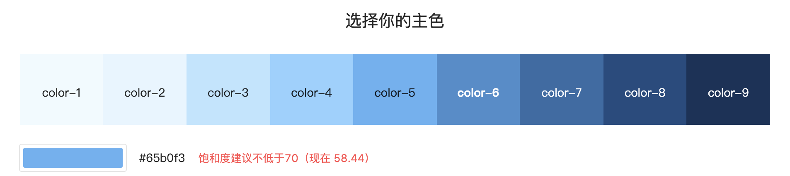

# 专业拆造轮子系列之按钮篇


## 0. 前言

仿造：JS 原生 Button —— Vue Button，各自造一个仓库，都是作为学习用。 react Button

设计规范样式，可以仿造 antd-design 的设计

仓库仿造学习：https://github.com/alexwolfe/Buttons，
学习版本：v2.0.0

## 1. 打包后的文件分析：全局运行机制

### 安装使用

```html
  <!-- Buttons core css -->
  <link rel="stylesheet" href="css/buttons.css">

  <!-- Only needed if you want support for dropdown menus -->
  <script src="//ajax.googleapis.com/ajax/libs/jquery/1.11.1/jquery.min.js"></script>
  <script type="text/javascript" src="js/buttons.js"></script>

  <!-- Only needed if you want font icons -->
  <link href="//netdna.bootstrapcdn.com/font-awesome/4.2.0/css/font-awesome.css" rel="stylesheet">
```
### Buttons.js

通过立即执行函数，注册到用户的运行环境上，依赖于 jQuery，把 jQuery 传递给 IIFE（立即执行函数），并通过它映射为 $，这样就避免了在执行的作用域被其他库覆盖。 

**上下文：**
```js
// the semi-colon before function invocation is a safety net against concatenated
// scripts and/or other plugins which may not be closed properly.
;(function ( $, window, document, undefined ) {
  'use strict';
  //  ....
  // undefined is used here as the undefined global variable in ECMAScript 3 is
  // mutable (ie. it can be changed by someone else). undefined isn't really being
  // passed in so we can ensure the value of it is truly undefined. In ES5, undefined
  // can no longer be modified.

  // window and document are passed through as local variable rather than global
  // as this (slightly) quickens the resolution process and can be more efficiently
  // minified (especially when both are regularly referenced in your plugin).

})( jQuery, window, document);
```

这个逻辑主要是针对下拉框，给按钮绑定一些事件。

其中 jQuery 的插件化思想可以学习下：

**编写插件**：
```js
  // Create the defaults once
  var pluginName = "menuButton";
  var menuClass = ".button-dropdown";
  var defaults = {
    propertyName: "value"
  };  
 // The actual plugin constructor
 /**
   * @description: 
   * @param {Object} element
   * @param {Object} options 配置项目
   */
  function Plugin( element, options ) {

    //SET OPTIONS
    this.options = $.extend( {}, defaults, options );
    this._defaults = defaults;
    this._name = pluginName;

    //REGISTER ELEMENT
    this.$element = $(element);

    //INITIALIZE
    this.init();
  }

  Plugin.prototype = {
    constructor: Plugin,

    init: function() {
      // WE DON'T STOP PROPGATION SO CLICKS WILL AUTOMATICALLY
      // TOGGLE AND REMOVE THE DROPDOWN
      this.toggle();
    },

    toggle: function(el, options) {
      if(this.$element.data('dropdown') === 'show') {
        this.hideMenu();
      }
      else {
        this.showMenu();
      }
    },

    showMenu: function() {
      this.$element.data('dropdown', 'show');
      this.$element.find('ul').show();
      this.$element.find('.button:first').addClass('is-active');
    },

    hideMenu: function() {
      this.$element.data('dropdown', 'hide');
      this.$element.find('ul').hide();
      this.$element.find('.button:first').removeClass('is-active');
    }
  };
```

**注册插件：**

要编写一个 jQuery 插件，需要为 jQuery.fn 对象增加一个新的函数属性，属性名就是插件的名字。

```js
  // A really lightweight plugin wrapper around the constructor,
  // preventing against multiple instantiations
  $.fn[pluginName] = function ( options ) {
    // 这里的 this 指向 jQuery 对象
    // 返回 this 关键字，保持调用链接性
    return this.each(function () {
      // 在这里 this 指向 DOM 元素
      // TOGGLE BUTTON IF IT EXISTS
      if ($.data(this, "plugin_" + pluginName)) {
        // 取出之前的实例化的 plugin 值，进行调用
        $.data(this, "plugin_" + pluginName).toggle(); 
      }
      // OTHERWISE CREATE A NEW INSTANCE
      else {
        // 把 new 实例化的东西进行存储到 data 里
        $.data(this, "plugin_" + pluginName, new Plugin( this, options )); 
      }
    });
  };

```

**使用插件：**
```js
  //DELEGATE CLICK EVENT FOR DROPDOWN MENUS
  $(document).on('click', '[data-buttons=dropdown]', function(e) {
    var $dropdown = $(e.currentTarget);
    $dropdown.menuButton(); // 使用插件
  });
```

**jQuery 插件化思想总结**
- 总是把插件包装在闭包中`{/* plugin goes here */}(jQuery)`。
- 不要在插件函数的立即作用域中额外包装 this 关键字。
- 总是让插件函数返回 this 关键字以保持 chainability，除非插件有真正的返回值。
- 不要传给插件大量参数，应该传一个可以覆盖插件默认选项的设置对象。
- 在单个插件中，不要让一个以上的名称空间搞乱了 jQuery.fn 对象。
- 总是为方法、事件和数据定义名称空间。
### Buttons.css

主要的样式组成如下：
- Button Defaults 默认样式
- Button Colors
- Button Shapes
- Button Sizes
- Color Mixin
- Base Button Style

默认命名空间，主要是 `.button`，整体以 - 为分隔，形成独立的单元，可以随意组合。

也运用到了元素的多种状态处理
- :active
- :hover
- :focus
- :disabled

其他官方的说明：
- Compass has been replaced with [autoprefixer](https://github.com/postcss/autoprefixer). Compass is not recommended but it is still supported.
- Button colors are now complete independent (ex. `button-primary`) we no longer have classes like `button-flat-primary` to achieve this you now simply add `button-flat` `button-primary`
- Buttons styles are now independent (ex. `button-flat`, `button-3d`, etc.). You can apply these styles and they will automatically pick up the color attached to the button (ex. button-primary button-3d)


## 2. src 源码查看

### 需求分析

#### 全局样式

**色彩**



https://ant.design/docs/spec/colors-cn

**字体**

```css
/*
* Addresses `font-family` inconsistency between `textarea` and other form
* elements.
*/
html,
button,
input,
select,
textarea {
  font-family: sans-serif; }

/*
* Addresses margins handled incorrectly in IE 6/7.
*/
body {
  margin: 0;
  font-family: "proxima-nova", Helvetica, Verdana, Arial, "Lucida Grande", sans-serif; }
```

**图标**
采用了 font-awesome 图标，https://fontawesome.com/

**阴影**

#### 按钮类型

**常规按钮**

- 次按钮
- 主按钮
- 文字按钮
- 图标按钮

**特殊按钮**
- 虚线按钮
- 危险按钮
- 幽灵按钮
- 行动号按钮

### 整体架构

#### 开发环境运行

1. 首先安装 package.json 下所有的依赖包，`grunt` 和相关的 `grunt plugin`。

```sh
yarn install
```
package.json
```json
  "devDependencies": {
    "grunt-autoprefixer": "^0.8.1",
    "grunt-contrib-clean": "^0.6.0",
    "grunt-contrib-connect": "^0.8.0",
    "grunt-contrib-copy": "^0.5.0",
    "grunt-contrib-cssmin": "^0.10.0",
    "grunt-contrib-qunit": "^0.5.2",
    "grunt-contrib-sass": "^2.0.0",
    "grunt-contrib-watch": "^0.6.1",
    "grunt-includes": "^0.4.5",
    "grunt-saucelabs": "^8.3.2"
  },
  "dependencies": {
    "grunt": "^0.4.5",
    "grunt-saucelabs": "^8.3.2"
  }
```


2. 然后需要安装 grunt 全局脚手架，它会寻找 GruntFile.js 配置文件和 grunt 依赖包。


```sh
npm install -g grunt-cli
```

3. 根据 README 在命令行终端运行 `grunt dev`，如果出现 sass 错误如下：

```sh
Warning: 
You need to have Ruby and Sass installed and in your PATH for this task to work.
More info: https://github.com/gruntjs/grunt-contrib-sass
 Use --force to continue.
```

you need to install Sass `gem install sass` or sudo `gem install sass` if like me you're on Mac（refer https://github.com/gruntjs/grunt-contrib-sass/issues/229）

#### 具体架构设计实现

**整体源码的目录如下：**

- css（由 scss 文件目录生成）
- js（Button 的逻辑文件）
- scss（按钮的主要 scss 样式文件）
- showcase（样例）
- tests（测试文件）
- Gruntfile.js（grunt 配置文件）

脚手架的搭建，主要是使用了 [grunt](https://gruntjs.com/)，**一个 JavaScript 任务运行工具**。

每次运行 `grunt` 时，它都会使用节点的 `require（）`系统查找本地安装的 Grunt。 因此，您可以从项目中的任何子文件夹运行 `grunt`。

如果找到本地安装的 Grunt，则 CLI 会加载本地安装的 Grunt 库，读取 `Gruntfile` 文件配置，并执行您要运行的所有任务。

**A `Gruntfile` 由以下部分组成：**

- The "wrapper" function
  ```js
  module.exports = function(grount) {
    // Do grunt-related things in here
  }
  ```
- Project and task configuration
  - 大多数 Grunt 任务依赖于传递给 `grunt.initConfig` 方法的对象中定义的配置数据。
    ```js
    // Project configuration.
    grunt.initConfig({
      pkg: grunt.file.readJSON('package.json'),
      uglify: {
        options: {
          banner: '/*! <%= pkg.name %> <%= grunt.template.today("yyyy-mm-dd") %> */\n'
        },
        build: {
          src: 'src/<%= pkg.name %>.js',
          dest: 'build/<%= pkg.name %>.min.js'
        }
      }
    });
    ```
- Loading Grunt plugins and tasks
  - 许多常用的任务（如串联，压缩和 lint）都可以作为grunt 插件使用。 只要在 `package.json` 中将插件指定为依赖项，并且已通过`npm install` 进行安装，就可以使用简单的命令在您的 `Gruntfile` 中启用它：
    ```js
    // Load the plugin that provides the "uglify" task.
    grunt.loadNpmTasks('grunt-contrib-uglify');
    ```
- Custom tasks
  - 您可以通过定义默认任务将 Grunt 配置为默认运行一个或多个任务。 在以下示例中，在命令行中运行grunt而不指定任务将运行 uglify 任务。 这在功能上与显式运行`grunt uglify` 甚至 `grunt default` 相同。 数组中可以指定任意数量的任务（带有或不带有参数）。
    ```js
    // Default task(s).
    grunt.registerTask('default', ['uglify']);
    ```
  - 如果您的项目需要的任务不是Grunt插件提供的，则可以在 `Gruntfile` 内部定义自定义任务。 例如，此`Gruntfile` 定义了一个完全自定义的默认任务，该任务甚至不利用任务配置
    ```js
    module.exports = function(grunt) {
      // A very basic default task.
      grunt.registerTask('default', 'Log some stuff.', function() {
        grunt.log.write('Logging some stuff...').ok();
      });
    };
    ```

总的来说，整体步骤如下：
1. 通过 `loadNpmTasks` 或自定义任务，并在 `initConfig` 中进行配置，
2. 然后使用 `grunt.registerTask()` 注册使用。
3. 最后按需运行对应注册的组合任务，比如 `grunt dev` 或 `grunt` 运行默认任务。

```js
 grunt.registerTask('dev', ['includes', 'sass', 'autoprefixer', 'cssmin', 'copyMain', 'clean:dev', 'connect', 'watch']);
```

现在我们具体看看项目中 Gruntfile.js 的配置：

```js
module.exports = function (grunt) {
  /**
  * Load Grunt Npm Modules
  *
  */
  grunt.loadNpmTasks('grunt-autoprefixer');
  grunt.loadNpmTasks('grunt-contrib-sass');
  grunt.loadNpmTasks('grunt-contrib-clean');
  grunt.loadNpmTasks('grunt-contrib-watch');
  grunt.loadNpmTasks('grunt-contrib-connect');
  grunt.loadNpmTasks('grunt-contrib-copy');
  grunt.loadNpmTasks('grunt-contrib-cssmin');
  grunt.loadNpmTasks('grunt-saucelabs');
  grunt.loadNpmTasks('grunt-contrib-qunit');
  grunt.loadNpmTasks('grunt-includes');

  /**
  * Grunt Configuration
  *
  */
  grunt.initConfig({

    /*
    * Template Includes
    *
    */

    includes: {
      build: {
        cwd: 'showcase/pages',
        src: ['*.html' ],
        dest: 'showcase/',
        options: {
          includePath: 'showcase/includes'
        }
      }
    },


    /*
    * Sass Compilation
    *
    */

    sass: {
      all: {
        files: {
          'tmp/css/buttons.css': 'scss/buttons.scss',
          'tmp/css/showcase.css': 'showcase/scss/showcase.scss'
        }
      }
    },


    /*
    * Vendor Prefixing
    *
    */

    autoprefixer: {
      options: {
        browsers: ['last 3 versions', 'safari 5', 'ie 8', 'ie 9', 'Firefox >= 20']
      },
      all: {
        expand: true,
        flatten: true,
        src: 'tmp/css/*.css',
        dest: 'tmp/css'
      }
    },


    /*
    * Minify files
    *
    */

    cssmin: {
      add_banner: {
        options: {
          banner: '/* Buttons */',
          keepSpecialComments: 1
        },
        files: {
          'tmp/css/buttons.min.css': ['tmp/css/buttons.css']
        }
      }
    },

    /*
    * Copy files
    *
    */

    copy: {
      css_library: {
        files: [{
          expand: true,
          cwd: 'tmp/css',
          src: ['**/*', '!showcase.css', '!showcase.css.map'],
          dest: 'css'
        }]
      },
      css_showcase: {
        files: [{
          expand: true,
          cwd: 'tmp/css',
          src: ['**/*', '!buttons.min.css', '!buttons.css.map'],
          dest: 'showcase/css'
        }]
      },
      js_showcase: {
        files: [{
          expand: true,
          cwd: 'js',
          src: ['**/*'],
          dest: 'showcase/js'
        }]
      },
      showcase_dist: {
        files: [{
          expand: true,
          cwd: 'showcase',
          src: ['*.html', 'css/**/*', 'fonts/**/*', 'images/**/*', 'js/**/*'],
          dest: 'showcase-dist'
        }]
      }
    },


    /*
    * Clean tmp folders
    *
    */

    clean: {
      dev: {
        src: ["tmp"]
      },
      build: {
        src: ["showcase-dist"]
      }
    },


    /*
    * Launch local server
    *
    */

    connect: {
      livereload: {
        options: {
          port: 8000,
          livereload: 35729, // change this to '0.0.0.0' to access the server from outside
          hostname: 'localhost',
          base: 'showcase',
          open: true
        }
      },
      sauce: {
        options: {
          port: 9999,
          hostname: 'localhost',
          base: '',
        }
      }
    },


    /*
    * Watch for changes
    *
    */

    watch: {
      scripts: {
        files: ['js/**/*.js'],
        tasks: ['copy:main:js_showcase', 'clean:dev']
      },
      sass: {
        files: ['scss/**/*.scss', 'showcase/scss/**/*.scss'],
        tasks: ['sass', 'autoprefixer', 'copy:css_showcase', 'copy:css_library', 'clean:dev']
      },
      includes: {
        files: ['showcase/includes/**/*.html', 'showcase/pages/**/*.html'],
        tasks: ['includes']
      },
      livereload: {
        options: {
          livereload: '<%= connect.livereload.options.livereload %>'
        },
        files: [
          'scss/**/*.scss',
          'css/**/*.css',
          'js/**/*',
          'showcase/**/*'
        ]
      }
    },


    /*
    * QUnit
    *
    */

    qunit: {
      options: {
        urls:[
          'http://localhost:9999/js/tests/*.html'
        ]
      }
    },

    /*
    * Saucelabs
    * Requires environment variables set e.g. export SAUCE_USERNAME=XX; export SAUCE_ACCESS_KEY=XX
    *
    */
    'saucelabs-qunit': { //DO NOT CHANGE NAME
      all: {
        options: {
          build: process.env.TRAVIS_JOB_ID,
          concurrency: 3,
          tunnelTimeout: 5,
          urls: ['http://localhost:9999/tests/index.html'],
          testname: 'Buttons Sauce Unit Tests',
          browsers: [
            {
              browserName: 'safari',
              version: '6',
              platform: 'OS X 10.8'
            },
            {
              browserName: 'firefox',
              version: '25',
              platform: 'OS X 10.6'
            },
            {
              browserName: 'chrome',
              version: '31',
              platform: 'Windows 8.1'
            }
          ]
        }
      }
    }
  });


  /**
  * Grunt Helper Tasks
  *
  */

  grunt.registerTask('test', 'qunit');
  grunt.registerTask('sauceserver', 'connect:sauce');
  grunt.registerTask('sauce', 'saucelabs-qunit');
  var testSubtasks = ['test'];
  if (process.env.SAUCE_ACCESS_KEY !== undefined) {
    testSubtasks.push('sauceserver');
    testSubtasks.push('sauce');
  }
  grunt.registerTask('copyMain', ['copy:css_library', 'copy:css_showcase', 'copy:js_showcase']);


  /**
  * Grunt Core Build Tasks
  *
  */

  grunt.registerTask('default', ['sass', 'autoprefixer', 'cssmin', 'copyMain', 'clean:dev']);
  grunt.registerTask('dev', ['includes', 'sass', 'autoprefixer', 'cssmin', 'copyMain', 'clean:dev', 'connect', 'watch']);
  grunt.registerTask('dist', ['clean:build', 'includes', 'sass', 'autoprefixer', 'cssmin', 'copyMain', 'copy:showcase_dist', 'clean:dev']);
  grunt.registerTask('tests', testSubtasks);
};

```

**进行测试：**

运行 `grunt dev`，会依次跑以下的任务：
**1. includes**

```js
grunt.initConfig({
   includes: {
      build: {
        cwd: 'showcase/pages',
        src: ['*.html' ],
        dest: 'showcase/',
        options: {
          includePath: 'showcase/includes'
        }
      }
    },
 })
```
把 `showcase/includes` 里面的 `*.html` 文件作为 `show/pages/*.html` 的一部分导入进去，最终输出到 dest 指定的 `showcase/` 文件内进行展示。

**2. sass**

```js
grunt.initConfig({
    /*
    * Sass Compilation
    *
    */

    sass: {
      all: {
        files: {
          'tmp/css/buttons.css': 'scss/buttons.scss',
          'tmp/css/showcase.css': 'showcase/scss/showcase.scss'
        }
      }
    },
})
```

左边为输出的文件，右边为输入的文件。

其中 showcase/pages/index.html 会引入生成的文件：

```html
  <link rel="stylesheet" href="css/showcase.css">
  <link rel="stylesheet" href="css/buttons.css">
```

**3. autoprefixer**

```js
grunt.initConfig({
    /*
    * Vendor Prefixing
    *
    */

    autoprefixer: {
      options: {
        browsers: ['last 3 versions', 'safari 5', 'ie 8', 'ie 9', 'Firefox >= 20']
      },
      all: {
        expand: true, // 开启 expand 属性，可以指定输入目录
        flatten: true, // 从生成的目标路径中删除所有路径部分
        src: 'tmp/css/*.css', // 输入
        dest: 'tmp/css' // 输出
      }
    },
});
```

对生成的 css 文件进行添加不同浏览器的兼容适配前缀。

**4. cssmin**

```js
grunt.initConfig({

    /*
    * Minify files
    *
    */
    cssmin: {
      add_banner: {
        options: {
          banner: '/* Buttons */',
          keepSpecialComments: 1
        },
        files: {
          'tmp/css/buttons.min.css': ['tmp/css/buttons.css']
        }
      }
    },
})
```

压缩 buttons.css 文件。 

**5. copyMain**

```js
grunt.initConfig({
 /*
    * Copy files
    *
    */

    copy: {
      css_library: {
        files: [{
          expand: true,
          cwd: 'tmp/css',
          src: ['**/*', '!showcase.css', '!showcase.css.map'],
          dest: 'css'
        }]
      },
      css_showcase: {
        files: [{
          expand: true,
          cwd: 'tmp/css',
          src: ['**/*', '!buttons.min.css', '!buttons.css.map'],
          dest: 'showcase/css'
        }]
      },
      js_showcase: {
        files: [{
          expand: true,
          cwd: 'js',
          src: ['**/*'],
          dest: 'showcase/js'
        }]
      },
      showcase_dist: {
        files: [{
          expand: true,
          cwd: 'showcase',
          src: ['*.html', 'css/**/*', 'fonts/**/*', 'images/**/*', 'js/**/*'],
          dest: 'showcase-dist'
        }]
      }
    },
})
```

复制生成的 css 和 js 文件到样例 showcase 和库文件夹内，以及打包演示的文件。

**6. clean:dev**

```js
grunt.initConfig({
    /*
    * Clean tmp folders
    *
    */

    clean: {
      dev: {
        src: ["tmp"]
      },
      build: {
        src: ["showcase-dist"]
      }
    },
})
```

在 dev 下，清空 tmp 文件夹。在 build 下，清除 showcase-dist 文件夹。

**7. connect**

```js
grunt.initConfig({
  /*
    * Launch local server
    *
    */

    connect: {
      livereload: {
        options: {
          port: 8000,
          livereload: 35729, // change this to '0.0.0.0' to access the server from outside
          hostname: 'localhost',
          base: 'showcase',
          open: true
        }
      },
      sauce: {
        options: {
          port: 9999,
          hostname: 'localhost',
          base: '',
        }
      }
    },
})
```

`grunt-contrib-connect` 任务对应的 `connect`配置，用于启动一个 8000 端口的静态服务器，它的基础路径设为相对 gruntfile 的 `showcase`目录，任何后续运行的服务都可以进行访问。其中 sause 就是测试任务所需要设置的，启动了静态服务器 `localhost:9999`

，在浏览器中加载`http://localhost:9999/js/tests/*.html` 页面，页面里主要是引入了 `qunit.js` 和 `qunit.css` 资源，以及对应的测试文件 `tests.js`。 

```js
<!DOCTYPE html>
<html>
<head>
  <meta charset="utf-8">
  <title>QUnit Example</title>
  <link rel="stylesheet" href="./resources/qunit.css">
</head>
<body>
  <div id="qunit"></div>
  <div id="qunit-fixture">
    <span id="testmeout" class="button-dropdown"></span>
  </div>
  <script src="//ajax.googleapis.com/ajax/libs/jquery/1.11.1/jquery.min.js"></script>
  <script src="../js/buttons.js"></script>
  <script src="./resources/qunit.js"></script>
  <script src="./resources/tests.js"></script>
</body>
</html>
```

这个时候，就可以看到 tests.js 编写的测试用例了，主要是测试 Buttons.js 的下拉框插件逻辑。


```js
var log = [];
var testName;
var $dropdown;
var plugin;

QUnit.done(function (test_results) {
  var tests = [];
  for(var i = 0, len = log.length; i < len; i++) {
    var details = log[i];
    tests.push({
      name: details.name,
      result: details.result,
      expected: details.expected,
      actual: details.actual,
      source: details.source
    });
  }
  test_results.tests = tests;

  window.global_test_results = test_results;
});
QUnit.testStart(function(testDetails){
  QUnit.log(function(details){
    if (!details.result) {
      details.name = testDetails.name;
      log.push(details);
    }
  });
  $dropdown = $("#testmeout").menuButton();
  plugin = $dropdown.data().plugin_menuButton;
});

QUnit.testDone(function( details ) {
  $dropdown = null;
  plugin = null;
});

test("plugin defaults", function() {
  equal(plugin._name, "menuButton", "default plugin name");
  equal(plugin.options.propertyName, "value", "default property name");
  ok($(plugin.$element).hasClass('button-dropdown'), "has button-dropdown class");
});

test("shows", function() {
  var $dropdown = $("#testmeout").menuButton();
  plugin = $dropdown.data().plugin_menuButton;
  plugin.showMenu();
  equal($dropdown.data('dropdown'), "show", "gets shown");
});

test("hides", function() {
  var $dropdown = $("#testmeout").menuButton();
  plugin = $dropdown.data().plugin_menuButton;
  plugin.hideMenu();
  equal($dropdown.data('dropdown'), "hide", "gets hidden");
});


```


**8. watch**

```js
grunt.initConfig({
  /*
    * Watch for changes
    *
    */

    watch: {
      scripts: {
        files: ['js/**/*.js'],
        tasks: ['copy:main:js_showcase', 'clean:dev']
      },
      sass: {
        files: ['scss/**/*.scss', 'showcase/scss/**/*.scss'],
        tasks: ['sass', 'autoprefixer', 'copy:css_showcase', 'copy:css_library', 'clean:dev']
      },
      includes: {
        files: ['showcase/includes/**/*.html', 'showcase/pages/**/*.html'],
        tasks: ['includes']
      },
      livereload: {
        options: {
          livereload: '<%= connect.livereload.options.livereload %>'
        },
        files: [
          'scss/**/*.scss',
          'css/**/*.css',
          'js/**/*',
          'showcase/**/*'
        ]
      }
    },
})
```

使用了 `grunt-contrib-watch` 任务模块，通过配置`watch` 监控一些文件的改变，在改变后触发相关 tasks 的执行。

**9. qunit**

```js
    /*
    * QUnit
    *
    */

    qunit: {
      options: {
        urls:[
          'http://localhost:9999/js/tests/*.html'
        ]
      }
    },
      
   /*
    * Saucelabs
    * Requires environment variables set e.g. export SAUCE_USERNAME=XX; export SAUCE_ACCESS_KEY=XX
    *
    */
    'saucelabs-qunit': { //DO NOT CHANGE NAME
      all: {
        options: {
          build: process.env.TRAVIS_JOB_ID,
          concurrency: 3,
          tunnelTimeout: 5,
          urls: ['http://localhost:9999/tests/index.html'],
          testname: 'Buttons Sauce Unit Tests',
          browsers: [
            {
              browserName: 'safari',
              version: '6',
              platform: 'OS X 10.8'
            },
            {
              browserName: 'firefox',
              version: '25',
              platform: 'OS X 10.6'
            },
            {
              browserName: 'chrome',
              version: '31',
              platform: 'Windows 8.1'
            }
          ]
        }
      }
    }
```

qunit 对于 `grunt-contrib-qunit` 模块的设置。本项目中采用的单元测试模式是怎样的？测试相关的配置如下所示：

```js
  grunt.registerTask('test', 'qunit');
  grunt.registerTask('sauceserver', 'connect:sauce');
  grunt.registerTask('sauce', 'saucelabs-qunit');
  var testSubtasks = ['test'];
  if (process.env.SAUCE_ACCESS_KEY !== undefined) {
    testSubtasks.push('sauceserver');
    testSubtasks.push('sauce');
  }
    /*
    * QUnit
    *
    */

    qunit: {
      options: {
        urls:[
          'http://localhost:9999/js/tests/*.html'
        ]
      }
    },
      /*
    * Saucelabs
    * Requires environment variables set e.g. export SAUCE_USERNAME=XX; export SAUCE_ACCESS_KEY=XX
    *
    */
    'saucelabs-qunit': { //DO NOT CHANGE NAME
      all: {
        options: {
          build: process.env.TRAVIS_JOB_ID,
          concurrency: 3,
          tunnelTimeout: 5,
          urls: ['http://localhost:9999/tests/index.html'],
          testname: 'Buttons Sauce Unit Tests',
          browsers: [
            {
              browserName: 'safari',
              version: '6',
              platform: 'OS X 10.8'
            },
            {
              browserName: 'firefox',
              version: '25',
              platform: 'OS X 10.6'
            },
            {
              browserName: 'chrome',
              version: '31',
              platform: 'Windows 8.1'
            }
          ]
        }
      }
    }
```

命令行终端跑动 `grount tests --verbose` ，会依次运行 test、qunit 子任务，测试报告是否有错误。其中 --verbose 是输出详细的日志信息。这个没发现有必要的终端输出信息，主要还是在 connect 任务那跑动的页面测试结果。

### 需求逐个实现

样式的 scss 源文件组织如下：

- types
  - _3d.scss
  - _border.scss
  - _wrapper.scss
  - ....
- _base.scss
- _layout.scss
- _mixins.scss
- _options.scss
- buttons.scss

 buttons.scss 作为入口文件

#### buttons.scss

```js
/*
* Required Files
*
* These files include the variables and options
* and base css styles that are required to generate buttons.
*/

@import 'options'; // 引入变量
@import 'mixins'; // 引入函数
@import 'base'; // 基础 Button 样式
@import 'layout'; // 基础布局样式


/*
* Button Types (optional)
*
* All of the files below represent the various button
* types (including shapes & sizes). None of these files
* are required. Simple remove the uneeded type below and
* the button type will be excluded from the final build
*/

@import 'types/shapes';
@import 'types/border';
@import 'types/borderless';
@import 'types/raised';
@import 'types/3d';
@import 'types/glow';
@import 'types/dropdown';
@import 'types/groups';
@import 'types/wrapper';
@import 'types/longshadow';
@import 'types/sizes';
```

#### options.scss

#### 全局样式

色彩

字体

图标

## 3. 小结


## 参考资料

- [创建插件](https://gist.github.com/quexer/3619237) 很详细的关于 jQuery 创建插件的方方面面，包括数据、事件编写等最佳实践，其中命名空间这块挺值得学习的，如何更好地注册，更彻底的卸载。
- [边译边学-QUnit下的JavaScript自动化单元测试](https://www.zhangxinxu.com/wordpress/2013/04/qunit-javascript-unit-test-%E5%8D%95%E5%85%83%E6%B5%8B%E8%AF%95/) 