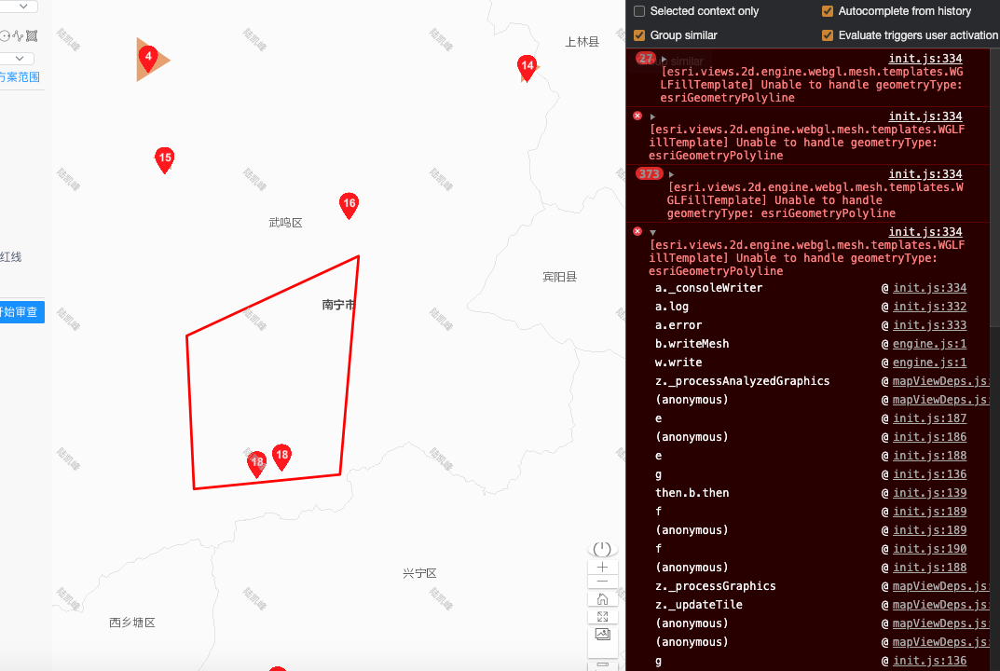

# 绘制原理及实践

解决 arcgis 绘制工具报错问题。



解决思路：
- 分析报错和调用栈信息，定位到 drawTool-mixin 绘制工具。
- 理解绘制工具的工作原理。

## 绘制

基本的鼠标交互操作：
1. 点击地图一个点，移动线，点击点，点击地图一个点，移动线，点击点，双击点绘制结束。
2. 监听地图单击事件、地图鼠标 move 事件、地图鼠标双击事件。
3. 监听鼠标的操作，通过 "vertex-add"、"vertex-remove"、"cursor-update"、"draw-complete" 等事件获得当前绘制的所有点，每一个操作都重新清除 WebGl 画布上旧的所有的点，然后获得新的点集合，进行绘制即可。

```flow
st=>start: openDraw
op=>operation: enableCreatePolygon1
op2=>operation: createPolygonGraphic
e=>end: End

st->op->op2->e

```

openDraw 选择绘制的类型：

```js
  async enableCreatePolygon1(drawType, isContinueDraw) {
    const { Draw } = await loadModules("esri/views/2d/draw/Draw");

    this.mapDraw = new Draw({
      view: this.mapView
    });
    let action = this.mapDraw.create(drawType, {
      mode: "click"
    });
    action.on("vertex-add", evt => {
      this.createPolygonGraphic1(evt.vertices);
    });
    action.on("vertex-remove", evt => {
      this.createPolygonGraphic1(evt.vertices);
    });
    action.on("cursor-update", evt => {
      this.createPolygonGraphic1(evt.vertices);
    });
    action.on("draw-complete", evt => {
      this.createDrawPolygonGraphic1(evt.vertices, isContinueDraw);
    });
  },
```


分析原因：

由于绘制两个点时，不满足面的函数需求，最终导致 Arcgis 的源码报错。因此只需要添加一个条件判断即可解决。

```js
 async enableCreatePolygon1(drawType, isContinueDraw) {
      const { Draw } = await loadModules("esri/views/2d/draw/Draw");

      this.mapDraw = new Draw({
        view: this.mapView
      });
      let action = this.mapDraw.create(drawType, {
        mode: "click"
      });
      action.on("vertex-add", evt => {
        if (evt.vertices.length > 2) { // <--- 新增代码：大于两个点才能成为面，否则会导致 Arcgis draw 获得的类型不对应
          this.createPolygonGraphic1(evt.vertices);
        } else {
          this.createPolylineGraphic(evt.vertices);
        }
      });
      action.on("vertex-remove", evt => {
        this.createPolygonGraphic1(evt.vertices);
      });
      action.on("cursor-update", evt => {
        if (evt.vertices.length > 2) { // <--- 新增代码：
          this.createPolygonGraphic1(evt.vertices);
        } else {
          this.createPolylineGraphic(evt.vertices);
        }
      });
      action.on("draw-complete", evt => {
        this.createDrawPolygonGraphic1(evt.vertices, isContinueDraw);
      });
    },
```
