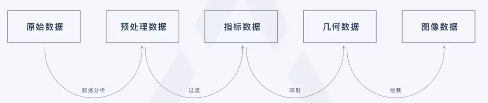
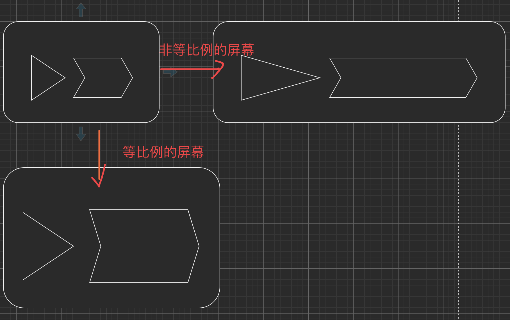
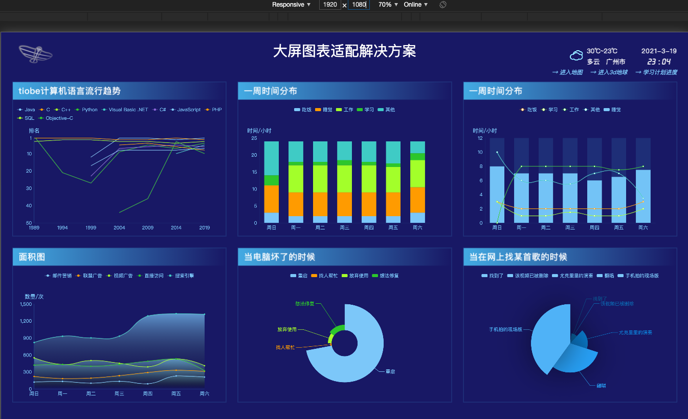
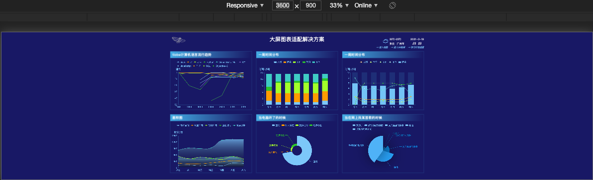
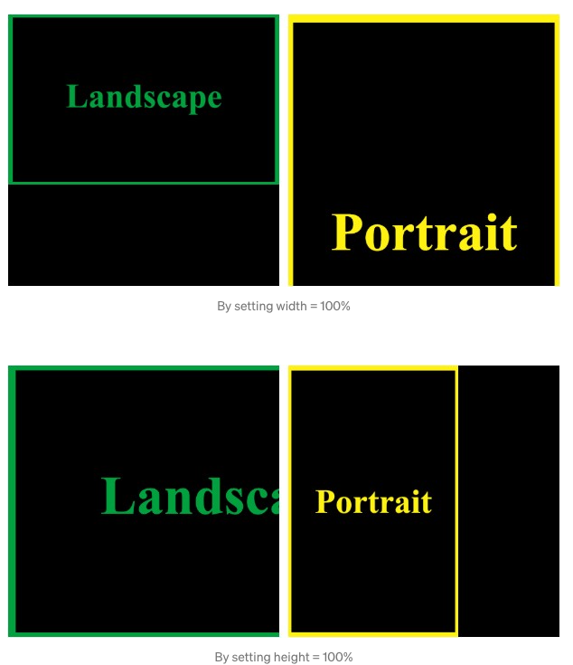
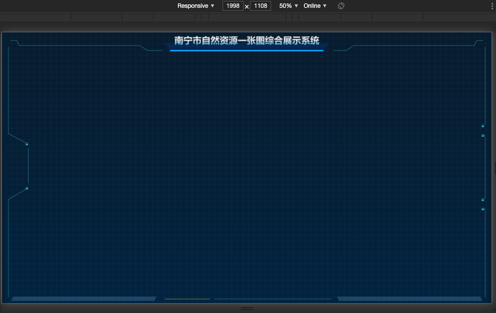
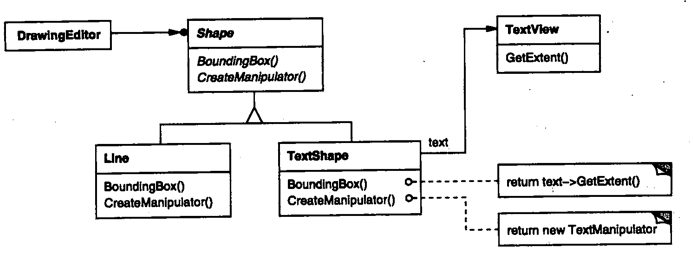

# 可视化大屏项目总结（实战篇）


## 0. 前言


大屏数据可视化目前主要有信息展示、数据分析及监控预警三大类

- 信息展示
- 数据分析
- 监控预警

二三维图表 + 二三维地图的交互数据展示系统。

## 1. 需求分析

- 1、要求我们的大屏需要适配不同规格的屏幕（一楼、六楼的宽屏、二楼的三倍屏、市政府电视）
- 2、要结合体检评估指标考虑应用效果；如，结合具体的业务，提供项目落地的依据，是否符合控规的产业布局落地要求，是否符合指标；
- 3、要求数据展示方面和数据应用方面有创新性，考虑总规成果和三调现状的衔接，打造南宁系统的亮点；
- 4、对于以后扩展的分析展示，形成固定的**展示主题**，以下拉菜单方式进行切换；
- 5、结合业务场景，提供体检评估的**实时分析展示**，如某小区十五分钟公共配套覆盖率（缓冲范围）；
- 6、考虑结合三维数据的展示应用，比如，三维报建的高度、日照、采光的分析。
- 7、需要有演练功能，演练未来的建设情况，也可以看到过去的情况。

核心需求：数据 + 地图的大屏适配展示，UI 风格上显示为暗黑风格。

样式主题自动切换。
### 接到需求怎么做

确认核心需求（信息展示），划分版本，技术选型与重难点整理。

#### 版本管理

- 版本 0.00 是一个hello,world程序
- 版本0.01包含了可以工作的代码
- 版本0.11是基本可以正常的版本

项目初版本时，版本号可以为 0.1 或 0.1.0, 也可以为 1.0 或 1.0.0，如果你为人很低调，我想你会选择那个主版本号为 0 的方式；

- 当项目在进行了局部修改或 bug 修正时，**主版本号和子版本号都不变，修正版本号加 1**；

- 当项目在原有的基础上增加了部分功能时，**主版本号不变，子版本号加 1，修正版本号复位为 0**，因而可以被忽略掉；

- 当项目在进行了重大修改或局部修正累积较多，而导致项目整体发生全局变化时，主版本号加 1

另外，编译版本号一般是编译器在编译过程中自动生成的，我们只定义其格式，并不进行人为控制

### 分支

- master 主分支
- dev 开发分支
- 其他为 功能分支

### ✅0.0.0

- [x] 初始化模版

- [x] 名称
- [x] 协议

### 0.0.1

- [x] 整体项目结构、路由页面考虑、基本的界面结构、layout 层

- [x] 响应式适配所需的大屏幕显示，大屏尺寸的适配，目前按照标准屏进行设计，但需要考虑2倍、3倍屏（存在标准屏、二倍屏、三倍屏；具体尺寸带客户测量后提供）

  在引入地图前发布一个版本。0.0.1

- [x] 先行构建系统框架，设计自然资源界面，引入图表

### 0.1.0 

要达到的效果，主要展示**指标类信息点和地理类信息点**两大可视化数据。

- [ ] 引入地图，二三维一体化，考虑三维地图框架的支持；
- [ ] 图表与地图联动
- [ ] 各大主题模块下，需要切换小主题；（如，自然资源下可选择林地小主题，或固定的分析功能）
- [ ] 编写好 README 文档

需要处理的事情

- [ ] 大屏尺寸的可选适配
- [ ] 暗黑皮肤主题自定义
- [ ] 二三维一体化地图框架
- [ ] 功能主题的处理（路由这些）
- [ ] 数据可视化的前后端基本流程处理



人员配置

- [ ] 需要与 UI 配合，切图以及主题色之类的处理（寻找下 DataV 阿里的设计交接），主要是用代码写不出的样式或动效
- [ ] 先使用 mock 数据，暂不需要后端介入。

个人目标

- [ ] 设计模式：使用适配器模式/代理模式二三维一体
- [ ] 数据处理：原始数据到图像数据的开发流（设计模式和数据结构封装）
- [x] 样式切换与响应式布局
- [ ] 插件化架构，插入 Arcgis API 可以被其他地图组件，比如超图替换。如何可以达到可插拨呢？
  - [ ] 比如直接换一个组件，也就是超图组件，就可以实现插件化了。这里的需求，不太适合插件化。可以把各个地图、比如超图，比如 Arcgis，先通过组件方式引进来。后续再考虑如何支持。需要更好的抽象。
- [x] Vue3 和 TypeScript、使用 TSX 开发 Vue3（才有更好的类型提醒，**TypeScript 原生支持 JSX 语法，而基本无望 TS 官方能支持 SFC 的 template 语法**。）
- [ ] canvas 是否可以绘制背景框/图？

技术选型

- UI 层 Antd-degisn-vue
- Vue 3.x 全家桶（理由，Composition API，以及对 TS 有更好的支持）
- Echarts 图表组件，使用 Vue-ECharts（支持 5.0），旧的项目 vue-echarts-v3 只支持 3.x 的 echart。需要对比下。
- Arcgis 4.12 地图（Echart）
- Webpack5
- TypeScript
- Grid 网格布局（需要研究）
- Sass
- <del>Socket.IO 即时通信（这块后续）</del>
- <del>Three.js （后续可能需要）</del>

#### 确立开发计划

目标：渲染其他指标数据，跑通一个图表的地图联动与指标数据联动。先打通一个图表。再考虑其他的u吧。

| 6    | 7    | 8                                                    | 9                                                            |
| ---- | ---- | ---------------------------------------------------- | ------------------------------------------------------------ |
| 开发 | 开发 | 自然资源整体界面完善，指标动态、指标轮播，路由完善等 | 部署到测试环境，考虑 CI& CD 的实践，逐步实现，先把 常事把 gitlab ci 利用起来，比如版本的发布。比如可以先用实现把制品传递到测试环境。再说。 |

### 1.0.0

- [x] 响应式适配所需的大屏幕显示
- [ ] 图表与地图能够联动
- [ ] 地理飞线、三维光

### 1.0.1

- [ ] 具有主题的概念

## 2. 设计实现

参考二三维一体化思维导图

轮询法，看看哪种适合。
- 各种数据结构和设计模式
- 架构模式

实现方式：单独实现的系统 || 基于现在的系统底层支持（这个就考虑原有系统的支持和改造）。

**先单独实现的系统，demo 展示，可以作为一个模版放到 xcli 去。**再提交到开源。先实现。

Vue、Echart、Arcgis。

需要固定屏幕比例。（这块是自己不熟悉的地方，所谓大屏的屏幕如何适配）。

通过按钮切换，多种屏幕大小和比例，代码读取。

是否要把系统作为单独的考虑，

嵌入式：

使用 iframe，前提下是考虑当前的系统的权限问题的等。其实是否嵌入式进去。等比缩放，会有点问题的。

如果是直接在原系统使用，样式上可能会有影响。

单独使用 iframe 就好。

### 2.1 整体架构设计

### 2.2 整体项目结构、路由页面考虑、基本的界面结构、layout 层，跑通主体

先主体，后局部

路由

- 首页
- 自然资源
- 空间规划
- 监测预警
- 实施评估

layout 层对应二级路由，在 layout 里面的 router-view 对应二级路由的三级路由。比如 

- 首页 / - home 组件 
- zrzy - layout 组件
- zrzy/default - layout 下的 default.component

```html
<template>
  <div class="app-main">
    <div class="app-main-header" :style="headerStyle" @mouseenter="handleMouseEnter" ref="mainHeader">
      <Header
        :system-list="systemList"
        :sub-system-list="subSystemList"
        @on-change-page="changePage"
      />
    </div>
    <div class="app-main-con">
      <router-view />  <!-- 显示 default 路由页面 -->
    </div>
  </div>
</template>
```

#### 路由跳转&路由菜单高亮

各个路由的 name 要唯一。

#### 路由菜单获取

###### 非权限下考虑

###### 权限下考虑

###### 基线的处理

### 2.3 多屏幕分辨率适配

##### 前置知识

显示器

- 屏幕像素
- CSS 像素
- 物理像素
- 分辨率

CSS 知识点

- vw/vh
- rem

##### 实施监督系统标准屏的 rem 适配方案是怎么处理

1. 获得固定的设计稿尺寸比如 1920，设置 html 的 font-size 为 1vw（把屏幕分为 100 份），计算出 1 rem 为 19.2px，设置容器宽度为 19.2rem，高度为 10.8 rem。
2. 在放大窗口的过程，window 宽度为 3600，此时的 1 rem 为 36px，那么容器宽度为 3600rem。

具体处理：

一般的 rem 方案，全局处理。

```css
html {
  font-size: 1vw;
}
html,
body {
  width: 100%;
  height: 100%;
  overflow: hidden;
  margin: 0;
  padding: 0;
}
```

px2rem 进行设置。

另一种是 smart-rem 加 postcss-auto-rem

优势：smart-rem 自动完成rem值计算，posts-auto-rem自动将 px 编译成rem。两者的计算比例完美相合 劣势：两个包结合使用，而无需手工撸码，也无需多余配置。工程化最佳，大大提高了开发效率。

上面两种设置中，这里的设计的确可以适应 1920 x 1080 下的屏幕体系，当换到别的屏幕比例下，比如 3600 ： 900，由于这个时候的比例是 36:9，跟原来的比例 192:108 是不一致的。因此按照原来固定 19.2 计算出来的值，在 36: 9 的屏幕比例下，整体上的元素布局是会变形的。

如下图所示：



缺点：不适应不同比例的浏览器屏幕。

##### 方案一：采用等比例缩放（先采用这种方案）


在浏览器中显示页面，会涉及以下三种尺寸，为了避免后续搞混，这里提前声明下。

**三种尺寸**：原始设计稿尺寸、页面/文档尺寸（Web 页面尺寸）、屏幕物理显示尺寸（通常为浏览器 window 窗口的尺寸）。


<del>**在三种尺寸，在多种屏比例中，这里的原始设计稿尺寸也就是屏幕物理显示尺寸，两者为一物。因为跟原始的静态设计稿不一样，这里的动态设计稿尺寸也就是屏幕尺寸**（后续说到的设计稿尺寸，也就是浏览器 window 窗口的尺寸。）</del>

3月 19 晚上 ，前面的一句话是自己误解了，补充：设计稿尺寸，跟屏幕的尺寸是不可一谈的，如果改变输入的设计尺寸为屏幕，是会导致初始的图形发生变形的。



比如 1920 x 1080 的设计稿下，这些图形是比例 4:3 的长方形，刻意把它改为 36:9的情况，这些长方形就会变为 4：1 的比例了。因此，要适应多种屏幕尺寸的话，


一是不变形的，两边可能会有留白。（PS：考虑用点东西填补两边空白，或新增一些隐藏元素，只有留白时，才会出现，当然这个就需要考虑更多的情况处理了。）



二是变形，通过输入设计稿的比例为屏幕尺寸，这样的变形有一定的处理。比如 1920 x 1080 的设计稿下，这些图形是比例 4:3 的长方形，刻意把它改为 36:9的情况，这些长方形就会变为 4：1 的比例，相当于在元素不变的情况下，把原稿拉长，并且压扁。（**这就是所谓的多屏适配，带来的问题。比例不同。等比例方案难以适配**）。这个输入屏幕尺寸的处理，其实就是 **「scratch 模式」**，宽度和高度都为屏幕的一半。因此，**实际上只需要提供 contain 和 cover、scratch 三种方式给用户，看用户看哪种方式比较顺眼了**。


因此，有以下公式。

1. **为了保证原始设计稿尺寸与页面文档尺寸保持等比例不变形**。因此有以下公式：

 **page H /pageW   = designH/desginW **。

2. 文档尺寸与屏幕物理尺寸

   - 拉伸模式（也就是不出现滚动条），让页面文档的尺寸的宽度、高度完全等于浏览器窗口的尺寸。
   - cover 模式，文档内容宽高比不变、铺满整个容器的宽度，多出的部分则会被裁掉，可能会出现滚动条。考虑设计稿尺寸宽高一般不相等（屏幕也不像以前是正方形的），因此先保证文档尺寸的一边等于固定容器也就是浏览器窗口的一边，等比例求出另外一边。
     - 页面文档宽度设置为与浏览器窗口宽度相等，高度设置为 pageW *designH   /desginW
     - 页面文档高度与浏览器窗口宽度相等，宽度设置为 pageH * designW / designH
   - contain 模式，文档内容宽高比不变，缩放至整个窗口，文档内容能完全显示出来，可能会有留白区域，不出现滚动条。
     - 页面文档宽度与浏览器窗口宽度相等，高度设置为 pageW *designH   /desginW
     - 页面文档高度与浏览器窗口宽度相等，宽度设置为 pageH * designW / designH

3. 可以看到 cover 模式和 contain 模式的处理逻辑基本一致，后面再讨论他们之间的区别。现在都要面临一个问题，那就是文档尺寸可能为 LandScape，也可能为Potrait。


按照前面所说，如果固定一边的话，会出现这种情况：在屏幕为 Portrait 的情况下，设置宽度为 100%，那么有可能会出现文档为 Portrati 显示不全。如果设置高度为 100%，有可能出现 LandScape 的文档宽度看不到。



因此，我们需要判断当前的文档尺寸是否为 Landscape，如果是 Landscape 的话，就设置文档内容宽度 100%，否则设置文档内容高度为 100%。这样我们只需要判断，设计稿尺寸的宽度与高度的对比即可。

Q：为什么需要进行比例判断呢？这样更加精确？（后续再理解，遗留问题。）

   - 浏览器窗口显示比例 pageRatio = pageW/pageH，设计稿尺寸显示比例 designRatio = Cfg.designW / Cfg.designH;

   - **isLandScape = pageRatio > designRation**;

     ```css
&.contain {
         &.landscape {
           width: 100%; /* 设置宽度为浏览器窗口的宽度，高度按比例计算*/
         }
         &:not(.landscape) {  /* 设置高度为浏览器窗口的宽度，宽度按比例计算*/
           height: 100%;
         }
       }
       &.cover {
         &.landscape {
           height: 100%;
         }
         &:not(.landscape) {
           width: 100%;
         }
       }
     ```
     
     在确定了按照宽度，还是按照高度来进行缩放好。

      contain 模式 和 cover 模式 的区别：
     
     从图上，得出区别。
     
     


     


 ###### 计算比例


<!--在 contain 模式下，-->

- <!--如果是 Portrait 的话，页面文档高度与浏览器窗口宽度相等，宽度设置为 pageH * designW / designH，缩放比例 scale 采用高度的比例。-->
- <!--如果是 LandScape 的话，面文档宽度与浏览器窗口宽度相等，高度设置为 pageW *designH   /desginW，缩放比例 scale 采用宽度的比例。-->

- <!--在 cover 模式下-->

  - <!--如果是 Portrait 的话，页面文档高度与浏览器窗口高度相等，宽度设置为 pageH * designW / designH，缩放比例 scale 采用宽度的比例。-->
  - <!--如果是 LandScape 的话，页面文档宽度与浏览器窗口宽度相等，高度设置为 pageW *designH   /desginW，缩放比例 scale 采用高度的比例。-->

  ```js
  switch (Cfg.zoomMode) {
        case "contain":
            if (isWider) {
                $container.css({width: pageH * Cfg.designW / Cfg.designH, height: '100%'});
            } else {
                $container.css({height: pageW * Cfg.designH / Cfg.designW, width: '100%'});
            }
            scale = isWider ? scaleH : scaleW; // 在 contain 模式下，如果是 Portrait 的话，则采用高度的比例。
            break;
        case 'cover':
            $("html,body").css('overflow', 'initial');
            if (isWider) {
                $container.css({height: pageW * Cfg.designH / Cfg.designW, width: '100%'});
            } else {
                $container.css({width: pageH * Cfg.designW / Cfg.designH, height: '100%'});
            }
            scale = isWider ? scaleW : scaleH; // 在 cover 模式下，如果是 Portrait 的话，则采用宽度的比例。
            break;
        case 'stretch':
            scale = isWider ? scaleH : scaleW;
            $container.css({width: '100%'}, {height: '100%'});
            break;
    }
  $("html").css("font-size", scale * 16 + "px").css("opacity", 1);
  ```

  

<!--要解决上面的问题：在不同屏幕尺寸上，对标准尺寸的设计稿进行的**「缩放比例系数」**。就不能是固定的了。需要动态进行处理，动态计算要缩放的比例，避免变形。要适应不同的屏幕比例，这里就要把设计尺寸当作输入尺寸，通过计算页面尺寸后，就可以适应当前屏幕了。-->

<!--**核心**：不变形的基础上，也就是说：在保证屏幕尺寸里面的内容容器（元素有三角形、多边形）的形状不变的情况下，将内容容器 container 乘以一定的比例，让它按比例适应新屏幕。-->


有两种情况：

1. 设置页面**容器高度**为实际显示屏幕宽度的 100%，宽度则为屏幕实际高度 page高度 * 输入的设计稿尺寸宽度 / 输入设计稿尺寸高度。

**具体流程**：

**缩放原理**：是通过计算页面和原始尺寸的比例，控制 html 的 fontSize 来进行所有元素的尺寸缩放，元素尺寸单位用 rem。

核心代码：

```js
[pageH, pageW] = [$(window).height(), $(window).width()];
let isWider = pageW / pageH > Cfg.designW / Cfg.designH;
let [scaleW, scaleH] = [pageW / Cfg.designW, pageH / Cfg.designH];
let $container = $("#container");
if (isWider) {
    $container.css({width: pageH * Cfg.designW / Cfg.designH, height: '100%'});
} else {
    $container.css({height: pageW * Cfg.designH / Cfg.designW, width: '100%'});
}
scale = isWider ? scaleH : scaleW;
$("html").css("font-size", scale * 16 + "px").css("opacity", 1);
```


对于不同比例的屏幕适应，页面上的元素排版是一致的。比如 1920：1080 和 36: 9 这两种比例下的屏幕显示的元素布局是一样的，只不过会根据高度和宽度来进行放大或缩小的。


**优点**：最简单的处理，不用考虑不同屏幕下的元素重新排。

**缺点**：可能出现两边空白的情况（使用 contain 方式）

留白问题，先实现标准屏。其他比例，比如两倍屏和三倍屏的留白问题，需要提前告知。


**进一步优化思路**：要真正实现多屏适配，避免出现多倍屏空白问题，就需要设个多个设计稿，代码层面根据不同的设计尺寸，在满足等比例情况下，再进行对应元素的布局加减处理。

```js
export default defineComponent({
  name: "Default", // 自然资源
  setup() {
    const pagesize = () => {
      const settings = {
        designW: 1920, // 设计稿尺寸，也就是输入的屏幕尺寸
        designH: 1080, // 虽然可以这样输入，适应的屏幕尽量比例一致
        zoomMode: "contain"
      };
      const pageH = window.innerHeight;
      const pageW = window.innerWidth;
      const isWider = pageW / pageH > settings.designW / settings.designH;
      const [scaleW, scaleH] = [
        pageW / settings.designW,
        pageH / settings.designH
      ];
      const $container = document.querySelector("#container");
      const $html = document.querySelector("html");
      const $body = document.querySelector("body");
      let scale = 1;
      switch (settings.zoomMode) {
        case "contain":
          console.log("hhh");
          if (isWider) {
            ($container as any).style.width =
              (pageH * settings.designW) / settings.designH;
            ($container as any).style.height = "100%";
          } else {
            ($container as any).style.height =
              (pageW * settings.designH) / settings.designW;
            ($container as any).style.width = "100%";
          }
          scale = isWider ? scaleH : scaleW;
          break;
        case "cover":
          if (isWider) {
            ($container as any).style.height =
              (pageW * settings.designH) / settings.designW;
            ($container as any).style.width = "100%";
          } else {
            ($container as any).style.width =
              (pageH * settings.designW) / settings.designH;
            ($container as any).style.height = "100%";
          }
          scale = isWider ? scaleW : scaleH;
          // 支持滚动查看
          ($html as any).style.overflow = "initial";
          ($body as any).style.overflow = "initial";
          break;
        case "stretch":
          scale = isWider ? scaleH : scaleW;
          ($container as any).style.width = "100%";
          ($container as any).style.height = "100%";
          break;
      }

      ($html as any).style.fontSize = scale * 16 + "px";
      ($html as any).style.opacity = 1;
    };
    onMounted(() => {
      pagesize();
      window.addEventListener("resize", pagesize);
    });
  },
  render(


    
  ) {
    return (
      <div class={css.default} id="container">
        <div class={css.row}>
          <div class={css.triangle1}></div>
          <div class={css.triangle2}></div>
          <div class={css.triangle3}></div>
          <div class={css.triangle4}></div>
        </div>
        <div class={css.row}>
          <div class={css.triangle1}></div>
          <div class={css.triangle2}></div>
          <div class={css.triangle3}></div>
          <div class={css.triangle4}></div>
        </div>
        <div class={css.row}>
          <div class={css.triangle1}></div>
          <div class={css.triangle2}></div>
          <div class={css.triangle3}></div>
          <div class={css.triangle4}></div>
        </div>
        <div class={css.row}>
          <div class={css.triangle1}></div>
          <div class={css.triangle2}></div>
          <div class={css.triangle3}></div>
          <div class={css.triangle4}></div>
        </div>
      </div>
    );
  }
});

```

最后，需要安装插件自动把系统中的 px 转为 rem 值。（这个后面完善）

- 针对系统开发编写的
- 针对第三方组件库编写的，比如 antd-design-vue

##### 方案二：Grid + 媒体查询

复杂繁琐，不一定效果，需要和 UI 考虑屏幕区间，元素的摆放和大小。别的公司有用到这套。翰阳。

##### 其他待考虑到的方案

### 2.4 皮肤主题支持

#### 常规没支持主题切换的项目

在 styles 文件声明一些变量、全局样式、mixins，在 vue 组件的 style 标签中注入一些变量就基本搞定样式的处理了，接下来按照规范实现即可。

```
    // *给 sass-loader 传递选项*

​          sass: {

​            data: `@import "@/styles/index.scss";`

        },
```

其实传统的项目也会支持主题切换的，只不过是离线层面的主题切换，在确保好开发者都使用定义的变量。然后在需要时，把对应的主题变量进行更改即可。

如果用户在线的支持比较的难，可以先支持离线的处理。

#### 整体样式

字体

icon

颜色

图片

- 品牌色
- 功能色
- 中性色

##### Sass 样式组织和使用

主要考虑以下两点内容：

1. 公共样式的声明与使用、覆盖

单独在 styles 文件夹下进行维护，然后注入到全局内，在 `main.ts`

```js
import "@/styles/index.scss" // 引入全局样式
// @import "../styles/cores/option.scss";  使用 @ 时，vscode 无法识别跳转到那个文件，相对路径则可以，但是如果移动文件夹，这个位置也要改变。
```

使用方式：

1）组件自定义样式，如果要用到  style 定义的变量，mixins，则可以 import 方式导入进来：

```css
@import "@/styles/cores/option.scss";
.layout {
  background-color: $primary-color;
}
```

2）另外一种方式就是在 vue.config.js 全局注入到组件的 scss 样式中（待验证），这种方式的好处开发者不用依次每个组件导入。坏处是，其他 review 时定位到对应的文件，有点难，只能全局搜索寻找。

2. 组件自定义样式

开发流程：全局样式都写在 `src/styles` 目录下，每个页面自己对应的样式都写在自己组件文件夹的 `.vue` 文件之中，或者写在 index.module.scss 中。

##### 图片使用

图片存放的地方

src/assets/

图片使用的地方

- Template/TSX
- 样式文件中

```scss
.layout {
  height: 100%;
  width: 100%;
  background: url("../assets/background.png"); // 编译为 background: url(/img/background.2dad2100.png); 实际打包输出的路径
}

```

如果使用 @ 会导致路径找不到，需要额外处理。打包时，没有对样式文件中的 @ 做处理，必须通过相对路径引入。详情见 vuecli 文档  参考文档：https://cli.vuejs.org/zh/guide/html-and-static-assets.html#%E5%A4%84%E7%90%86%E9%9D%99%E6%80%81%E8%B5%84%E6%BA%90

##### Layout 层的适配

背景

1. 通过 rem 设置好 padding，#app 容器居中处理
2. body 设置为蓝底色，后续可以研究绘制出对应的表格。
3. 设置 #app 的背景图为以下，后续根据第 2 点的处理后，进行拆解为更灵活的处理。



##### 主体布局

###### 切割布局

- header
- sidebar
- main

###### 层叠布局

main 主体下

#### 主题

理想的效果，一般主题皮肤包括以下方面：

- 字体
- icon
- 颜色
- 图片
- 更复杂的，布局方式
- 更复杂的，则是交互的体验（比如王者，买了皮肤的英雄，出的招式都会变化。）

最优先需要支持的便是「颜色层面」。而换个颜色，区别是看颗粒度的大小。指标系统的颗粒度比较大，一些许的大颜色。我们的颗粒度比较小，是整体风格的，比如暗黑风格，一些按钮，地图工具，地图图表整体上的考虑。「**而颜色下，还有考虑到主色、圆角、边框和部分组件的视觉定制**。」

可能会遇到的问题：

1. 系统主题色改变，依赖的 UI 组件库、Echarth 表、地图库渲染等这些主题能否一同改变，如何做到呢？

先实现系统的风格，再实现第三方 UI 库同步风格处理。

#### 解决方案

检视阅读。

考核指标：

- 主题的实现，我们往往需要了解业务特性，去寻找最合适的解决方案。不同项目，有不同的实现方式，但目标都是为了提高项目的可维护性、可扩展性，以及降低接入复杂度。

- 不仅仅考虑到实现效果，目标客户。还要考虑到内层的用户，也就是开发者用户（也就是团队维度）。后期如何快速新增主题，减少代码量。

##### 方案一 prop 下发 theme

原理：定义`theme`参数，通过`prop`下发，子组件根据`theme`来动态绑定`style`的方式实现

##### 方案二 ajax 注入 DOM

原理：通过`Ajax`获取`css，`，然后其中的颜色变了，再通过 `style` 标签将演示插入 DOM

##### 方案三 变量动态编译

原理：使用可以在浏览器上直接运行的`less`，通过传入变量动态编译。

##### 方案四 控制 body

原理：给所有`css`选择器加一个样式名的类选择器，并把这个类名绑定到`body`元素上，然后通过`DOM API`来动态切换主题。

大概了解下几种方案，再来实现。

##### 方案五 webpack 插件

##### 参考资料

- [实现Vue项目主题切换](https://juejin.cn/post/6844904016892133383#heading-0)

#### 图表引入

```tsx
// *引入 echarts*

import ECharts from "vue-echarts";

import { use } from "echarts/core";

// *// 手动引入 ECharts 各模块来减小打包体积*

import { CanvasRenderer } from "echarts/renderers";

import { BarChart, PieChart } from "echarts/charts";

import { GridComponent, TooltipComponent,} from "echarts/components";

use([CanvasRenderer, BarChart, PieChart, GridComponent, TooltipComponent]);
```

可以定制主题，让 UI 去定制，这样开发更便捷。也满足要求。

### 2.5 引入地图，二三维一体化，考虑三维地图框架的支持

达到的效果：

- 能够随时切换三维，能够同步三维数据。

在南宁弄的二三维不是很像适配器模式，因为没有调用二维地图时，直接使用的二维地图的组件。

点击三维视图时，直接使用的三维地图组件。

- D3-map
- D2-map
- Map 作为统一入口

消费者组件使用 Map 组件，Map 组件根据消费者的需求，返回 D2-Map 或 D3-Map 组件。

#### 适配器设计模式。

- 源角色
- 适配器角色
- 目标角色



源角色可以是调用 Map 组件的外部组件，比如它调用二维目标角色，就可以通过适配器角色返回二维目标角色。假如要调用三维目标角色，就可以通过适配器返回三维目标角色。这样的解释不够合理。（适配器角色没有继承源角色，也没有实现目标角色的接口。）

前面的大场景不符合适配器设计模式。前端的树结构渲染等，很多时候都处理后台的数据以符合树组件的数据结构，便使用了适配器。

Map 作为适配器基础了源角色，这块可以看下 axios 是如何应用适配器模式的。

什么时候应用到适配器模式呢，**那就是「同步数据和视图」这块就用到了适配器设计模式，二维的坐标系转三维，三维转二维。图层的处理，通过多个数据格式化工具进行处理**。

或者说，baidumap.show() 和 googleMap.display()，使用适配器基础百度地图，重新实现 googleMap 。

<!--这里需要修改 interview 的说法。新增代理的设计模式-->

那么，主体的架构用到了什么设计模式呢，那就是代理设计模式。

适配器模式主要用在 二三维数据的转换和同步。

#### 中介者设计模式

<!--二三维数据的管控使用了MVC模式（控制层便是位于表现层与模型层之间的中介者）-->

主要体现在切换二维与三维视图时，都通过 Map 组件进行数据的处理。

还有就是把当前地图的 map、mapView 放到 Vuex 里，这里的 vuex 就是中介者。

#### 代理设计模式

**注意事项：** 1、和适配器模式的区别：适配器模式主要改变所考虑对象的接口，而代理模式不能改变所代理类的接口。 2、和装饰器模式的区别：装饰器模式为了增强功能，而代理模式是为了加以控制。

应用： 1、远程代理。 2、虚拟代理。 3、Copy-on-Write 代理。 4、保护（Protect or Access）代理。 5、Cache代理。 6、防火墙（Firewall）代理。 7、同步化（Synchronization）代理。 8、智能引用（Smart Reference）代理。

访问 Map，Map 负责实例化生成 d2-map 或 d3-map。

只**能说类似代理设计模式，但没有严格上的。因为 Map 组件和 d2-map 并没有定义相同的接口（这个没必要，要不然所有的都要这样处理）**。况且 map 是视图组件类型，共同的接口就是 display ，也就是视图这块显示出来。也算是代理设计模式了。

- Proxy（Map）
- Subject
- RealSubject（d2-map、d3-map）

而 Map 根据情况渲染 d2-map，或则 d3-map，动态组件。

其他的应用：

这里可以考虑代理访问，直接使用 $refs 访问。

```js
    /**
     * @description: 获得当前渲染的视图组件
     * @param {*}
     * @return {*}
     */
    getViewComponent() {
      return this.$refs.renderDynamicComponent;
    }
```

#### 简单工厂模式（比较符合）

传递不同的参数，比如 d2 或 d3，实例化生成不同的组件。至于切换时，就通过 props 传递函数参数，让 map 获得数据，进行处理后，再传递给 d3。

> 参考资料：https://www.codenong.com/j5ddfbedd6fb9a071975/，这种是 react 的传递函数做法，vue 的确可以直接采用 emit 的，只不过传递函数的话，对于参数有比较好的提醒作用。

所以，对于数据的同步处理，通过函数传递比较灵活。至于其他事件，则可以通过 emit /on 处理。


至于外部的事件，是否需要给 map 设置  v-on="$listeners" v-bind="$attrs" 这两个东西来把 map 的 props 传递给 d2map/d3map，或者把 d2map/d3map 传递给外部呢。

有没有必要这样处理呢？比如地图加载完成这个事件，是否需要直接传递到外部去呢？还是说中间中转一层比较好一点。既然做了 Map 中间处理层， 就不应该再过多传递到外部？

this.$listener 读取该组件上获取的监听器，然后再监听到 `<component></component>` 组件上来，同理 this.$attrs 获取该组件上外部赋予的属性，再传递到 `<component>` 子组件上来。（通过 react 的写法，这两个东西就一目了然。）

外部使用 Map.vue

```html
<Map @on-xxxx="xxxx" :xxxx="xxxx"></Map>
```

Map.vue

```html
<component ref="renderDynamicComponent" :is="activeComponent" @on-switch-view="onSwitchView" v-on="$listeners" v-bind="$attrs"  :layers="viewLayers" :viewpoint="activeViewPoint"></component>
```

它的缺点是会让组件的状态来源变得不可控，从哪里获取的 props，以及从哪里处理的，开发者难以寻找来源。但它还是能解决一定的问题，比如 d2map 有多个 emit 事件时，这个时候就可以用。（后面再看怎么优化）

- map
  - d2map
  - d3map


至于统一的 map ，外部传递到 vuex 即可。

#### 其他设计模式（需要考虑）

如果外部要获取 d2-map 的实例，直接通过 vuex 来获取这样更好，地图工具栏会使用到。每个系统加载时，都会初始化 vuex 上保存的唯一值。图表工具需要使用 Map 对象的话，直接可以从 vuex 中获取 state 状态。

##### 问题

特殊的情况：既然作为 Map 组件，那就可以同时渲染实例化多个地图。这个时候 vuex 的值以哪个为准呢，特别是说两个地图都有工具栏的，这块就得

如果同时存在多个地图组件的话，这个工具栏对地图组件的依赖，其实可以通过外部 prop 传递进来。这样就不会跟 vuex 绑死了。后续再思考。

如何同时保持外部能够使用，又能保持独立性进行覆盖呢？

三维到二维，这里存储的 map 也要改变的。不能给地图组件一直引用着。

#### 实现步骤

##### 地图 api 引入

###### 传统的处理

直接把 css 和 js 添加到 html 里面

###### 通过 esri-loader

1. 读取配置文件 的 arcgisUrl，传入 Vue.use 里面

```js
// 初始化地图
Vue.use(Map, {
  load: {
    arcgisUrl: ARCGISURL // 传入地址
  }
});
```

2. Map 插件：

```js
import { loadCss, loadScript } from "esri-loader"; // 动态构建 style 和 script 标签进行加载
import lazyValue from "@/utils/lazyValue";
const DEFAULTURL = "http://52.82.69.134:18080/dgp_js_api412";

import Map from "./map.vue";

const loadEyeMapApi = async (url: string) => {
  // await loadEchartsArcGISApi();
  const jsUrl = url + "/init.js";
  const cssUrl = url + "/esri/css/main.css";
  return new Promise((resolve, reject) => {
    try {
      loadCss(cssUrl);
      loadScript({
        url: jsUrl
      }).then(resolve);
    } catch (error) {
      reject(error);
    }
  });
};

// 异步加载 arcgis api
const makeEyeMapApiPromiseLazy = (options: { load: { arcgisUrl: string } }) => {
  const { load } = options;
  const onApiLoaded = () => {
    console.log("api has loaded");
  };

  if (load) {
    const { arcgisUrl = DEFAULTURL } = load;
    return lazyValue(() => {
      return new Promise((resolve, reject) => {
        try {
          loadEyeMapApi(arcgisUrl).then(resolve);
        } catch (error) {
          reject(error);
        }
      }).then(onApiLoaded);
    });
  }
};

export const install: any = (
  Vue: any,
  options: { load: { arcgisUrl: string } }
) => {
  if (install.installed) return;

  install.installed = true;
  const eyeMapApiPromiseLazy = makeEyeMapApiPromiseLazy(options);

  Vue.prototype.$eyeMapApiPromiseLazy = eyeMapApiPromiseLazy;
  Vue.component("eye-map", Map);
};

const plugin = { install };
export default plugin;
```

3. 然后在客户使用处，初始化调用 this.$eyeMapApiPromiseLazy 进行加载即可。

```js
export default class D2Map extends Vue {
  mounted() {
    this.$eyeMapApiPromiseLazy().then(() => {
      console.log("$eyeMapApiPromiseLazy ->");
      // this.init();
    });
  }
```

如果在这里没有加载依赖的 arcgis 的 css 和 js api，那么在加载模块时 esri-loader 内部会进行判断，如果没有加载就会默认加载 4.18 的 api。

```js
   const {
      Map,
      MapView,
      Basemap,
      // TileLayer,
      MapImageLayer
    } = await loadModules(
      "esri/Map",
      "esri/views/MapView",
      "esri/Basemap",
      // "esri/layers/TileLayer",
      "esri/layers/MapImageLayer"
    );

// esri 内部

```

##### Map 组件

- prop
  - layerOptions

##### D2Map


### 2.6 获取指标系统数据

- 需要用户的信息
- 同源，能够获取 cookie 登录信息

参考指标系统，调用 http://52.82.69.134:18080/dgp-ims-web/ims/rest/v1/login/sso 调用这个接口进行单点登录判断，即可获得用户的信息。也就可以获取到指标系统数据的接口，

看数据的复杂度如何，当前是否需要后端帮忙处理。

临时方案：先使用写死的指标数据。

#### 数据与图表自适应读取渲染

没考虑下钻的情况下：

饼图，一维

- Key：名称（挑选一列的值作为每份显示的名称）
- value：数值/百分比（挑选一列的值作为每份大小的计算依赖）

柱状图

- key：名称（通常位于水平轴，挑选一列作为 x 轴名称显示）
- value：数值/百分比（挑选一列作为y 轴显示）

表格

- 多个列（维度）

根据数据的特征，来表明当前可以适配的图表。

先通过：通过JSON数据，快速配置图形报表。

获得的原始数据通常都是二维列表。

后续 Review 学习数据可视化 BI 平台：

- 数据与图表的映射

- 如何拖拽生成

  01 通过JSON数据，快速配置图形报表

  02 通过SQL数据，快速配置图形报表

  03 图表模板配置，实现不同数据源图表合并展示

  04 图表布局，支持单排、双排、组合、TAB

由于 UI 没确定，暂时难以考虑复用的问题。先直接写到图表数据里去。

### 2.7 获取主系统地图服务信息

- 能否直接获取用户的登录信息，如果是在从主系统页面打开的话，这样就可以利用到主系统配置的地图服务。
- 或者写死使用管理员登录，可以先提供一个登录认证，用于获取地图服务信息。

参考指标系统，调用 http://52.82.69.134:18080/dgp-ims-web/ims/rest/v1/login/sso 调用这个接口进行单点登录判断，即可获得用户的信息。也就可以获取到地图服务。

地图服务不要挂在某个系统下，而是挂在通用服务的获取下。

### 2.8 地图与图表联动

目标：渲染其他指标数据，跑通一个图表的地图联动与指标数据联动。先打通一个图表联动。

A：地图服务和数据可以先通过 json 进行配置，可以快速把效果弄起来。

B：调用指标系统也可以的，通过后端处理指标数据，并且让这些指标数据能够与地图服务关联起来，考虑名称、id 等。这样开发周期需要多两天。可以先用 A 计划，让领导看下先。

实体之间的关联关系是怎么的，架构交互状态图，领域驱动

指标 

- 年份

地图服务

- 

指标与地图服务是一对一的关系，关联键是什么？

流程图

```fl
初始化加载所有指标数据和地图数据
```

UML 图

echart5 的 dataset 比 echart4 更灵活了。

#### 地图组件存放问题

- 是否每个子页面都需要维护不同的地图信息
- 是否需要保留上一个页面的地图信息，比如自然资源和实施评估的。目
- 居于目前考虑，整个系统应用只需要保留一个 map 组件。

什么时候存储到 vuex 上，什么时候进行读取。

地图组件尽量不依赖 vuex，vuex 的交接由 smart 组件去处理。

在地图组件可以通过 $emit 出去，外部组件使用时，获得 @ 监听后，再传递到 vuex 上来。目前 vuex 只需存一个，这个共享模式也涉及到设计模式。


在 map.view(xxx) 回调时进行存储，并发布

## 3. 问题杂锦

### CSS Module

无法在 scss 中组合样式类，compose 没识别。

### TypeScript  

依照 Echart 等经验，这块需要在大屏严格执行起来。总结相关的检查点，复合标准的 TypeScript 项目。避免优点没用上，反而降低开发效率。

需要好好总结下。


这块声明主要在基础组件，以及业务组件的后端接口数据声明上来。

### 请求封装类 React-Query 的 vue 解决方案

详细见：用 React Query 来管理数据请求https://zhuanlan.zhihu.com/p/261146977

## Vue 3 降级 Vue2

1. vue2 全家桶
2. UI 组件库也用回 2，考虑用 quark
3.  TS 不改变，这样修改的成本小一点。使用 class 风格，跟 react 更加的类似，后续跟 vue3 的 defineProperty 函数也更符合。修改的成本更低一点。

维护性能，以及 Template 模版。

使用 

- vue-property-decorator
- vuex-module-decorators
- vue-class-component

而 `vue-property-decorator` 正是基于此而来，它在此基础上增加了装饰器相关的功能，因此它也同时拥有 `vue-class-component` 的功能。

- @vue/composition-api 针对插件 vue-echart
- 需要安装 vue-template-compiler 针对单文件组件编译

4. vue2 挂载后，是直接把 #app 替换为挂载的组件。而 vue3 会把挂载的组件 append 进 app 中。

### 使用 vue2 + TS 类风格，不需要响应式的数据如何处理？


### 是否继续使用 CSS module 还是回到 vue scoped 上来？能否找到最佳实践？

1. 已经用了 CSS module 的，就先保留，后续新的还是用 vue scoped 来处理。OK。
2. CSS Module 更加适合于后端模版使用，一些比较简单的设计稿，比如博客平台。

或者两者结合，原子类可以放到 CSS Module 上来，至于其他的，则可以放到 scoped 上。

## Render vs Template

### 性能上的对比

vue 框架特别针对 Template 做了优化，比如哪些是动态节点，哪些是静态节点等。

而 render 是运行时，缺失相应的优化。

### 内置组件的使用

#### 使用 Render 无法使用动态组件

```js
renderRealMap() {
    if (this.viewType === "d2") {
      return (
        <d2-map
          onMapReady={this.handleMapReady.bind(this)}
          onMapViewChange={this.handleMapViewChange.bind(this)}
        ></d2-map>
      );
    } else {
      return (
        <d3-map
          onMapReady={this.handleMapReady.bind(this)}
          onMapViewChange={this.handleMapViewChange.bind(this)}
        ></d3-map>
      );
    }
  }

  render() {
    return <div class="map">{this.renderRealMap()}</div>;
  }
```

Template.vue

```html
<template> 
  <component ref="renderDynamicComponent" :is="activeComponent" @on-switch-view="onSwitchView" v-on="$listeners" v-bind="$attrs"  :layers="viewLayers" :viewpoint="activeViewPoint"></component>
</template>
```

显然当动态组件很多时，使用 template 写法更清晰。

#### 过渡组件是否可以使用

## 

### 内置指令的使用


## 4. 总结


## 参考资料

- [一个炫酷大屏展示页的打造过程](https://juejin.cn/post/6844903518180999176#heading-2)

- [React数据大屏的应用实践](https://juejin.cn/post/6844903958415327246#comment)

- [iDataV](https://github.com/yyhsong/iDataV)

- [超全面设计指南：如何做大屏数据可视化设计？](http://www.woshipm.com/pd/1782868.html)

- [开源之美：开源软件开发流程](https://www.phodal.com/blog/how-to-build-a-opensource-project/)

- [自适应布局最佳实践](https://mp.weixin.qq.com/s/8GvZetosiFJmZ1n3ZLfxNA)

- [Antd Vue + Highcharts 实现数据大屏](https://juejin.cn/post/6858545114130841607#heading-12)

- [vue-element-admin](https://panjiachen.github.io/vue-element-admin-site/zh/)

- [常用设计模式在前端开发中的应用](https://zhuanlan.zhihu.com/p/41423006)

  

