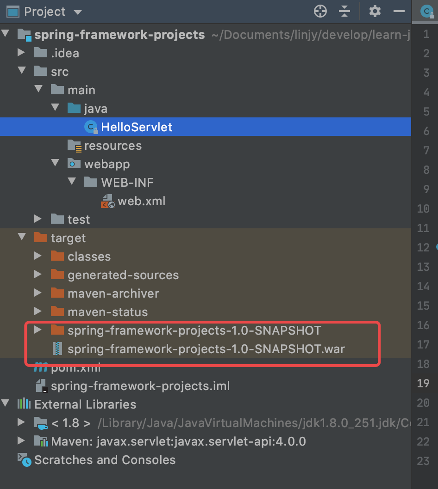

# 10分钟教你开发部署一个 Java后端简单应用

文章分类
- 实践总结型

目标读者

- 从零部署、对后端新手

## 0. 前言

大家好，今天纳撸多要分享的是如何快速开发部署一个 Java 后端简单应用，实现效果是：在浏览器地址栏，访问应用地址，在页面中打印出` “Hello, naluduo"`  文字。浏览器作为客户端，Java 应用作为服务端，通信协议是 HTTP，我们需要使用 Java 编写一个 HTTP 服务器响应浏览器端的访问请求。

## 1. 开发制品

### 1.1 Servlet 入门

编写 HTTP 服务器其实不难，只需要先编写给予多线程的 TCP 服务器，然后在一个 TCP 连接中读取 HTTP 请求，发送 HTTP 响应即可。

```sh
┌───────────┐                                   ┌───────────┐
│Application│                                   │Application│
├───────────┤                                   ├───────────┤
│  Socket   │                                   │  Socket   │
├───────────┤                                   ├───────────┤
│    TCP    │                                   │    TCP    │
├───────────┤      ┌──────┐       ┌──────┐      ├───────────┤
│    IP     │<────>│Router│<─────>│Router│<────>│    IP     │
└───────────┘      └──────┘       └──────┘      └───────────┘
```

具体编写的 Java 代码如下：

```java
import java.io.BufferedReader;
import java.io.BufferedWriter;
import java.io.IOException;
import java.io.InputStream;
import java.io.InputStreamReader;
import java.io.OutputStream;
import java.io.OutputStreamWriter;
import java.net.ServerSocket;
import java.net.Socket;
import java.nio.charset.StandardCharsets;

public class Server {
	public static void main(String[] args) throws IOException {
		ServerSocket ss = new ServerSocket(5050); // 监听指定端口
		System.out.println("server is running...");
		for (;;) {
			Socket sock = ss.accept();
			System.out.println("connected from " + sock.getRemoteSocketAddress());
			Thread t = new Handler(sock);
			t.start();
		}
	}
}

class Handler extends Thread {
	Socket sock;

	public Handler(Socket sock) {
		this.sock = sock;
	}

	@Override
	public void run() {
		try (InputStream input = this.sock.getInputStream()) {
			try (OutputStream output = this.sock.getOutputStream()) {
				handle(input, output);
			}
		} catch (Exception e) {
			try {
				this.sock.close();
			} catch (IOException ioe) {
			}
			System.out.println("client disconnected.");
		}
	}

	private void handle(InputStream input, OutputStream output) throws IOException {
		System.out.println("Process new http request...");
		var reader = new BufferedReader(new InputStreamReader(input, StandardCharsets.UTF_8));
		var writer = new BufferedWriter(new OutputStreamWriter(output, StandardCharsets.UTF_8));
		// 读取HTTP请求:
		boolean requestOk = false;
		String first = reader.readLine();
		if (first.startsWith("GET / HTTP/1.")) {
			requestOk = true;
		}
		for (;;) {
			String header = reader.readLine();
			if (header.isEmpty()) { // 读取到空行时, HTTP Header读取完毕
				break;
			}
			System.out.println(header);
		}
		System.out.println(requestOk ? "Response OK" : "Response Error");
		if (!requestOk) {
			// 发送错误响应:
			writer.write("404 Not Found\r\n");
			writer.write("Content-Length: 0\r\n");
			writer.write("\r\n");
			writer.flush();
		} else {
			// 发送成功响应:
			String data = "<html><body><h1>Hello, Jecyu!</h1></body></html>";
			int length = data.getBytes(StandardCharsets.UTF_8).length;
			writer.write("HTTP/1.0 200 OK\r\n");
			writer.write("Connection: close\r\n");
			writer.write("Content-Type: text/html\r\n");
			writer.write("Content-Length: " + length + "\r\n");
			writer.write("\r\n"); // 空行标识Header和Body的分隔
			writer.write(data);
			writer.flush();
		}
	}
}
```

但是，要编写一个完善的 HTTP 服务器，以 HTTP/1.1 为例，需要考虑的包括：

- 识别正确和错误的 HTTP 请求
- 识别正确和错误的 HTTP 头
- 复用 TCP 连接
- 复用线程
- IO 异常处理
- ......

为了简单起见，我们编写 Servlet 而不是从零用 Java 编写 HTTP 服务器，把处理 TCP 连接，解析 HTTP 协议这些底层工作统统交给现成的服务器去做，我们只需要把自己的应用程序跑在 Web 服务器上。为了实现，这一目的，JavaEE 提供了 Servlet API，我们使用 Servlet API 编写自己的 Servlet 来处理 HTTP 请求，Web 服务器实现 Servlet API 接口，实现底层功能：

```sh
                 ┌───────────┐
                 │My Servlet │
                 ├───────────┤
                 │Servlet API│
┌───────┐  HTTP  ├───────────┤
│Browser│<──────>│Web Server │
└───────┘        └───────────┘
```

而 Tomcat 服务器就实现了 Servlet API。

综上，我们整体的开发部署步骤如下：

- 编写 Servlet
- 打包为 war 文件
- 复制到 Tomcat 的 webapps 目录下
- 启动 Tomcat

### 1.2 使用 Maven 构建开发环境

Maven 是一个优秀的项目构建工具，可以很方便的对项目进行分模块构建，这样在开发和测试打包部署时，效率会提高很多。其次，Maven 进行依赖的管理，可以将不同系统的依赖进行统一管理，并且可以进行依赖之间的传递和继承。

Maven 遵循`约定 》 配置 》编码`，Maven 要负责项目的自动化构建，以编译为例，Maven 要想自动进行编译，那么它必须知道 Java 的源文件保存在哪里，这样约定之后，不用我们手动指定位置，Maven 能知道位置，从而帮我们完成自动编译。

- Maven 使用 `pom.xml` 定义项目内容，并使用预设的目录结构；
- 使用 Maven 中声明一个依赖项可以自动下载并导入 classpath；
- Maven使用`groupId`，`artifactId`和`version`唯一定位一个依赖。

1. 安装Maven

要安装Maven，可以从[Maven官网](https://maven.apache.org/)下载最新的Maven 3.6.x，然后在本地解压，设置几个环境变量：

```
M2_HOME=/path/to/maven-3.6.x
PATH=$PATH:$M2_HOME/bin
```

然后，打开命令行窗口，输入`mvn -version`，应该看到Maven的版本信息：

```sh
Java version: 1.8.0_251, vendor: Oracle Corporation, runtime: /Library/Java/JavaVirtualMachines/jdk1.8.0_251.jdk/Contents/Home/jre
Default locale: zh_CN, platform encoding: UTF-8
OS name: "mac os x", version: "10.15.7", arch: "x86_64", family: "mac"
```

2. 按照 Maven 的规约来设置目录：

- /src/main/java/ ：Java 源码。
- /src/main/resource ：Java 配置文件，资源文件。
- /src/test/java/ ：Java 测试代码。
- /src/test/resource ：Java 测试配置文件，资源文件。
- /target ：文件编译过程中生成的 .class 文件、jar、war 等等。
- pom.xml ：配置文件

1. 首先下载 IntelliJ IDEA 编译器，在新建项目时选择 maven，可以自动帮我们生成以上目录：


2. 生成目录后，接下来，我们要编写 pom.xml 文件，填写项目需要的依赖和编译配置，其中 maven 使用 groupId，artifactId和version唯一定位一个依赖。

本应用中，主要依赖为 javax.servlet 4.0.0 版本的 API，以及依赖的 java 版本为 1.8。

```xml
<?xml version="1.0" encoding="UTF-8"?>
<project xmlns="http://maven.apache.org/POM/4.0.0"
         xmlns:xsi="http://www.w3.org/2001/XMLSchema-instance"
         xsi:schemaLocation="http://maven.apache.org/POM/4.0.0 http://maven.apache.org/xsd/maven-4.0.0.xsd">
    <modelVersion>4.0.0</modelVersion>

    <groupId>org.example</groupId>
    <artifactId>spring-framework-projects</artifactId>
    <version>1.0-SNAPSHOT</version>

    <properties>
        <project.build.sourceEncoding>UTF-8</project.build.sourceEncoding>
        <project.reporting.outputEncoding>UTF-8</project.reporting.outputEncoding>
        <maven.compiler.source>1.8</maven.compiler.source>
        <maven.compiler.target>1.8</maven.compiler.target>
        <java.version>1.8</java.version>
    </properties>

    <dependencies>
        <dependency>
            <groupId>javax.servlet</groupId>
            <artifactId>javax.servlet-api</artifactId>
            <version>4.0.0</version>
            <scope>provided</scope> 
        </dependency>
    </dependencies>
</project>
```

### 1.3 编写 Servlet 代码

```java
import javax.servlet.ServletException;
import javax.servlet.annotation.WebServlet;
import javax.servlet.http.HttpServlet;
import javax.servlet.http.HttpServletRequest;
import javax.servlet.http.HttpServletResponse;
import java.io.IOException;
import java.io.PrintWriter;

// WebServlet注解表示这是一个Servlet，并映射到地址/:
@WebServlet(urlPatterns = "/")
public class HelloServlet extends HttpServlet {
    protected void doGet(HttpServletRequest req, HttpServletResponse resp)
            throws ServletException, IOException {
        // 设置响应类型:
        resp.setContentType("text/html");
        // 获取输出流:
        PrintWriter pw = resp.getWriter();
        // 写入响应:
        pw.write("<h1>Hello, naluduo!</h1>");
        // 最后不要忘记flush强制输出:
        pw.flush();
    }
}
```

## 2. 制品构建

### 2.1 Tomcat 部署规范

无论使用哪个服务器，只要它支持 Servlet API 4.0（因为我们引入的Servlet版本是4.0），我们的 war 包都可以在上面运行。这里我们使用开源免费的 Tomcat 服务器，要打包成什么样的文件，首先要了解部署的容器的规范。

1.  web应用规范

### 2.2 打包构建

1. 在 pom.xml 中 project 标签下添加声明，打包为 war 包

```xml
<packaging>war</packaging> <!-- 打包为 war 包 -->
```

2. 在 src/main/webapp 新建 WEB-INF 文件夹，然后新建文件 web.xml，填写打包的应用信息

```xml
<!DOCTYPE web-app PUBLIC
        "-//Sun Microsystems, Inc.//DTD Web Application 2.3//EN"
        "http://java.sun.com/dtd/web-app_2_3.dtd">
<web-app>
    <display-name>Archetype Created Web Application</display-name>
</web-app>
```

3. 执行打包命令

   ```sh
   mvn clean package
   ```

4. 获得打包后的文件如下：



## 3. 部署制品

### 3.1 部署 war 应用的多种方式

### 3.2 解决 tomcat 部署 war 404 问题

tomcat 10 版本实现的 Javax.servlet 有问题。

## 4. 小结

## 参考资料

- [Springboot打war包部署，以及出现404错误的原因](https://blog.csdn.net/howeres/article/details/109746369)
- [Deploying a WAR file gives me a 404 Status Code on Tomcat?
](https://stackoverflow.com/questions/3365135/deploying-a-war-file-gives-me-a-404-status-code-on-tomcat)