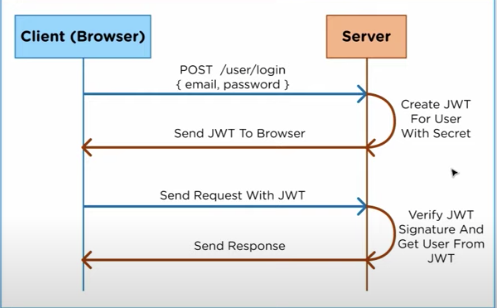

# 系统登录方案之 SSO 单点登录

一篇登录

头脑风暴

- 登录方式
- 授权方式
- 用户账号系统如何同步（我方与第三方）（授权模式）、运维同步读取（读取现有的用户表和权限、进行运维的再次构造同步）
- 理论 + 实战
- 单点登录与单点注销
- 全局会话与局部会话
- cas
- 登录方式
  - Cookie + Session 登录
  - Token 登录（JWT）
  - SSO 单点登录（优先）
  - OAuth 第三方登录
- 前后端分离
- 加密
- 应用
  - 分析百度与淘宝 SSO
  - github 授权登录
- 加密算法
  - 非对称（常用用于系统登录时，先通过接口获去公钥（后台可能通过域名判断是否发送公钥），然后把密码和公钥一起加密发送给后台，后台再使用私钥来解密。）
- 如何同步 sso 认证中心的用户表，例如给运维系统使用，可以得到授权连接它的数据，获取读写用户权限关联表的授权，然后跟现有的权限表进行关联。
- 基于 token 的认证（保存用户状态到客户端）和基于 session 的认证（保存用户状态到服务器）
- cookie 是存在于客户端不安全，因此便有了 session 的存在，session 是保存在服务端。然后把 sessionId 发送给浏览器端作为 cookie 保存下来。
- 网络安全

## 安全

## OAuth 2.0

- 授权码（authorization-code）
- 隐藏式（implicit）
- 密码式（password）
- 客户端凭证（client credentials）

注意，不管哪一种授权方式，第三方应用申请令牌之前，都必须先到系统`备案`，说明自己的身份，然后会拿到两个`身份识别码`：`客户端 ID（client ID）`和`客户端密钥（client secret）`。这是为了防止令牌被滥用，没有备案过的第三方应用，是不会拿到令牌的。

## 登录

目前的单点登录，相当于是一张图系统想要获取政务云的用户身份数据，从而进行同步登录。

这里所谓的单点登录是不是通过 iframe 嵌入进去的意思，如果是的话，就直接获取根域下的 cookie 就行了，至于用户账号权限体系这些直接（数据库的表同步）。

如果不是通过 iframe 嵌入的，可以直接共享同一个根域下的 Cookie 共享就可以了单点登录了。这里需要考虑是否还需要有一张图的退出了，因为登录都放到同一个认证中心。

方案一：

1. A 网站在请求 A 网站后端服务时，后端进行验证 cookie。（token） 是否有效，无效的话则跳转到统一认证中心进行用户的授权（比如输入账号和密码登录）。
2. 用户同意，统一认证中心就会重定向回 A 网站，同时发回一个 token。
3. A 网站后端获得 token 后，给 A 网站设置 cookie，并在统一认证中心设置该用户有效。
4. 然后 B 网站进入系统时，如何同步登录？

### 第三方登录

单点登录与第三方登录还是有区别的。一个是授权，也就是说不能在 A 网站进行退出所有关联的网站。

cookie： uid

session 是服务端自己维护的会话数据结构，可以根据 cookie 获取当前用户的 session 会话状态。

### 单系统登录

session 是另一种记录客户状态的机制，与 cookie 保存在客户端浏览器不同，session 保存在服务器当中；
当客户端访问服务器时，服务器会生成一个 session 对象，对象中保存的是 key:value 值，同时服务器会将 key 传回给客户端的 cookie 当中；当用户第二次访问服务器时，就会把 cookie 当中的 key 传回到服务器中，最后服务器会吧 value 值返回给客户端。
因此上面的 key 则是全局唯一的标识，客户端和服务端依靠这个全局唯一的标识来访问会话信息数据。

这里的 session 在单点登录中则属于本地（局部）会话。

#### 用户密码登录

- Setting up a server with Node.js and Express
- Setting up Passport with Node.js and Express
- How to encrypt user passwords
- Restricting access to routes to only logged in users
- Showing flash messages with Node.js and Express

#### cookie-sessoin


这里是 session 方案：

- 登录 （sessionid 作为客户端的 cookie 值 ）
- 注销（清除 session 对象中对应的 sessionId + value 项 ）

session 需要保存

```js
const http = require("http");
const fs = require("fs");
const url = require("url");
const qs = require("querystring");
const path = require("path");

// converts string to object
// Cookie is as string type such as `name=Jecyu;year=1994` and we need to convert this to object type such as {name: 'Jecyu', year: '1994'}
const parseCookies = (cookie = "") =>
  cookie
    .split(";")
    .map((v) => v.split("="))
    .map(([k, ...vs]) => [k, vs.join("=")])
    .reduce((acc, [k, v]) => {
      acc[k.trim()] = decodeURIComponent(v);
      return acc;
    }, {});

const session = {};

const app = http.createServer((req, res) => {
  const cookies = parseCookies(req.headers.cookie);
  if (req.url.startsWith("/login")) {
    // if the url start with `/login`
    const { query } = url.parse(req.url); // analyze url
    const { name } = qs.parse(query);
    const expires = new Date();
    expires.setMinutes(expires.getMinutes() + 1); // we set the cookie that expires in 1 minute
    
    const randomInt = +new Date();
    session[randomInt] = { // we set name and expired time in session object
      name,
      expires
    }

    
    res.writeHead(302, {
      Location: "/",
      "Set-Cookie": `session=${randomInt};Expires=${expires.toUTCString()};HttpOnly;Path=/`,
    });
    res.end();
  } else if (cookies.session && session[cookies.session].expires > new Date()) { // If cookie.session does not exceed the expiration date, we get the user information from session variable
    // if the url start with `/` and has the cookie
    res.writeHead(200, { "Content-Type": "text/html; charset=utf-8" });
    res.end(`Welcome ${session[cookies.session].name}`);
  } else {
    fs.readFile(path.join(__dirname, "./login.html"), (err, data) => {
      // relative path should be written like this `path.join(__dirname, "./login.html")` rather than './login.html' https://stackoverflow.com/questions/40678995/relative-path-readfile-error-enoent-no-such-file
      if (err) {
        throw err;
      }
      res.end(data);
    });
  }
});

module.exports = app;
```

#### JWT



#### 理论

- What JWT is
- JWT vs Session
- How JWT is secue
- When you should use JWT
- The advantages of JWT 

认证与授权是不同的概念

JSON（session data）+ Signature = JWT

JWT 不需要保存用户信息如 userId，可以用 userId 打包进 JWT 一起发送给客户端。

可以把相同的 JWT 发送给多个服务器，解决（Java、NodeJS 不同的 cookie key 名称的问题）

中间人攻击，至少上 https。

##### How JWT is secue


- header： 加密算法
- payload：携带的数据
- signature：签名

只需要加密的算法一致

##### When you should use JWT


- SSO （如果采用传统的方案的话，A 服务器带有该用户 session，但是 B 服务器没有该用户 session，那这样用户还得登录 B 应用）
- 而采用 JWT 则避免这种情况，因为 JWT 存储在客户端，可以给这两个服务器发送相同的 JWT。
- 只需要保证两个服务上都有私钥去解密。
- 对于不是 SSO 的情况，如果是集群负载均衡的话，采用 session 方案的话，得同步所有服务器的 session，而 JWT 不需要这样做。
- JWT 只需有私钥解密即可。
- 微服务，不同的域名。

##### JWT 实战

- Creating Node.js authentication middleware
- Using refresh tokens with JWT
- Authenticating users with JWT
- Invalidating refresh tokens to log users out
- How to use JWT securely

用户登录后，获得 JWT token，下次请求资源可以把 token 发送过去被服务器验证。（可以 以 cookie 的形式发送，也可以通过请求 header）。

前端获得的 JWT token，要如何解密呢？

不一定是公钥或私钥？

简单的可以使用哈希，进一步可以使用公钥、私钥。

JWT sso

刷新的 JTW key。

rest-client 可以快速测试接口。后续再进行真正的处理，但不太便于后续思路的记录。demo 的运行。

1. 单服务器测试
2. 多服务器传输测试（最终抽离为统一认证中心）

refreshToken 是需要存储的。（数据库或者 redis cache）

在 accessToken 过期后，继续获取新的 token
，通过 refreshToken 去拿。（假如现在没有登出，即用户的 refreshToken 是有效的，即可返回新的 AccessToken 给用户）

```js
app.post("/token", (req, res) => {
  const refreshToken = req.body.token;
  if (refreshToken == null) return res.sendStatus(401);
  if (!refreshTokens.includes(refreshToken)) return res.sendStatus(403);

  jwt.verify(refreshToken, process.env.REFRESH_TOKEN_SECRET, (err, user) => {
    if (err) return res.sendStatus(403);
    const accessToken = generateAccessToken({ name: user.name });
    res.json({ accessToken });
  });
});

```

这个之前在一体化中有出现过，就是用户的 token 过期后，可以通过 refreshToken 去自动请求刷新时间。

logout 用于去除 refreshToken 的一直存在。（跟 session 一样的道理）

这个使用 session 操作起来也是一样的。

#### 实战

- 登录
- 注销

### 单点登录

#### 假的单点登录

- 同域共享 cookie（目前国土系统）

单点登录与单点注销。

1. 引入一个中间态的 Server
2. 基于 CAS 的 SSO 系统

单点登录也是用了授权模式，拿到认证中心的令牌，进行对保护资源的访问。

相比于单系统登录，SSO 需要一个独立的`认证中心`，只有认证中心能接受用户的用户名密码等安全信息，其他系统不提供登录入口，只接受认证中心的间接授权。间接授权通过令牌实现，SSO 认证中心验证用户的用用户名和密码没问题，创建`授权令牌`，在接下来的跳转过程中，授权令牌作为参数发送给各个子系统，子系统拿到令牌，即得到了授权，可以借此创建局部会话，`局部会话`登录方式与单系统的登录方式相同。这个过程，也就是单点登录的原理。

#### 部署图

单点登录涉及 SSO 认证中心与众子系统，子系统与 SSO 认证中心需要通信以`交换令牌`、`检验令牌`及发起`注销请求`，因而子系统必须`集成 SSO 的客户端`，SSO 认证中心则是 `SSO 服务端`，整个单点登录过程实质是 `SSO 客户端与服务端通信`的过程。

#### 实现

JWT 统一处理。

##### 6、sso-server 接收并处理令牌请求

令牌与系统注册地址通常存储在 key-value 数据库（如 redis）中，redis 可以为 key 设置有效时间也就是令牌的有效期。redis 运行在内存中，速度非常快，正好 sso-server 不需要持久化任何数据。

令牌与注册系统地址可以用下图描述的结构存储在 redis 中，可能你会问，为什么要存储这些系统的地址？如果不存储，`注销的时候就麻烦了`，用户向 sso 认证中心提交注销请求，`sso 认证中心注销全局会话，但不知掉哪些系统用此全局会话建立了自己的局部会话，也不知道要向哪些子系统发送注销局部会话`：


## 应用


实现的功能：单点登录与单点登出

状态的同步：本地会话、全局会话的关系

涉及的实体：

- sso-client 单点登录客户端，也就是业务后台
- sso-server 单点登录服务端，也就是统一认证中心
- sso-client 对应的客户端，也就是 sso-client 对应的浏览器端。

1. 用户访问系统 1 的受保护资源，系统 1 发现用户未登录，跳转至 sso 认证中心，并将自己的地址作为参数。

```js
// express.req.session
```

2. 入口文件

```js
app.use(checkSSORedirect()); // 中间件，每次请求都进行检查 SSO 重定向检查

app.get("/", isAuthenticated, (req, res, next) => {
  res.render("index", {
    what: `SSO-Consumer One ${JSON.stringify(req.session.user)}`,
    title: "SSO-Consumer | Home",
  });
});
```


## 用户信息同步

## 参考资料

- [auth](https://auth0.com/why-auth0?utm_source=jwtio&utm_medium=navbar_whats_auth0&utm_campaign=jwt_nav_cta_12_2019)
- [jwt](https://jwt.io/)
- [Build Node.js User Authentication - Password Login](https://www.youtube.com/watch?v=Ud5xKCYQTjM)
- 理论
  - [现在用的比较多的单点登录技术是什么？](https://www.zhihu.com/question/342103776/answer/798611224?utm_source=wechat_session&utm_medium=social&utm_oi=710800537397764096&utm_content=first)
  - [全面介绍 SSO（单点登录）](https://juejin.im/post/5de46d28e51d4532c21facb3#heading-2) —— 结合项目查看
  - [OAuth 2.0 的一个简单解释](http://www.ruanyifeng.com/blog/2019/04/oauth_design.html)
  - [前端登录，这一篇就够了](https://mp.weixin.qq.com/s/VSBC_KL5UaVWHEFooUEHAA)
  - [Building A Simple Single Sign On(SSO) Server And Solution From Scratch In Node.js.](https://codeburst.io/building-a-simple-single-sign-on-sso-server-and-solution-from-scratch-in-node-js-ea6ee5fdf340)
  - [https://www.youtube.com/watch?v=7Q17ubqLfaM](https://www.youtube.com/watch?v=7Q17ubqLfaM) JWT
  - [封装 axios 拦截器实现用户无感刷新 access_token](https://juejin.im/post/5f1ba98ae51d4534b73a9d7a?utm_source=gold_browser_extension#comment)
- 实战
  - [simple-sso](https://github.com/ankur-anand/simple-sso) nodeJS 版
  - [simple-sso](https://github.com/sheefee/simple-sso/tree/0.1) Java 版
- [Authorization and Authentication For Everyone](https://dev.to/kimmaida/authorization-and-authentication-for-everyone-27j3?utm_source=digest_mailer&utm_medium=email&utm_campaign=digest_email)
