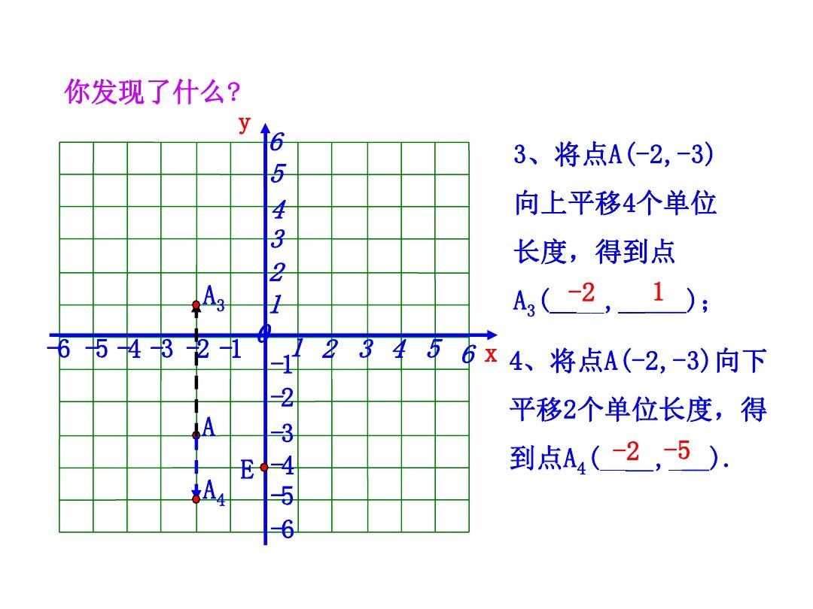
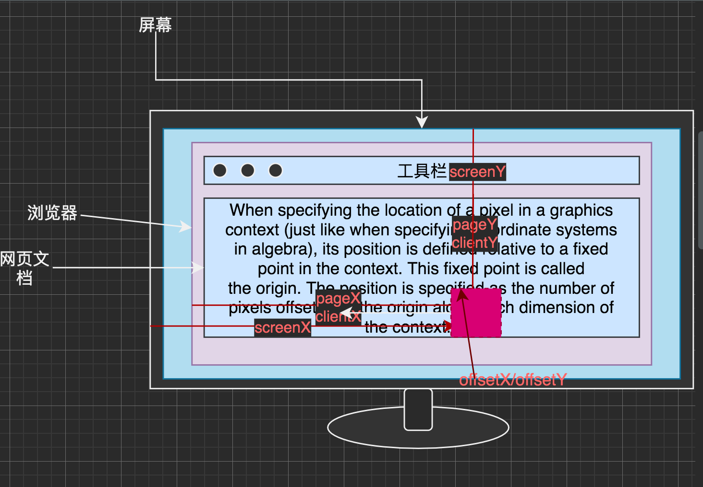
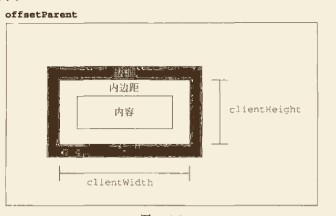
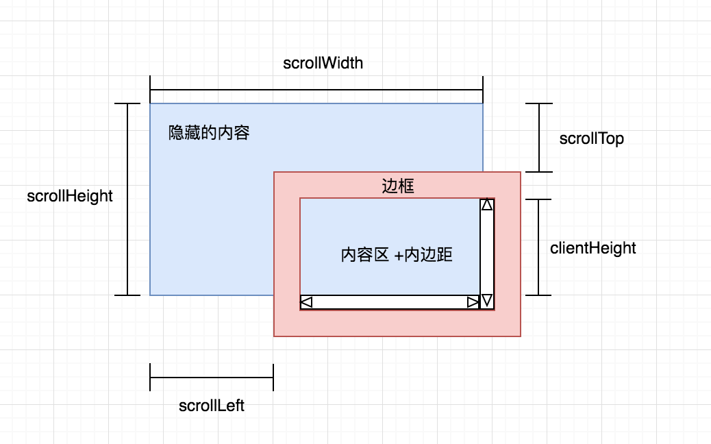
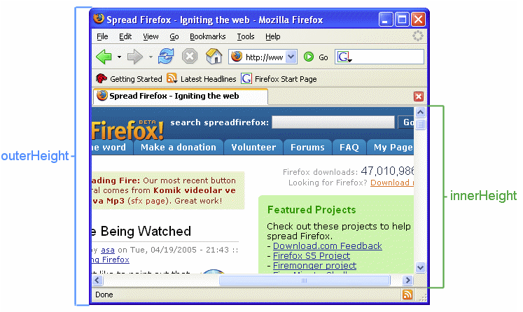
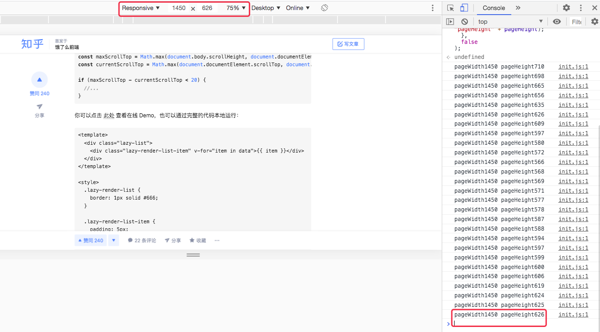

# web 元素位置尺寸与应用

## 头脑风暴

## 前言

最近在写页面、写组件中遇到不少有关于动态获取元素的大小、位置、滚动等问题，像是 offset、clientWidth 等名词，第一次遇到时快速 google 一下，原来如此！复制，粘贴，了事！第二次，第三次，遇到相同的 scrollWidth，又懵了，挠晒头。这都什么玩意，一团乱。你是否会遇到过这种情况呢？下面让我帮你整理整理吧。

本文主要讲述以下几点内容：

面向读者：

## 坐标系

在 3D 的世界中，要指定一个物体的位置，得有一个固定的参照物。
一个物体的位置是相对的，它随着参照物的不同而改变。通常，日常生活中，通常会有这样的场景，嘿，你的三点钟方向，正有一位美女向你招手。还有基友的日常骚操作，每个人自己都可以是一个参照物。

上面都是以时钟为标准的。除了时钟之外，对于描述位置的，我们最熟悉莫过于数学上的坐标系了，想起以前做过的数学题目：



但是在 web 中或者说在浏览器的坐标系是怎样的呢？


### 二维坐标系分类



在进行页面滚动的时候：


通过获取鼠标的对象，MouseEvent

- offsetX/offsetY
- clientX/clientY
- pageX/pageY
- screenX/screenY

可以把下面的代码粘贴到控制台，调试查看。

```js
document.addEventListener(
  "click",
  function(e) {
    console.log(
      "offset" + e.offsetX + "," + e.offsetY,
      "page: " + e.pageX + "," + e.pageY,
      "client: " + e.clientX + "," + e.clientY,
      "screen: " + e.screenX + "," + e.screenY
    ); // 坐标原点位于屏幕左下角，而在扩展屏幕时则会根据方向而决定（扩展左边，则原点位于左下角，扩展右边，则右下角）
  },
  false
);
```

#### Screen

屏幕坐标系，坐标原点位于屏幕的左下角。

#### Page

网页文档坐标系，坐标原点位于根节点左上角。

#### Client

客户端坐标系，浏览器窗口可见区域的左上角。

#### Offset

局部坐标系，以目标元素自身的左上角为原点。

### 三维坐标系

除了二维中坐标系外，web 中还有三维坐标系。

## 大小尺寸

浏览器

说到大小尺寸，先会说到有关浏览器的大小，有点小累，放松下，撸撸某破站。

下面这些属性都代表了哪些呢？

## 操作 API

### JS

#### Element 对象（元素大小）

- offset（偏移量）
  

  - offsetHeight
    - 元素在垂直方向占用的空间大小，以`像素`计，包括元素的高度、（可见的）水平滚动条的高度、上边框高度和下边框高度
  - offsetWidth
    - 元素在水平方向上占用的空间大小，以`像素`计。包括元素的宽度、（可见的）垂直滚动条的宽度、左边框宽度和右边框宽度。
  - offsetTop
    - 元素偏移父元素的上边边距离
  - offsetLeft
    - 元素偏移父元素的左边距离

- client（客户区大小）
  

  - clientHeight
    - 元素可视区部分，padding 和 width 属性之和，元素边框和滚动条不包括在内。
  - clientWidth
    - 元素可视区部分，padding 和 width 属性之和，元素边框和滚动条不包括在内。
  - clientLeft
  - clientTop

- scroll （滚动大小）
  

  - scrollHeight
    - 在没有滚动条的情况下，表示元素总高度，包括由于溢出而无法展示在网页的不可见部分。
  - scrollWidth
    - 在没有滚动条的情况下，表示元素总宽度，包括由于溢出而无法展示在网页的不可见部分。
  - scrollLeft
    - 元素水平滚动距离
  - scrollTop
    - 元素竖直滚动距离



```js
function isOnBottom(el) {
  if (el.scrollHeight === el.clientHeight + el.scrollTop) {
    return true;
  }
  return false;
}
/**
 * @description: 解决底部一定距离，如提前加载数据
 * @param {type}
 * @return:
 */
function isCloseToBottom(el, distance) {
  if (el.scrollHeight < el.clientHeight + el.scrollTop + distance) {
    return true;
  }
  return false;
}
```

可以写为更语义化的写法。
```js
function isOnBottom(el) {
  const maxScrollTop = el.scrollHeight - el.clientHeight;
  const currentScrollTop = el.scrollTop;
  if (maxScrollTop ===currentScrollTop) {
    return true;
  }
  return false;
}
function isCloseToBottom(el, distance) {
  const maxScrollTop = el.scrollHeight - el.clientHeight;
  const currentScrollTop = el.scrollTop + distance;
  if (maxScrollTop <= currentScrollTop) {
    return true;
  }
  return false;
}
```

如果是位于 window 上的可滚动区域，要区分 body（标准模式） 和 documentElement（混杂模式）。

```js
const maxScrollTop = Math.max(document.body.scrollHeight, document.documentElement.scrollHeight) - window.innerHeight;
const currentScrollTop = Math.max(document.documentElement.scrollTop, document.body.scrollTop);
​
if (maxScrollTop - currentScrollTop < 20) {
  //...
}
```


使用
```js
function updated(e) {
  const target = e.target || e.srcElement;
  if (isCloseToBottom(target, 400)) {
    console.log("isCloseToBottom 400px=>", target);
  }
  if (isOnBottom(target)) {
    // console.log("isOnBottom =>", target);
  } else {
    // console.log("isNotOnBottom =>", target);
  }
}
let outerDom = document.querySelector(".outer");
// 注意这里要给 outerDOM 设置 overflow: scroll-y; 否则则是 window 的滚动条件触发了
outerDom.addEventListener("scroll", updated, false);
```

#### inifite-scroll 的实现

#### screen 对象

screen 对象基本上只用来表明客户端的能力，其中包括浏览器窗口外部的显示器的信息，如像素宽度和高度等。

- height
- width
- availHeight

#### window 对象

<u>ECMAScript 是 JavaScript 的核心，但如果要在 Web 中使用 JavaScript，那么 BOM（浏览器对象模型）则无疑才是真正的核心。</u>多年来，缺少事实上的规范导致 BOM 既有意思又有问题，因为浏览器提供商会按照各自的想法随意去扩展它。于是，浏览器之间共有的对象就称为了事实上的标准。这些对象在浏览器中得以存在，很大程度上是由于它们提供了与浏览器的互操作性。W3C 为了把浏览器中 JavaScript 最基本的部分标准化，已经将 BOM 的主要方面纳入了 HTML5 的规范中。

BOM 的核心对象是 window，它表示浏览器的一个实例。在浏览器中，window 对象有双重角色，它既是通过 JavaScript 访问浏览器窗口的一个接口，又是 ECMAScript 规定的 Global 对象。这意味着在网页中定义的任何一个对象、变量和函数，都以 window 作为其 Global 对象，因此有权访问 parseInt() 等方法。




- innerWidth
  - 以 CSS pixels 单位表示的浏览器框 viewport 宽度，包括垂直滚动条（如果渲染了的话）
- innerHeight
  - 以 CSS pixels 单位表示的浏览器框 viewport 高度，包括水平滚动条（如果渲染了的话）
- outerWidth：包括了浏览器外边框的窗口宽度
- outerHeight：viewport 高度 + 浏览器的标签栏、搜索栏等
- pageYOffset
- pageXOffset
- scrollX
- scrollY

取得页面视口的大小，可以把代码在控制台执行，并打开设备模式，不断搜索窗口进行检查。

```js
window.addEventListener(
  "resize",
  function(e) {
    const pageWidth = window.innerWidth;
    const pageHeight = window.innerHeight;
    if (typeof pageWidth != "number") {
      if (document.compatMode === "CSS1Compat") {
        pageWidth = document.documentElement.clientWidth;
        pageHeight = document.documentElement.clientHeight;
      } else {
        pageWidth = document.body.clientWidth;
        pageHeight = document.body.clientHeight;
      }
    }
    console.log("pageWidth" + pageWidth, "pageHeight" + pageHeight);
  },
  false
);
```



应用场景：在 window 对象下滚动。

- 方法
  - 确定元素大小：getBoundingClientRect()
  - getClientRects()
  - scrollTo()
  - scroll()
  - scrollBy()
  - scrollIntoView()

### CSS

#### 大小

<!-- - height
- width
- max-\*
- min-\*
- vw、vh
- overflow：auto -->

#### 定位

- left/top/bottom/right
- position

absolute：相对于（position为 relative/absolute 的父元素的左上角）
relative：相对自身的中心

为了使用 position 定位一个元素，要知道两点：
- left、top、bottom、right 等的坐标原点是哪里。
- 参照物是哪个，也就是说相对于哪个父元素定位。

成为参照物的条件：

默认不设置 positon: unset，仅仅设置 position: absolute; 的话，目标元素只是停留到 parent 元素的左上角。

#### transform

空间转换

### 元素的实际大小

getBoundingClientRect()

## 应用场景

懒渲染、可视区渲染、虚拟化列表都需要尺寸

点击导航滚动到固定位置


### rem 响应式

### 滚动进度条

### 滚动图片到底部懒加载/视频自动播放

### 导航栏贴顶

### 获取滚动条的宽度 

### 创建自定义滚动指令

<!-- ### 等高

### 一个随着屏幕大小自适应高度的弹框

### 实现一个鼠标拖拽滑块功能

### 如何保持一定的长宽比

### 二维图转三维用 -->

## 参考资料

- 位置大小
  - [CSS Position: Relative vs Position Absolute](https://dzone.com/articles/css-position-relative-vs-position-absolute)
  - [<transform-function>](https://developer.mozilla.org/en-US/docs/Web/CSS/transform-function)
  - [Using CSS transforms](https://developer.mozilla.org/en-US/docs/Web/CSS/CSS_Transforms/Using_CSS_transforms): how to alter a coordinate system
  - [The transform property allows you to visually transform an element in two-dimensional or three-dimensional space.](https://tympanus.net/codrops/css_reference/transform/#:~:text=The%20Coordinate%20System,the%20center%20of%20the%20element.)
  - [Understanding SVG Coordinate Systems and Transformations (Part 2) — The transform Attribute](https://www.sarasoueidan.com/blog/svg-transformations/)
  - [Understanding the CSS Transforms Matrix](https://maqentaer.com/devopera-static-backup/http/dev.opera.com/articles/view/understanding-the-css-transforms-matrix/index.html)
  - [How to understand CSS Position Absolute once and for all](https://www.freecodecamp.org/news/how-to-understand-css-position-absolute-once-and-for-all-b71ca10cd3fd/)
  - [How to get the real scroll height of div (say, inner text size)](https://stackoverflow.com/questions/20246443/how-to-get-the-real-scroll-height-of-div-say-inner-text-size)
- 坐标系
  - [Coordinate systems](https://developer.mozilla.org/en-US/docs/Web/CSS/CSSOM_View/Coordinate_systems)
  - [w3c 规范]
  - [Coordinates](https://javascript.info/coordinates)
  - [What is the difference between screenX/Y, clientX/Y and pageX/Y?](https://stackoverflow.com/questions/6073505/what-is-the-difference-between-screenx-y-clientx-y-and-pagex-y)
  - [JS 视口坐标，屏幕坐标，页面坐标分析](https://blog.csdn.net/zshsats/article/details/79942126)
  - [浅谈响应式 Web 设计与实现思路](https://juejin.im/post/5a5093bd6fb9a01c9b65c3c2#heading-28)
  - 《JavaScript3 高级程序设计 3》
  - [JS 获取各种高度宽度、浏览器窗口滚动条的位置、元素的几何尺寸](https://blog.csdn.net/swallowliyan/article/details/44598115)
  - 第三方库
    - [infinite-scroll](https://www.npmjs.com/package/infinite-scroll)
