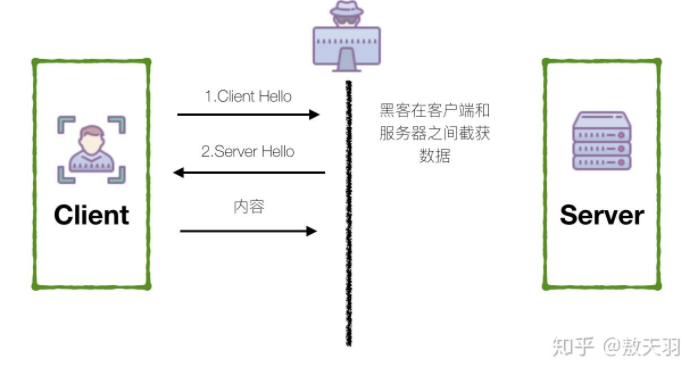
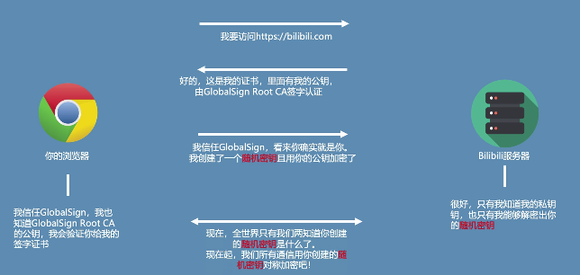

# http 与 https

- 概念
- chrome 的安全警告，从什么时候开始
- 前后端编码的差异
- 自签名证书（ArcGIS 的服务发布）
- 何为对称加密与非对称加密
- arcgis 是如何设置服务同时支持 HTTP 与 HTTPS？

目标读者
- 前端开发

## 为什么我们需要 HTTPS

中间人攻击。

你完全无法得知，你收到的结果是否是被篡改后的结果，当然，更无法保证，即使没动过的数据，是不是会被窃听。

我们叫图中的那位黑客「中间人」，也就会造成上文所说的中间人攻击。

因此后来，大家就想到了，只要手握一份密钥，是否就天下我有了。

常见的加密有两种：对称加密和非对称加密。无论对称加密还是非对称加密，密钥一旦泄漏，还是没办法。（对称加密比较快，但一份密钥非常容易泄漏，在非对加密中，公钥本身是公开的，只要截取私钥返回，需要公钥解密的部分，照样的截获数据。）（比如 JWT 中的存储问题xxxx）

于是，我们又想到了一种升级的加密方式：对称与非对称结合。

然后就变成了上图中的加密方式，我先用非对称加密的方式传输密钥，然后用对称加密传输数据，这样就可以避免了传输过程中对称加密密钥泄漏和公钥公开导致的截获数据两个问题了——但是，怎么证明你是个好人呢？

于是，终于找到了一个可信的三方机构：证书发布机构。

从上得知，HTTPS 即通讯加密，可以预防窃听和中间人攻击。当然，对于大多数用户和网站而言，最重要的是避免了各层的劫持。

Google 总结：
- 善意的或恶意的入侵者会利用你的网站和用户之间传输的每个未受保护的资源。
- 许多入侵者都会查看汇总的行为以识别你的用户。
- HTTPS 不仅可以阻止你的网站被你滥用，也是许多先进功能不可或缺的一部分，可作为类似应用功能（如服务工作线程）的实现技术。

## HTTPS 是如何工作的？

简单的来说 HTTPS 的 S，就是 SSL/TLS，SSL 是 TLS 的前身，基本上我们当成同一个 （S）看就行，换言之，HTTPS = HTTP + SSL/TLS，在 TCP 层到 HTTP 层之间加了一层 SSL。（安全套接字）

浏览器会在发起请求时帮你检验这个网站证书中的信息是否合法，是否是由授信机构发布的，如果不合法，那么就会报错，如果合法，那么就用对应颁发者的 CA 公钥解密，对服务器证书的签名解密。

之后使用 Hash 算法计算得到的证书和服务器发来的证书对应 Hash 是否一致，如果一致，代表没有被冒充。

之后读取证书中的密钥，用于后续加密通讯。🔐

## 如何为你的网站升级 HTTPS 

NGNIX 配置

## 我可以使用自签名证书吗？

当然，你自己可以用 openssl 生成一个证书，但是按照我们所讲的过程，这个证书是不受信任的，所以会有以下提示：

- 你的连接不是私密的

## HTTPS 对现有网站有影响吗？

- 第一次请求稍慢，后续跟 HTTP 一样

在 http 页面中请求 https 资源有问题吗？

有 https 页面中请求 http 资源有问题吗？

## 参考资料

- [HTTPS是如何工作的？3分钟介绍HTTPS](https://www.bilibili.com/video/BV1j7411H7vV?from=search&seid=7467835790250645901)
- [【科普】谷歌浏览器显示不安全的网站真的不安全？为什么不安全？HTTP与HTTPS科普](https://www.bilibili.com/video/BV1cb411T7Bd)
- [别闹！自签名证书！](https://zhuanlan.zhihu.com/p/41501360)
- [在https中引入http资源所导致的问题](https://juejin.im/post/6844903745931706381)
- [JS(HTTP页面)发送HTTPS请求、同源策略
](https://blog.csdn.net/Tastill/article/details/87874684)