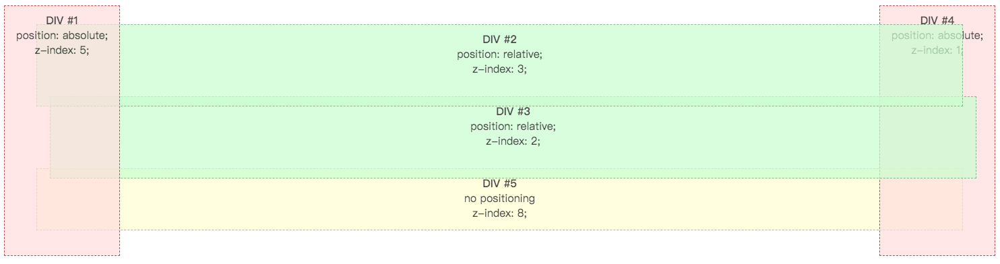

# CSS 层叠概念及应用



应用场景

- 进度条

- 可视区域渲染

- 获取最大的 zindex

- modal、popup 的设置

默认把菜单设置为最高的 z-index，因为含有下拉菜单。

JS 能够显示的数字的最大范围是：2\*\*32 ？

```js
function getMaxZIndex() {
  return Array.from(document.querySelectorAll("body *"))
    .map((a) => parseFloat(window.getComputedStyle(a).zIndex))
    .filter((a) => !isNaN(a))
    .sort((a, b) => a - b)
    .pop();
}

// or 使用 reduce 简化，除了 zIndex 还可以获取最长的数字？
```
