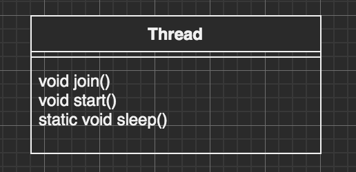
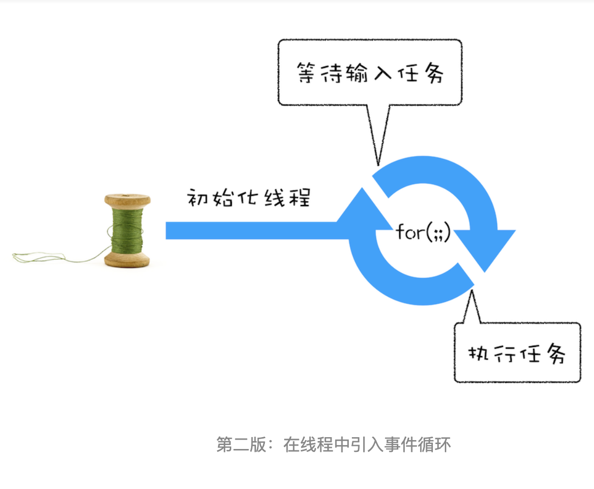
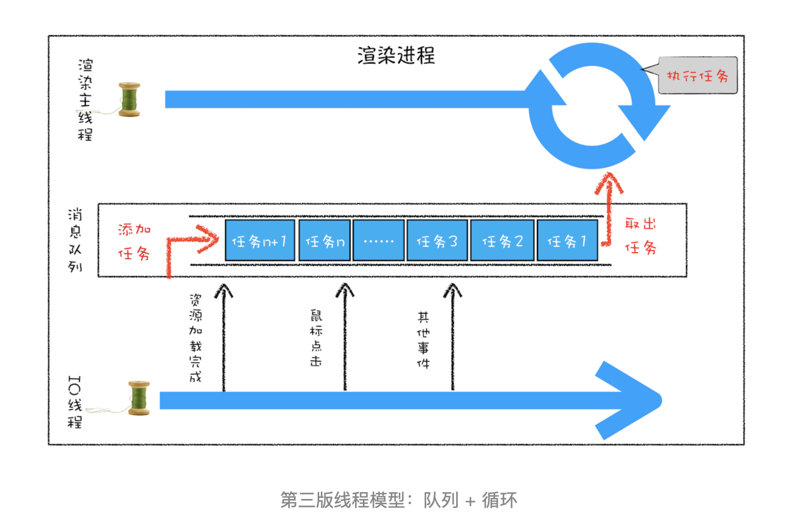
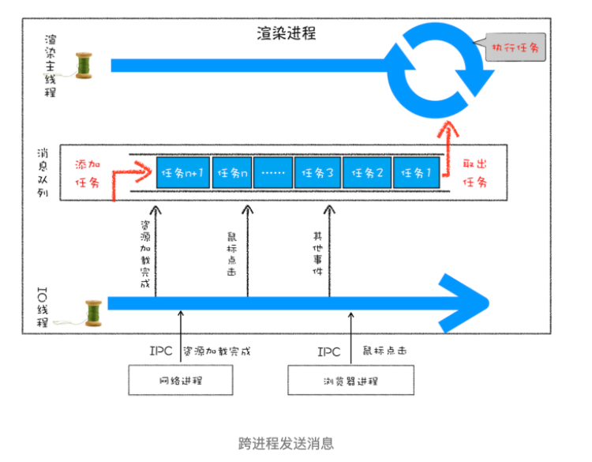
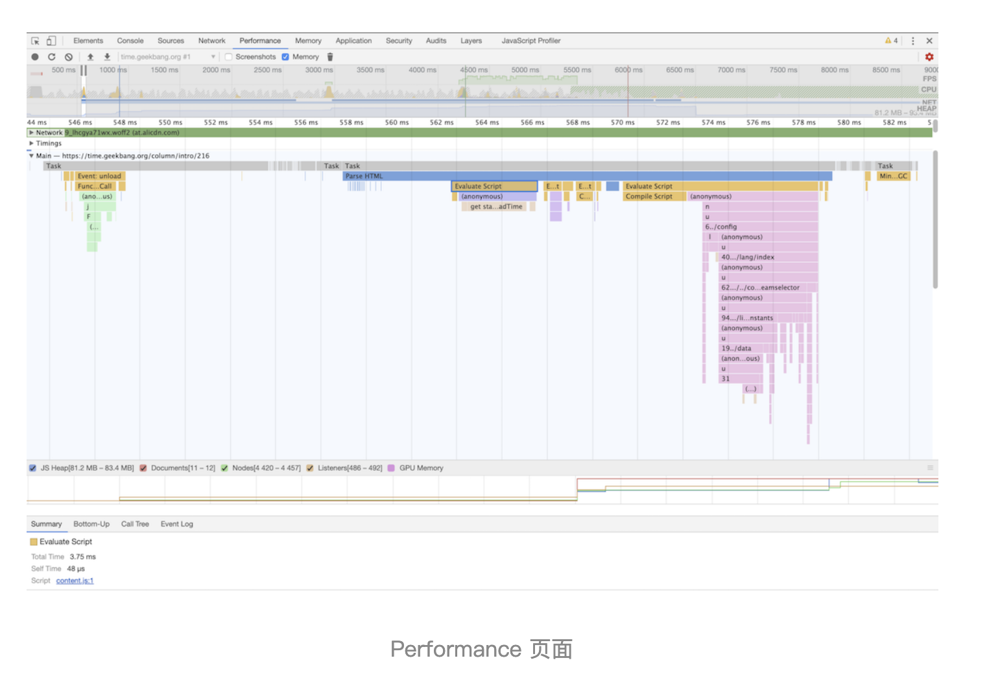

# 程序员内功——进程与线程、协程

头脑风暴：

- 需求延伸解决方案：进程-线程-协程
- 控制流与逻辑流
- 指令执行
- 生产者与消费者模式

目标读者

文章大纲

- CPU 计算
- 进程与线程
- 为什么要用多线程
- 多线程一定比单线程要快吗？
  - 什么时候使用多线程
  - 什么时候使用用单线程
- 如果采用单线程，要如何提效
  - js 单线程如何提效（事件驱动）
  - redis 单线程如何提效
- 比线程更小的执行单位：协程

## 前言

<!-- 这个知识很多地方都用到，干脆写一篇文章来对知识进行聚合 -->

运行速率 CPU > 内存 > 硬盘

现代操作系统（Window，macOS，Linux）都可以执行多任务。多任务就是同时运行多个任务，例如：

CPU 执行代码都是一条条顺序执行的，但是，<u>即使是单核 CPU，也可以同时运行多个任务。因为操作系统执行多任务实际上就是让 CPU 对多个任务轮流交替执行。</u>

## CPU 计算任务

## 进程与线程

在计算机中，我们把一个任务称为一个进程，浏览器就是一个进程，视频播放器是另一个进程，类似的，音乐播放器和 Word 都是进程。

进程和线程的关系就是：一个进程可以包含一个或多个线程，但至少会有一个线程，一个主线程。

多线程切换成本比多进程切换成本要低。

### 进程和线程之间的关系

#### 进程中的任意一线程执行出错，都会导致整个进程的崩溃。

#### 线程之间共享进程中的数据


因此如果线程 A 和线程 B 同时操作某一块数据的话，有必要同步锁住其中一个。例如浏览器渲染进程的 JS 线程与渲染线程。

#### 当一个进程关闭之后，操作系统就会回收进程所占用的内存

#### 进程之间的内容相互隔离

### 浏览器历史架构回顾

浏览器架构变迁

单进程、单线程

- 不稳定
- 不流畅
- 安全

多进程

目前多进程

- 浏览器进程
- 渲染进程
- GPU 进程（目前 chrome 无论是否 3D，都用 GPU 进程 进行页面渲染。）
- 网络进程
- 插件进程

多进程

- 更高的资源占用。
- 更复杂的体系架构

### 多线程


Java 语言内置了多线程支持：一个 Java 程序实际上是一个 （虚拟机）JVM 进程，JVM 进程用一个主线程来执行 `main()` 方法，在 `main()` 方法内部，我们又可以启动多个线程。此外，JVM 还有负责垃圾回收的其他工作线程等。



java.lang.Thread 是个表示线程的类，它有启动线程、连接线程和让线程闲置的方法（这里列出重要的几个）。

当有超过一个以上的`执行空间`时，看起来会像是有好几件事同时发生。实际上，只有真正的多处理器系统能够同时执行好几件事情，但使用 Java 的线程可以让它看起来好像同时都在执行中。也就是说，<u>执行动作可以在执行空间非常快速地来回切换，因此你会感觉到每项任务都在执行。</u>

即使是多核 CPU，因为通常任务的数量远远多于 CPU 的核数，所以任务也是交替执行的。也就是说是并发，而不是并行计算。

### 实现多线程

线程是独立的线程，它代表独立的执行空间。每个 Java 应用程序会启动一个主线程——将 `main()` 放在它自己执行空间的最开始处。
要记得 Java 也只是个在底层操作系统上执行的进程。一旦轮到 Java 执行的时候，Java 虚拟机实际上会执行什么？哪个字节码会被执行？答案就是目前执行空间最上面的会被执行！在 100 个毫秒内，目前执行程序代码可能会被切换到不同空间上的不同方法内。

每个 Thread 需要一个任务来执行，一个可以放在执行空间的任务。实现多任务计算。

```java
public class Main {
	public static void main(String[] args) {
		new Thread1().start();
		new Thread2().start();
		System.out.println("back in main");
	}

}
class Thread1 extends Thread {
  @Override
	public void run() {
			System.out.println("Thread-1: running...");
		}
	}
}

class Thread2 extends Thread {
  @Override
	public void run() {
			System.out.println("Thread-2: running...");
		}
	}
}
```

虽然是多线程执行，但是由于要执行的任务多，导致线程多于 CPU 的数量，因此还需要有`线程调度器`(scheduler)的出现，来处理线程的执行问题。

线程调度器会决定哪个线程从等待状况中被挑出来运行，以及何时把哪个线程送回等待被执行的状态。它会决定某个线程要运行多久，当线程被踢出时，调度器也会指定线程要回去等待下一个机会或者是暂时地堵塞。

比如，浏览器的渲染进程中，不能让 JS 线程一直在执行，在它执行完一个宏任务后，就阻塞它（locked）（如果这个宏任务太久了，就有必要开启多个 worker 线程了），让渲染线程来绘制画面。

两个线程就开始同时运行了，并且由操作系统调度，程序本身无法确定线程的调度顺序。要模拟并发执行的效果，可以让线程睡眠。

### 多线程的并发问题

`并行性（concurrency）`问题会引发`竞态状态（condition）`。竞争状态会引发数据的损毁。

这一切都来自于可能发生的一种状况，两个或两个以上的线程存取单一对象的数据。也就是说两个不同执行空间上的方法都在堆上对同一个对象执行 `getter` 或 `setter`。

两个线程各自认为自己是宇宙的中心，只关心自己的任务。因为线程会被打入可执行状态，此时基本上是昏迷过去的，当它回到执行中的状态时，根本不知道自己曾经不省人事。

#### 加锁

应用：单例模式（如果多个线程读取，会 new 的时候有问题）

## 为什么要用多线程

<!-- 回顾历史：

单核 CPU 的出现是解决了什么？双核是解决了什么。进程的出现。多进程的出现。线程的出现。多线程的出现。 -->

<u>使用多线程的最大原因是因为单线程只会映射到一个 CPU 上，而多线程会映射到多个 CPU 上。</u>对于多 CPU 而言，是最大限度地利用 CPU 资源。现今，新出的电脑几乎都是两核以上的了。

对于在单核 CPU 采用多线程的话，不会提供程序的执行速度，因为线程切换需要消耗时间，但对于用户来说，可以减少用户的响应时间。比如要执行一个网络任务，单线程需要一直在等待中，这是 CPU 不能做其他事情。

至于浏览器所说的事件驱动，这也是浏览器渲染进程的`事件触发线程`合作把事件添加进任务队列 ，才能使 JS 单线程提取能够来异步执行请求任务（但是如果这个异步请求事件触发频率很高，那么 `JS 引擎单线程`还是会影响阻塞 `渲染线程`，就会导致有问题，才会有 `WebWorker` 处理。至于长轮询，可以使用 socket 来处理，服务端推送信息。

创建 Worker 时，JS 引擎向浏览器申请开一个`子线程`（子线程是浏览器开的，完全受`主线程`控制，而且不能操作 DOM）。JS 引擎线程与 worker 线程间通信通过特定的方式通信（postMessage API，需要通过序列号对象来与线程交互特定的数据）。）

Java 本身支持多线程，对于不支持多线程的 JS 也可以向浏览器申请子线程来做非常耗时的工作如解码视频。而 JS 引擎是单线程的，这一点的本质仍然未改变，Worker 可以理解是浏览器给 JS 引擎开的外挂，专门用来解决那些大量计算问题。

目前 Web Worker 有：

- Service Worker ，需要支持 https 协议。
- WebWorker
- SharedWorker

## 多线程一定比单线程跑得快吗？

多线程会缓慢的原因：上下文切换、创建线程开销。

首先单线程不会切换，这样它一直在执行这个线程照道理不是更快吗？但是就没有很好地利用多核处理器的优势了，而是有时候我们不想计算机一直执行某个计算任务，应该在 A 任务。如果 java 多线程在单核计算机里又是如何被对待呢？（浏览器渲染进程：JS 语言没有支持多线程，JS 单线程通过事件驱动来处理，关联了任务队列。）

Java 多线程编程的特点又在于：

- 多线程模型是 Java 程序最基本的并发模型；
- 后续读写网络 、数据库、Web 开发等都依赖 Java 多线程基础。

## 如果采用单线程，要如何提效

### 为什么 JavaScript 是单线程？

JavaScript 语言的一大特点就是单线程，也就是说，同一个时间只能做一件事。那么，为什么 JavaScript 不能有多个线程呢？这样能提高效率啊。

JavaScript 的单线程，与它的用途有关。<u>作为浏览器脚本语言，JavaScript s 的主要用途是与用户互动，以及操作 DOM。这决定了它只能是单线程，否则会带来很复杂的同步问题。</u>比如，假定 JavaScript 同时有两个线程，一个线程在某个 DOM 节点上添加内容，另一个线程删除了这个节点，这时浏览器应该以哪个线程为准？

所以，为了避免复杂性，从一诞生，JavaScript 就是单线程，这已经成了这门语言的核心特征，将来也不会改变。

为了利用多核 CPU 的计算能力，HTML5 提出 `Web Worker` 标准，允许 JavaScript 脚本创建多个线程，<u>但是子线程完全受主线程控制，且不得操作 DOM</u>。所以，这个新标准并没有改变 JavaScript 单线程的本质。

创建 Worker 时，JS 引擎向浏览器申请开一个子线程（子线程是浏览器开的，完全受主线程控制，而且不能操作 DOM）
JS 引擎线程与 worker 线程间通过特定的方式通信（postMessage API，需要通过序列化对象来与线程交互特定的数据）

#### 浏览器主线程就是 js 引擎线程吗？

浏览器主线程就是 js 执行的线程的，可以在 js 引擎线程中编写 Web Worker 申请线程。

The main thread is where a browser processes user events and paints. By default, the browser uses a single thread to run all the JavaScript in your page, as well as to perform layout, reflows, and garbage collection. This means that long-running JavaScript functions can block the thread, leading to an unresponsive page and a bad user experience.

Unless intentionally using a web worker, such as a service worker, **JavaScript runs on the main thread, so it's easy for a script to cause delays in event processing or painting.** The less work required of the main thread, the more that thread can respond to user events, paint, and generally be responsive to the user.

- [Main thread](https://developer.mozilla.org/en-US/docs/Glossary/Main_thread#:~:text=The%20main%20thread%20is%20where%20a%20browser%20processes%20user%20events%20and%20paints.&text=Unless%20intentionally%20using%20a%20web,in%20event%20processing%20or%20painting.)

### 在线程运行过程中处理新任务

并不是搜有的任务都是在执行之前就安排好的，大部分情况下，`刷新的任务是在线程运行过程中产生的`。

要想在线程运行过程中，能接收并执行新的任务，就需要采用`事件循环机制`。

```js
int GetInput() {
  int input_number = 0;
  cout<<" 请输入一个数：";
  cin>>input_number;
  return input_number;
}
// 主线程（Main Thread）
void MainThread() {
  for(;;) {
    int first_num = GetInput();
    int second_num = GetInput();
    result_num = first_num + second_num;
    print("最终计算的值为:%d", result_num);
  }
}
```



- 引入循环机制，具体实现方式是在线程语句最后添加了一个 for 循环语句，线程会一直循环执行
- 引入了事件，可以在线程运行的过程中，等待用户输入的数字，等待过程中线程处于暂停状态，一旦接收到用户输入的信息，那么线程就会被激活，然后执行相加运算，最后输出结果。

判断是否有事件发生触发新的任务，激活线程执行。

### 处理其他线程发送过来的任务

事件循环只是解决了线程内部的任务问题，如果另外一个线程想让主线程执行一个任务，就需要用到`消息队列`。



注：这里的 IO 线程包括（事件触发线程、异步请求线程等）？

通过消息队列，我们实现了线程之间的消息通信。

例如一个鼠标点击事件，通过`事件触发线程`发送消息给主线程的`消息队列`，主线程执行的任务都全部从消息队列中获取。所以如果有其他线程想要发送任务让主线程去执行，只需要将任务添加到该消息队列中就可以了

```bash
Task clickTask;
task_queue.pushTask(clickTask)
```

### 处理其他进程发送过来的任务

通过消息队列，我们实现了线程之间的消息同学。在 Chrome 中，跨进程之间的任务也是频繁发生的，那么如何处理其他进程发送过来的任务？



### 消息队列中的任务类型

内部消息类型，如输入事件（鼠标滚动、点击、移动）、微任务、文件读写、WebSocket、JavaScript 定时器等。

除此之外，消息队列中还包含了很多与页面相关的事件，如 JavaScript 执行、解析 DOM、样式计算、布局计算、CSS 动画等。

以上这些事件都是在主线程中执行的，所以在编写 Web 应用时，你还需要衡量这些事件所占用的时长，并想办法解决单个任务占用主线程过久的问题。

#### GUI 渲染线程与 JS 引擎线程互斥

因为 JS 引擎可以修改 DOM 树，那么如果 JS 引擎在执行修改了 DOM 结构的同时，GUI 线程也在渲染页面，那么这样就会导致渲染线程获取的 DOM 的元素信息可能与 JS 引擎操作 DOM 后的结果不一致。为了防止这种现象，GUI 线程与 JS 线程需要设计为互斥关系，当 JS 引擎执行的时候，GUI 线程需要被冻结，但是 GUI 的渲染会被保存在一个队列当中，等待 JS 引擎空闲的时候执行渲染。
由此也可以推出，<u>如果 JS 引擎正在进行 CPU 密集型计算，那么 JS 引擎将会阻塞，导致主线程执行的这个 JS 任务长时间不空闲，</u>导致渲染进程一直不能执行渲染，页面就会看起来卡顿卡顿的，渲染不连贯，所以，要尽量避免 JS 执行时间过长。

#### JS 引擎线程与事件触发线程、定时触发器线程、异步 H TTP 请求线程

JS 执行任务也是在主线程，那其他线程在干嘛？ JS 单线程用来做什么的？

**主线程就是 JS 执行所在的线程**

事件触发线程、定时触发器线程、异步 HTTP 请求线程（还包括 GUI 线程的事件回调比如 Composite Layers。）三个线程有一个共同点，那就是使用回调函数的形式，当满足了特定的条件，这些回调函数会被执行。**这些回调函数被浏览器内核理解成事件，发送消息给主线程，添加进去`任务队列`**，遇到需要执行的 JS 任务，则等待 JS 引擎空闲执行。（JS 引擎线程本身也维护了自己的任务队列。

**主线程这里相当于是一个调度的作用**，执行 JavaScript 时，会让 JS 线程来做这个工作。只不过它相当于一个入口，就像 Java 中的 `main()` 线程一样。例如事件触发线程会在异步网络请求完成后，会把这个新任务提交到主线程，主线程执行后就会调用 JS 线程来执行回调函数，如果这个执行 JS 任务过久的话，就会阻塞页面的渲染，Chrome 锁定了 DOM。GUI 更新会被保存在一个队列中等到 JS 引擎空闲时立即被执行，因此才会有 worker 申请子线程。


现在可以在主线程，通过 worker 申请子线程，但是子线程是不能操作 DOM 的。

渲染主线程会频繁接收到来自于 IO 线程的一些任务，接收到这些任务之后，渲染进程就需要着手处理，比如接收到资源加载完成的消息后，渲染进程就要着手进行 DOM 解析了；接收到鼠标点击的消息后，渲染主线程就要开始执行相应的 JavaScript 脚本来处理该点击事件。



从图中可以看出，我们点击展开了 Main 这个项目，其记录了主线程执行过程中的所有任务。图中灰色的就是一个个任务，每个任务下面还有子任务，其中的 Parse HTML 任务，是把 HTML 解析为 DOM 的任务。值得注意的是，在执行 Parse HTML 的时候，如果遇到 JavaScript 脚本，那么会暂停当前的 HTML 解析而去执行 JavaScript 脚本。

执行完 CompoisiteLayer 任务后，主线程就会通知 GUI 线程去绘制渲染。

### 消息队列机制并不是太灵活，为了适应效率和实时性，引入了微任务

通常我们把消息队列中的任务称为宏任务，每个宏任务中都包含了一个微任务队列，在执行宏任务的过程中，如果 DOM 有变化，那么就会将该变化添加到微任务列表中，这样就不会影响到宏任务的继续执行，因此也就解决了执行效率的问题。

等宏任务中的主要功能都直接完成之后，这时候，渲染引擎并不着急去执行下一个宏任务，而是执行当前宏任务中的微任务，因为 DOM 变化的事件都保存在这些微任务队列中，这样也就解决了`实时性`问题。

主线程执行完一个宏任务后，就会进行渲染线程执行绘制画面了。

## 协程

跟 setTimeout 有点类似。

```cs
using System;
using System.Collections;
using System.Collections.Generic;

namespace Basic
{
  class MainClass
  {
    public static void Main(string[] args)
    {
      IEnumerable<int> numbers = MainClass.SomeNumbers();
      foreach (int number in numbers)
      {
        Console.Write(number.ToString() + " ");
      }
    }

    public static IEnumerable<int> SomeNumbers() // 返回一个可枚举的类型，带有 Enumerator 属性
    {
      yield return 3;
      yield return 5;
      yield return 8;
    }
  }
}
```

SomeNumbers 是一个简单的迭代器方法，里面分别用到了三次 `yield return` 语句。

SomeNumbers 被调用的时候，其函数体并不会执行，而是给变量 numbers 赋值了一个 `IEnumberable<int>` 类型。

每一次 `foreach` 循环执行的时候，`numbers` 的 `MoveNext` 方法会被调用到，`MoveNext` 方法会执行 `SomeNumbers` 方法内的语句，直到碰到 `yield return` 语句。

当碰到 `yield return` 语句时，`SomeNumbers` 方法将终止执行，并将 `yield return` 的值赋给 `number`。但并不代表 `SomeNumbers` 方法以及 ing 全部执行完毕，等到**下一次** `foreach` 循环执行时，代码会从上一次返回的 `yield return` 语句**之后**开始继续执行，直到函数结束或者遇到下一个 `yield return` 语句为止。

简而言之，`yield return` 的意义是返回一个值给 `foreach` 的每次迭代，然后`终止`迭代器方法的执行。等到下一次迭代时，迭代器方法会从`原来看的为止继续往下`运行。

可以理解为迭代器方法 `SomeNumbers` 为一个生产者，`foreach` 循环的每次循环 `MoveNext` 是一个消费者。每一次循环往下移动一格，消费者便要向迭代器方法要一个值。所以，yield 在其中的意思应该是 `产出`的意思，而且是按需生产的意思。

`yield break` 则可以视为`终止产出` 的意思，即结束迭代器的迭代。

### 什么是 Coroutine

Coroutine 翻译过来就是协程，和线程 Threads 是两个完全不同的概念。（自己交出控制权）

线程是完全异步的，在多核 CPU 上可以做到真正的并行。正是由于完全并行的自由，导致线程的编程特别麻烦。

比如：A 线程在读取一个变量的值时，B 线程可能正在给这个变量重新赋值，导致 A 线程读到的值并不准确。为了保证一个变量同一时刻只有一个线程访问，需要给变量加上锁，当线程访问完毕后记得解锁。

`协程`则是线程中执行的一短代码，它并不能做到真正异步。协程的代码可以只执行其中一部分，然后`挂起`，等到未来一个`恰当时机`再从原来挂起的地方`继续向下执行`。

这个可以联系上面提到的 `yield return` 语句，只执行一部分的代码，直到下一个 `yield return` 语句，然后挂起，直到恢复时接着之前的代码继续向下执行。

在 Unity 中的协程就用到了 `yield return` 语句，只不过跟上述的简单 `foreach` 循环不同。<u>Unity 是在游戏的每一`帧`（frame）中去检查是否需要从挂起的地方恢复继续向下执行。</u>

### yield return null

```cs

using UnityEngine;
using System.Collections;

public class CoroutineDemo01 : MonoBehaviour
{
  // Use this for initialization
  void Start()
  {
    StartCoroutine(ReturnNull());
    print("Start Ends");
  }

  // Update is called once per frame
  void Update()
  {
    print("Update");
  }

  IEnumerator ReturnNull()
  {
    print("ReturnNull Invoked");
    while (true)
    {
      print("before yield return null");
      yield return null;
      print("after yield return null");
    }
  }
}

```

以上代码输出为：

```bash
ReturnNull Invoked
before yield return null
Start Ends
Update
Update
after yield return null
before yield return null
Update
after yield return null
before yield return null
Update
after yield return null
before yield return null
Update
after ...
```

`StartCoroutine` 函数启动了一个协程方法 `ReturnNull`。

可以看到 `ReturnNull` 的函数体在 `StartCoroutine` 后立刻被执行，于是输出；饿 `ReturnNull Invoked` 和 `before yield return null`。之后便输出 `Start Ends`，并没有输出 `after yield return null`，说明代码在此终端。根据 yield 的用法，我们知道这只是一次暂时的挂起，在未来某个时候 `after yield return null` 将会输出。

紧接着输出了 `Update` ，这是我们的第一帧。后续的输出则构成了一个三句话的无限循环：

```
Update
after yield return null
before yield return null
```

为什么会是这样的输出呢？要理解这个之前，我们首先需要知道 Unity 在一帧中都干了些什么，而且它们是以怎样的顺序执行的。

### Unity 的时序


以上是 Unity 一帧内做的事情，可以看到 `yield return null` 是在 `Update` 之后执行。

现在我们来试着理解以上代码的输出过程。

首先，第一帧的 Update 输出了一个 `Update`，因为协程是在 `Start` 函数里开始的，所以要在下一帧才能从挂起状态恢复。

第二帧，从时序图可以看到，Mono 的 Update 函数先执行，所以会先输出一个 `Update`，然后协程被恢复运行。因为上一次协程是在 `yield return null` 被挂起的，所以协程会从它的下一句恢复，也就是 `print("after yield return null")`。意味代码处在一个无限循环中，所以 `print("before yield return null")` 会紧接着被执行到。接下来又执行到 `yield return null`，此时协程会再次被挂起，直到下一帧 Update 之后再恢复。

我们稍微总结一下：`yield return null` 是协程的`挂起点`，即协程内的代码块执行到这里将被挂起（包括方法体的执行状态都被暂存起来）。它同时也是一个`恢复点`，即在下一帧 Update 之后，将会执行它的下一句代码，直到函数结束或者遇到下一个 `yield return null`。

### 其他的用法

#### yield break

`yield break` 表示退出协程，即协程将不会从挂起点被恢复。在 `yield break` 之后的协程内的代码将都不会被执行到。

我们可以用这个方式来彻底终止协程的运行。

#### StartCoroutine & StopCoroutine

`StartCoroutine` 表示开始一段协程，它有两种方式：

```cs
public Coroutine StartCoroutine(IEnumerator routine);
public Coroutine StartCoroutine(string methodName, object value = n)
```

一种是用 `IEnumerator` 对象启动，例如上例的 `ReturnNull()`

另一种是以协程名启动，例如上例的协程启动可以写成：`StartCoroutine("ReturnNull")`

`StopCoroutine` 表示彻底终止一端协程，两种不同的启动方式，但必须与终止方式一一对应着：

```cs
public void StopCoroutine(string methodName);
public void StopCroutine(IEnumerator routine);
```

因为 `StopCoroutine(string methodName)` 的方式的性能开销（字符串查找）会比 `StopCoroutine(IEnumerator routine)` 更高一些，且前者的开始方式只能给协程传递`一个`参数，所以我们一般会倾向于使用 `StartCoroutine(IEnumerator routine)` 来开启协程。

不过，为了能使用 `StopCoroutine(IEnumerator routine)` 来终止协程运行，我们需要将开始协程的 `IEnumerator` 对象暂存起来。

#### yield return xxxx

上述所说的 `yield return null` 是最简单的协程类型，即在每一帧 `Update` 之后恢复。

在 Unity 中，还支持了其他的一些类型，举例如下：

`yield return new WaitForSeconds(1.5f)`，表示在 1.5 秒之后将协程恢复，从时序图中可以看到它的恢复也将在 Update 之后执行。

`yield return new WaitForEndOfFrame()`，表示在一帧的最后阶段将协程恢复，从时序图可以看到它的恢复将在一帧的最后执行，此时物理逻辑，游戏逻辑和渲染逻辑都已执行完毕。

`yield return new WaitForFixedUpdate()`，表示在物理引擎这一帧运算完毕后将协程恢复，从时序图可以看到它的恢复在物理运算的最后一步，在 FixedUpdate 之后执行。

`yield return new WWW("https://wuzhiwei.net/photo/photo1.jpg")`，表示通过 WWW 访问网址 `https://wuzhiwei.net/photo/photo1.jpg`，将图片下载完毕时将协程恢复。

`yield return StartCoroutine(routine)`，这是一种比较特殊的方式，即组合协程。即这个协程的恢复条件是 `routine` 这个协程的运行已经`彻底终止`。

例如：

```cs
using UnityEngine;
using System.Collections;

public class CoroutineDemo02 : MonoBehaviour
{
  // Use this for initialization
  void Start()
  {
    StartCoroutine(Test());
  }

  // Update is called once per frame
  void Update()
  {

  }
  private IEnumerator Test()
  {
    Debug.Log("Test Method Starts");
    yield return StartCoroutine(Test2());
    Debug.Log("Test Method Ends");
  }

  private IEnumerator Test2()
  {
    Debug.Log("Test2 Starts");
    int i = 0;
    while (i < 3)
    {
      Debug.Log("Before " + i);
      yield return null;
      Debug.Log("After" + i);
      ++i;
    }
  }
}

```

输出如下：

```bash
Test Method Starts
Test2 Starts
Before 0
After 0
Before 1
After 1
Before 2
After 2
Test Method Ends
```

只有当 `TestCoroutine` 中的 `i == 3` 时，`TestCoroutine` 这个协程将彻底终止，此时 `Test` 将被恢复，才输出了 `Test Method Ends`

### 应用场景

#### 延时执行一段代码

```cs
IEnumerator WaitForDoSomeThing() {
	yield return new WaitForSeconds(1.5f);
	DoSomeThing();
}

```

`StartCoroutine(WaitForDoSomething())` 开启协程后，在过 1.5 秒 `DoSomeThing()` 方法将被执行到。因为遇到 `yield return`，协程会被挂起，1.5 秒后，将会从挂起点恢复，向下执行 `DoSomeThing()` 方法。

#### 做进度的更新

比如下载一张图片：

```cs
IEnumerator WaitForDownLoad() {
	WWW www = new WWW("https://edmullen.net/test/rc.jpg");
	while(!www.isDone) {
		print(www.progress);
		yield return null;
	}
	print("photo ready!")
}
```

我们在图片下载完成之前（间接不阻塞主线程，通过协程时间分片），我们可以在每一帧中更新图片下载的进度，从而可以更新 Loading 条之类的进度指示器来提示玩家。

我们当然也可以在 `Update` 方法中来做这件事，这样可能更明显一点，但是有以下两个缺陷：

1. Update 每帧都会执行到，也就意味着 `www.isDone` 的条件判断会贯穿于整个游戏的生存周期，这样在图片下载完毕后会带来没必要的性能开销。（在协程中可以在图片下载完毕后，终止当前的协程。并且由于 www 不再被使用，会被垃圾回收）
2. 代码的聚合型不强，Update 里的逻辑会越来越多，而使用协程可以将逻辑内聚到协程内部。

加载场景：

```cs

  private IEnumerator LoadScene(int sceneNum)
  {
    asyncOperation = SceneManager.LoadSceneAsync("Level1");
    // 不允许就啊这完毕自动切换场景，因为有时候加载太快了就看不到加载进度条 UI 效果
    asyncOperation.allowSceneActivation = false;

    // 等待协程完全加载完毕，每次都会执行
    while (!asyncOperation.isDone && asyncOperation.progress < 0.8f)
    {
      // 执行到此语句时，程序会挂起，等待下一帧才会继续执行后面的代码
      yield return asyncOperation;
    }
  }
```

当 asyncOperation.isDone 后，不再有 yield 挂起状态，这个时候方法体内的数据都会被回收？

<!-- ```cs

using System.Collections;
using System.Collections.Generic;
using UnityEngine;

public class Countdown : MonoBehaviour
{
  // Start is called before the first frame update
  void Start()
  {
    StartCoroutine(CountdownCoroutine());
  }

  // Update is called once per frame
  void Update()
  {

    //Debug.Log("Update A frame!");
  }

  private IEnumerator CountdownCoroutine()
  {
    int seconds = 0;
    for (float timer = 3; timer >= 0; timer -= Time.deltaTime)
    {
			// 这里记录了下一帧执行，然后继续执行下面的代码
      yield return 0; // 当下一帧刷新后，继续回到上一次停留的位置，这个时候 second 已经变化了。
      seconds++;
      Debug.Log("This message appears after 3 seconds!");
      Debug.Log("seconds" + seconds);

    }
  }
}

```
在 yield 的地方停止该方法，然后在下一帧继续调用这个方法，只不过 timer 的状态被保存下来了（通过 yield return 值获得），跟闭包很像。 -->

### 总结及注意点

- 协程不是线程，不能做到真正异步。协程是运行在 Unity 主线程中的一段代码，它能被挂起，然后在`未来`的某个时刻从挂起的位置恢复执行。
- `yield return <expression>` 格式，表示协程的挂起点和未来的恢复点，究竟具体什么样的未来（一帧之后或 n 秒后或者其他等等），取决于 `<expression>` 具体是什么。
- `yield break` 格式，表示彻底退出协程，且其之后的协程代码将不会被执行到。
- `WaitForSeconds` 会受到 `Time.timeScale` 的影响，当 `Time.timeScale` 为 0 时，协程将永远不会被恢复。如果一定要用真实时间可以用 `WaitForSecondRealtime`，它不会受到 `Time.timeScale` 的影响。

## 小结

## 参考资料

- 协程
  - [Unity3D 协程介绍 以及 使用](https://blog.csdn.net/huang9012/article/details/38492937)
  - [漫画：什么是协程？](https://mp.weixin.qq.com/s/57IERpGIlvRwYCh6vSbMDA)
  - [知乎协程话题](https://www.zhihu.com/topic/19890065/top-answers)
  - [对 Unity 中 Coroutines 的理解](https://wuzhiwei.net/unity_coroutines/)
  - [协程](https://docs.unity3d.com/cn/current/Manual/BestPracticeUnderstandingPerformanceInUnity3.html)
  - [ 详解 Unity3D 中的协程（Coroutine）](https://www.coolketang.com/static3D/5a7f0028ee920a0044544e4f.html)
- [浏览器工作原理与实践](https://blog.poetries.top/browser-working-principle/guide/part1/lesson01.html#%E4%BB%80%E4%B9%88%E6%98%AF%E5%B9%B6%E8%A1%8C%E5%A4%84%E7%90%86)
- [面试官：多线程一定比单线程跑得快吗？](https://zhuanlan.zhihu.com/p/95005766)
- [多线程就一定比单线程快吗？](https://blog.csdn.net/u013568373/article/details/93488554)
- [多线程为什么比单线程快呢？](https://blog.csdn.net/BigJacky/article/details/51588956)
- 《Java 并发编程》
- 《Head First Java》
- [浅谈浏览器多进程与 JS 线程](https://segmentfault.com/a/1190000013083967#item-6-2)
- [JavaScript 单线程与异步](https://cloud.tencent.com/developer/article/1393277)
- [Java 主线程和其余线程的区别和实践（Main、Runnable、Thread）](https://blog.csdn.net/wd2014610/article/details/85291597)
- [javascript 既然是单线程语言 ， 为什么会分主线程和消息线程(event loop) ?]()
- [JavaScript 运行机制详解：再谈 Event Loop](http://www.ruanyifeng.com/blog/2014/10/event-loop.html)
- [史上最全！图解浏览器的工作原理](https://www.infoq.cn/article/CS9-WZQlNR5h05HHDo1b)
- [高性能网络通信库中为何要将侦听 socket 设置成非阻塞的？](https://mp.weixin.qq.com/s/jMPSkC7XdHc-v8_WslkBQA)
- [one thread one loop 程序的基本结构](https://mp.weixin.qq.com/s?__biz=MzU2MTkwMTE4Nw==&mid=2247487973&idx=2&sn=140004b0dfde45745091ab5c6522dcba&scene=21#wechat_redirect)
