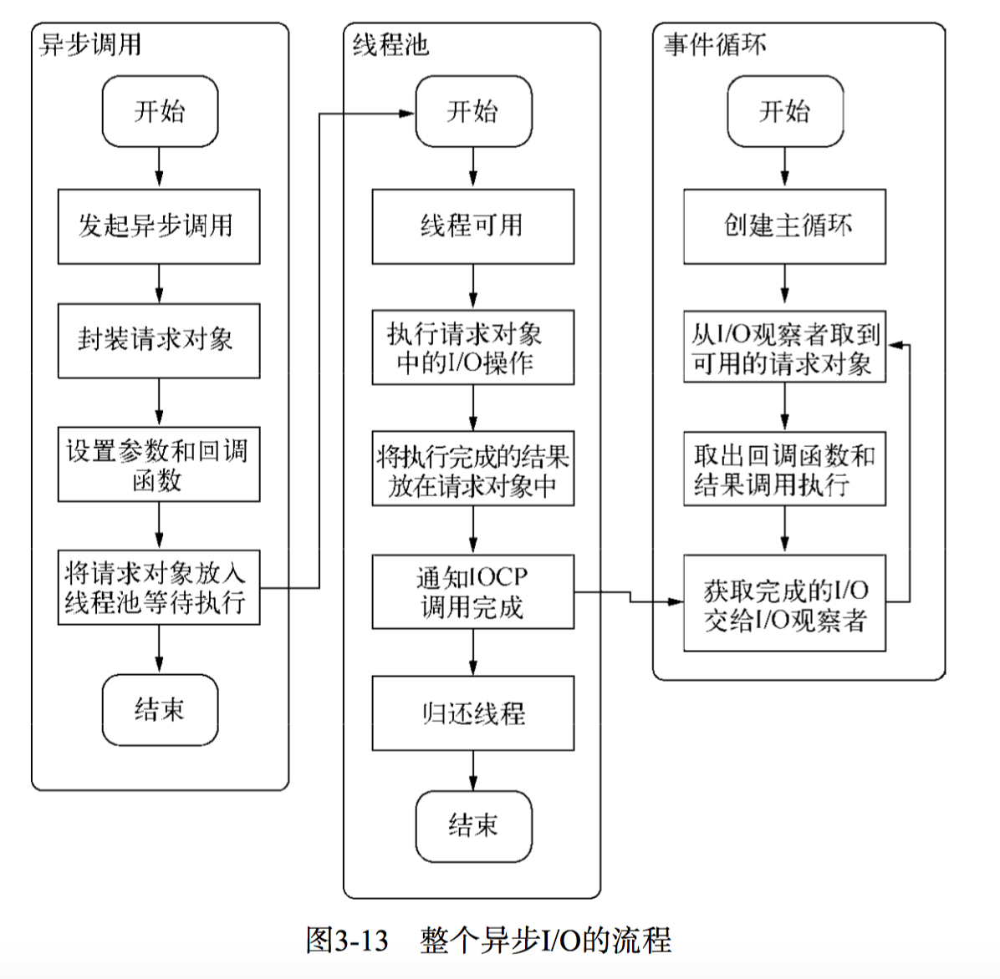

头脑风暴

读者

为什么 node 事件驱动会比多线程的要好？事件驱动在高并发问题上不会有问题吗

事件循环是一个典型的生产者/消费者模型。异步 I/O、网络请求等则是事件的生产者，源源不断为 Node 提供不同类型的事件，这些事件为传递到对应的观察者那里，事件循环则从观察者那里取出事件并处理。

对于开发者来说，Java 的网络编程比 Node 更加底层，Node 已经封装的很好了，并且还有 Express 框架。

因此，Java 才需要 Sevlet API，让 Tomcat 实现我们编写的 Servlet API 接口，实现 Web 应用的底层工作。而 node 就很方便编写响应。
