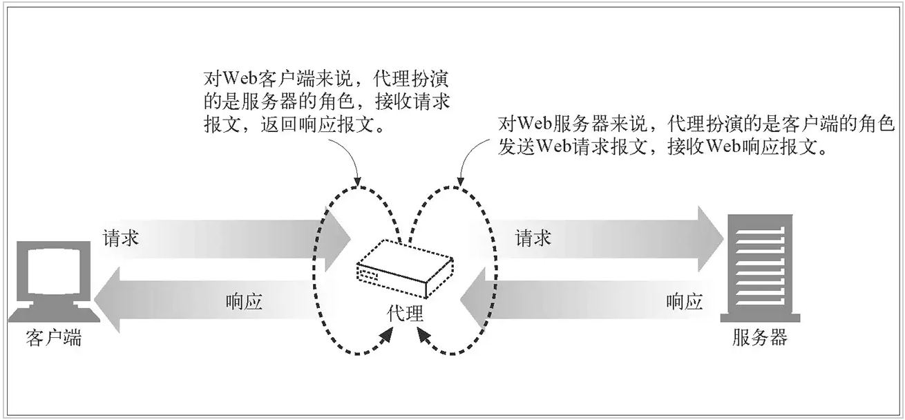

# charles

## 简介

## 安装

## 过滤网络请求

## 截取 HTTP/HTTPS 数据

## 问题

- charles之localhost、127.0.0.1抓不到包的问题

解决方案就是配置 在host文件中添加一行

127.0.0.1 localhost.charlesproxy.com

## 抓包原理

一句话简要的阐述一下抓包工具的工作原理：抓包工具会在网络传输的某个层次或节点截获发送或接收的数据

不同的抓包工具的工作工作原理类似但实现方式不尽相同，如 charles 本质是一个应用程序（比如浏览器）的 http 代理，chrome 的 network 则是直接在浏览器应用程序内部实现，而 wireshark 会直接在网卡抓取数据

以 charles 为例，即使在浏览器中途进行了取消请求，只是在浏览器层面取消了请求，它是不会影响经过 charles 应用发送的请求的。相当于浏览器与 charles 断开了连接。

## 参考资料

- [Charles 抓包二三谈](https://juejin.im/post/5b4f005ae51d45191c7e534a) —— 图文并茂，小白也能看懂。