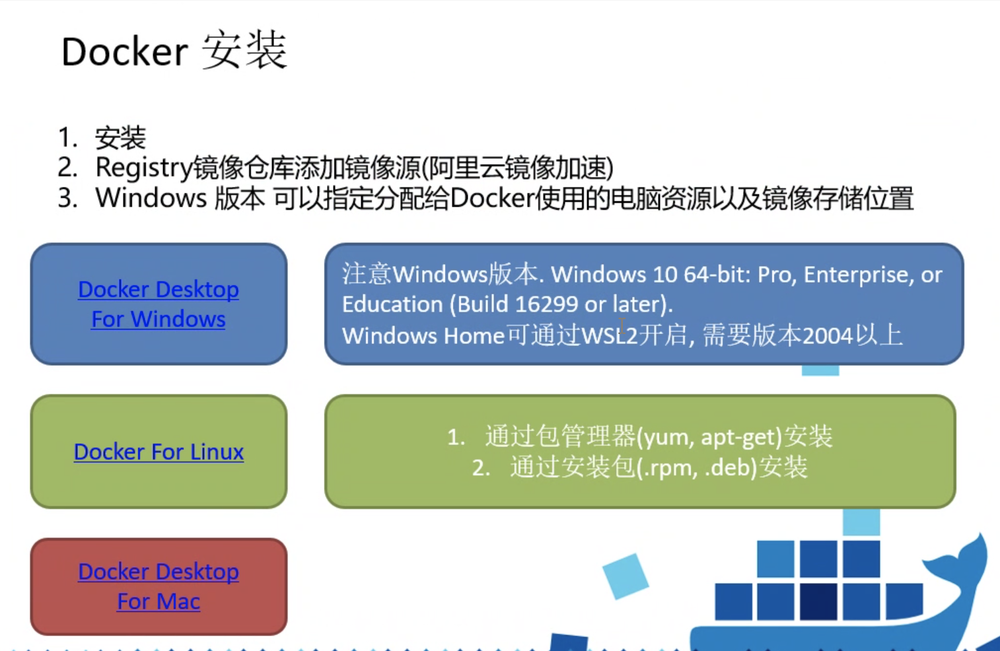
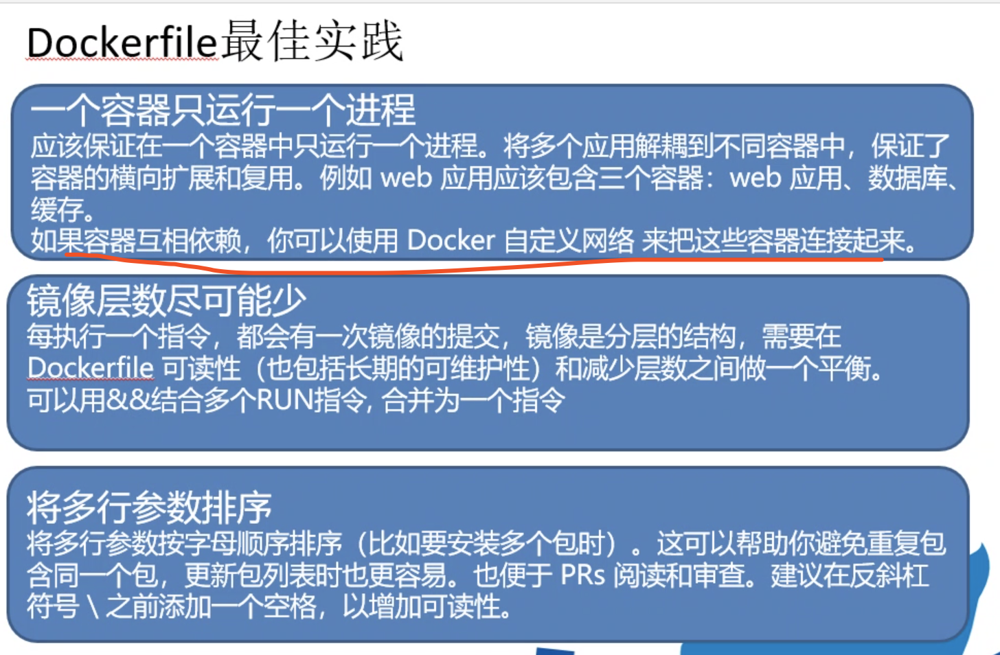

# docker 

- 为什么要有 docker
- 有 docker 和没有 docker 的区别
- 可以用 docker 来做什么




## 基础使用

### 操作容器

### 进入容器

#### exec 命令

```bash
# docker exec -it mysql bash
docker exec -it `容器名` bash
``` 

### 退出容器

```bash
exit
```

### 终止容器

可以使用 `docker container stop` 来终止一个运行中的容器。此外，当 Docker 容器中指定的应用终结时，容器也自动终止。
```bash
docker container stop
```

终止状态的容器可以用 `docker container ls -a` 命令看到。处于终止状态的容器，可以通过`docker container start`命令重新启动。

此外，`docker container restart` 命令会将一个运行态的容器终止，然后再重新启动它。

## 实战

运行容器的时候指定本地的一个文件目录和容器中的一个文件目录的映射，通过这个可以做文件数据同步，两方无论哪一方有修改，另一方都会同步内容
```bash
docker run -d -v $(pwd):/usr/share/nginx/html -p 80:80 --name nginx nginx
```

这个时候`-v:`前面的参数是本机文件路径， `:`后面是docker容器文件目录， `$(pwd)`当前命令执行的路径（也就是本地机器的文件目录）

值得注意的是，使用bind Mounting方式做数据卷的映射时，首次docker run -v 运行，如果本机的文件夹是没有内容的，docker容器中的文件夹是有内容的，则本机的会覆盖dokcer容器中的，也就是容器中原本有内容的也会没有内容。

### 数据持久化之 bind Mounting

### docker文件夹映射的两种方式---主机卷映射和共享文件夹映射

- docker容器不保持任何数据
- 重要数据请使用外部卷存储（数据持久化）
- 容器可以挂载真实机目录或共享存储为卷

https://blog.csdn.net/zhydream77/article/details/81909706



## 参考资料

- 《Docker——从入门到实践》
- [Docker的持久化存储和数据共享（四）](https://juejin.im/post/5b6d4439f265da0f800e0d5a#heading-2)
- [从零搭建docker+jenkins+node.js自动化部署环境](https://juejin.im/post/5b8ddb70e51d45389153f288#heading-7)