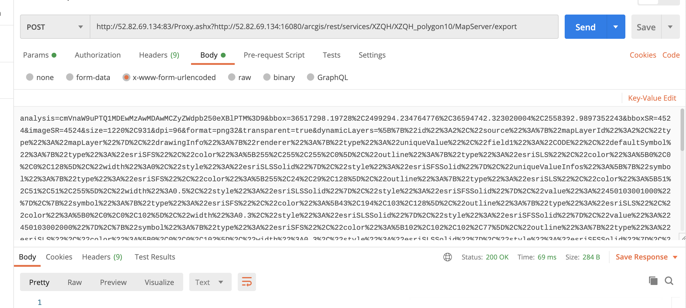

可以通过 postman 查看完整请求

POST 各种请求的区别处理，

formdata 是如何组成处理的。

body
- form-data
- x-www-form-urlencoded
- raw
- binary

### Form 表单提交的四种方式

#### application/json

#### x-www-form-urlencoded

这是默认的表单提交方式

参考资料：https://juejin.cn/post/6844903773819633678#heading-1

#### form-data

当涉及到提交表单时，就需要使用这种方式。

有可能是 postman 的 bug，不支持代理查询地址。因为在应用程序中是可以正常处理。

