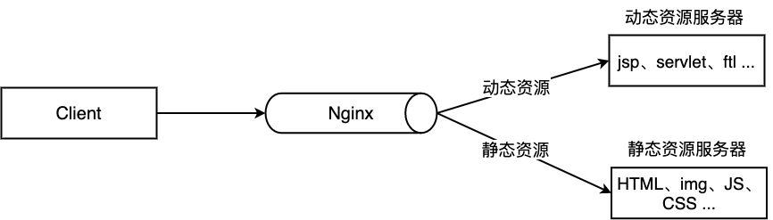

# Nginx

## 介绍

传统的 Web 服务器，每个客户端连接作为一个单独的进程或线程处理，需在切换任务时将 CPU 切换到新的任务并创建一个新的运行时上下文，消耗额外的内存和 CPU 时间，当并发请求增加时，服务器响应变慢，从而对性能产生负面影响。

Nginx 是开源、高性能、高可靠的 Web 和反向代理服务器，而且支持热部署，几乎可以做到 7 * 24 小时不间断运行，即使运行几个月也不需要重新启动，还能在不间断服务器的情况下对软件版本进行热更新。性能是 Nginx 最重要的考量，其占用内存少、并发能力强、能支持高达 5w 个并发连接数，最重要的是，Nginx 是免费的并可以商业化，配置使用也比较简单。

Nginx 的最重要的几个使用场景：

1. 静态资源服务，通过本地文件系统提供服务；
2. 反向代理服务，延伸出包括缓存、复载均衡等；
3. API 服务，OpenResty；

Nginx 和 Node.js 的理念很类似，HTTP 服务器、事件驱动、异步非阻塞等，且 Nginx 的大部分功能使用 Node.js 也可以实现，但 Nginx 和 Node 并不冲突，都有自己擅长的领域。Nginx 擅长于底层服务器端资源的处理（静态资源处理转发、反向代理，负载均衡等），Node.js 更擅长上层具体业务逻辑的处理，两者可以完美组合，共同助力前端开发。


## Nginx 快速安装

### 相关文件夹

我们可以使用 `rpm -ql nginx` 来查看 Nginx 被安装到了什么地方，有哪些相关目录，其中位于 `/etc` 目录下的主要是配置文件。

.sh 是 Unix 系统运行的脚本、.bat 是 Windows 系统下运行脚本

Nginx 采用了异步非阻塞的事件处理方式。

- select
- poll
- epoll

## Nginx 配置 语法

配置文件位于 `/etc/nginx/nginx.conf`

### 典型配置

Nginx 的典型配置：

```shell
user  nginx;                        # 运行用户，默认即是nginx，可以不进行设置
worker_processes  1;                # Nginx 进程数，一般设置为和 CPU 核数一样
error_log  /var/log/nginx/error.log warn;   # Nginx 的错误日志存放目录
pid        /var/run/nginx.pid;      # Nginx 服务启动时的 pid 存放位置

events {
    use epoll;     # 使用epoll的I/O模型(如果你不知道Nginx该使用哪种轮询方法，会自动选择一个最适合你操作系统的)
    worker_connections 1024;   # 每个进程允许最大并发数
}

http {   # 配置使用最频繁的部分，代理、缓存、日志定义等绝大多数功能和第三方模块的配置都在这里设置
    # 设置日志模式
    log_format  main  '$remote_addr - $remote_user [$time_local] "$request" '
                      '$status $body_bytes_sent "$http_referer" '
                      '"$http_user_agent" "$http_x_forwarded_for"';

    access_log  /var/log/nginx/access.log  main;   # Nginx访问日志存放位置

    sendfile            on;   # 开启高效传输模式
    tcp_nopush          on;   # 减少网络报文段的数量
    tcp_nodelay         on;
    keepalive_timeout   65;   # 保持连接的时间，也叫超时时间，单位秒
    types_hash_max_size 2048;

    include             /etc/nginx/mime.types;      # 文件扩展名与类型映射表
    default_type        application/octet-stream;   # 默认文件类型

    include /etc/nginx/conf.d/*.conf;   # 加载子配置项
    
    server {
    	listen       80;       # 配置监听的端口
    	server_name  localhost;    # 配置的域名
    	
    	location / {
    		root   /usr/share/nginx/html;  # 网站根目录
    		index  index.html index.htm;   # 默认首页文件
    		deny 172.168.22.11;   # 禁止访问的ip地址，可以为all
    		allow 172.168.33.44； # 允许访问的ip地址，可以为all
    	}
    	
    	error_page 500 502 503 504 /50x.html;  # 默认50x对应的访问页面
    	error_page 400 404 error.html;   # 同上
    }
}
```

server 块可以包含多个 location 块，location 指令用于匹配 uri，语法

```sh
```


### 全局变量

## Nginx 操作常用命令

Nginx 的命令在控制台中输入 `nginx -h` 就可以看到完整的命令，这里列举几个常用的命令：指令

```sh
nginx -s reload  # 向主进程发送信号，重新加载配置文件，热重启
nginx -s reopen	 # 重启 Nginx
nginx -s stop    # 快速关闭
nginx -s quit    # 等待工作进程处理完成后关闭
nginx -T         # 查看当前 Nginx 最终的配置
nginx -t -c <配置路径>    # 检查配置是否有问题，如果已经在配置目录，则不需要-c
```

systemctl 是 Linux 系统应用管理工具 systemd 的主命令，用于管理系统，我们也可以用它来对 Nginx 进行管理，相关命令如下：
```sh
systemctl start nginx    # 启动 Nginx
systemctl stop nginx     # 停止 Nginx
systemctl restart nginx  # 重启 Nginx
systemctl reload nginx   # 重新加载 Nginx，用于修改配置后
systemctl enable nginx   # 设置开机启动 Nginx
systemctl disable nginx  # 关闭开机启动 Nginx
systemctl status nginx   # 查看 Nginx 运行状态
```

## Nginx 架构

- 多进程模式

  - 支持手动关闭后台模式，让 Nginx 在前台运行，通过配置取消 master 进程，使 Nginx 以单进程方式运行

- Nginx 启动后，会有一个 master 进程和多个 worker 进程

  - ```sh
    ps -ef | grep nginx
    root       923     1  0 8月26 ?       00:00:00 nginx: master process /usr/local/nginx/sbin/nginx -c /usr/local/nginx/conf/nginx.conf
    www       5837   923  0 17:29 ?        00:00:00 nginx: worker process
    root      5848  5773  0 17:30 pts/0    00:00:00 grep --color=auto nginx
    ```

  - master 进行主要用来管理 worker 进程
    - 包含：接收来自外界的信号，向各 worker 进程发送信号，监控 worker 进程的运行状态，当 worker 进程退出后(异常情况下)，会自动重新启动新的 worker 进程
    - 网络事件放在 worker 进程中
  - worker 进程
    - 多个 worker 进程对等，同等竞争来自客户端的请求，各进程互相之间是独立的
    - 一个请求只能在一个 worker 进程中处理
    - 一个 worker 进程不能处理其他进程的请求
    - worker 进程数可以设置，一般设置为与机器cpu核数相同

- `nginx -s reload`nginx从容重启：

  - 首先 master 进程在接到信号后，会先重新加载配置文件，然后再启动新的 worker 进程，并向所有老的 worker 进程发送信号，告诉他们可以光荣退休了。
  - 新的 worker 在启动后，就开始接收新的请求，而老的 worker 在收到来自 master 的信号后，就不再接收新的请求，并且在当前进程中的所有未处理完的请求处理完成后，再退出

### 进程模型


- 每个 worker 进程 fork master 进程(在 master 进程完成建立好 listen 的 socket 之后)
- 为保证只有一个worker进程处理这个请求，在 worker 注册 listenfd 事件前抢 accept_mutex,抢到的注册事件
- 读事件里调用 accept 接受该链接，读取请求，解析请求，处理请求，产生数据并返回，断开连接
- 该模型好处
  - 独立进程不加锁，省事
  - 相互之间不影响，服务不中断
- 事件的三种类型：网络事件、信号、定时器

## 操作常用命令

linux

### window 版

记得以管理员身份运行 cmd 命令行程序。

Windows 下 Nginx 的启动、停止等命令

在 Windows 下使用 Nginx，我们需要掌握一些基本的操作命令，比如：启动、停止 Nginx 服务，重新载入 Nginx 等，下面我就进行一些简单的介绍。

假设你安装在 C:\server\nginx-1.0.2 目录下，

cmd 命令进入安装文件；

1、启动：

```sh
C:\server\nginx-1.0.2>start nginx
```

或

C:\server\nginx-1.0.2>nginx.exe

注：建议使用第一种，第二种会使你的 cmd 窗口一直处于执行中，不能进行其他命令操作。

2、停止：

C:\server\nginx-1.0.2>nginx.exe -s stop

或

C:\server\nginx-1.0.2>nginx.exe -s quit

注：stop 是快速停止 nginx，可能并不保存相关信息；quit 是完整有序的停止 nginx，并保存相关信息。

3、重新载入 Nginx：

C:\server\nginx-1.0.2>nginx.exe -s reload

当配置信息修改，需要重新载入这些配置时使用此命令。

4、重新打开日志文件：

C:\server\nginx-1.0.2>nginx.exe -s reopen

5、查看 Nginx 版本：

C:\server\nginx-1.0.2>nginx -v

## 实战

### 负载均衡


### 动静分离


### 正向代理和反向代理


### 配置动静分离


### 配置反向代理

## 参考资料

- [Nginx 从入门到实践，万字详解！](https://juejin.im/post/6844904144235413512#heading-12)
- 极客时间 nginx 课程
- Nginx 书籍 《2015_NGINX_a_practical_guide》
