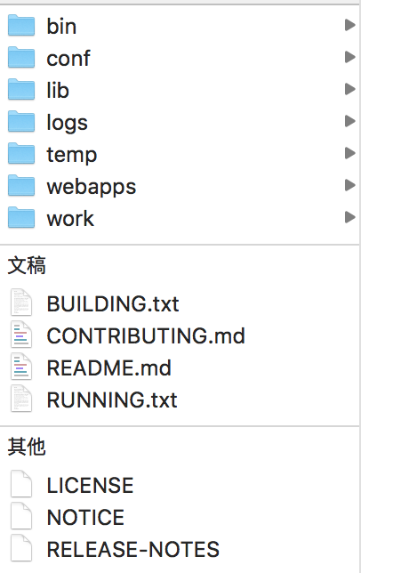
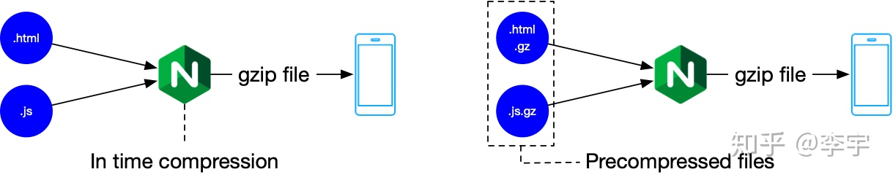

# Tomcat

Apache Tomcat 是由 Apache Software Foundation （ASF）开发的一个开源 Java WEB 应用服务器。

tomcat 端口设置


### Tomcat 是什么

#### Tomcat 与 Java

##### Tomcat 与 Java SE

Tomcat 是用 Java 语言编写的，需要运行在 Java 虚拟机上，所以一般需要先安装 JDK，以提供运行环境。

##### Tomcat 与 Java EE

Tomcat 实现了几个 Java EE 规范，包括 Java Servelt、Java Server Pages（JSP），Java Expression Language 和 Java WebSocket 等，这些都是下载 Tomcat 安装包默认提供的，可以在源码中看到相关 Java EE 规范 API 源码引用，如下：

此外，官网还提供了另外一些 Java EE 规范的实现，如 JMX Remote
、Web services，要使用的话需要另外下载，放到 Tomcat 安装目录 /lib 中。

可以说 Tomcat 是一个不完整的 Java EE 应用服务器。

#### Tomcat 与 Sevlet/编程开发

Tomcat 实现的几个 Java EE 规范最重的是 Servlet 规范，因为实现了 Servlet 规范，所以 Tomcat 也是一个 Servlet 容器，可以运行我们自己编写的 Servlet 应用程序处理动态请求。

平时用的 Struts2、SpringMVC 框架就是基于 Servlet，所以我们可以在这些框架的基础上进行快速开发，然后部署到 Tomcat 中运行。

另外，对于 JSP 规范实现：`可以混合 HTML 与 Java 开发在一个文件中（.jsp）`，这种文件在第一次调用之后会被 Tomcat 的 Jasper 组件编译成一个 servlet 类，在后续的操作中则可以直接使用此类。这种开发方式不灵活，一般少用。

#### Tomcat 与 Web/HTTP 请求

Tomcat 的 （HTTP 类型）Connector 组件实现了 HTTP 请求的解析，Tomcat 通过 Connector 组件接收 HTTP 请求并解析，然后把解析后的信息交给 Servlet 处理：

- 对于静态（html/js/jpg 等）请求，Tomcat 提供默认的 Servlet 来处理并响应；
- 对于动态请求，可以`映射`到自己编写的 Servlet 应用程序并处理。

类似 Node 也可以响应静态请求，并在另外一个 Node 程序提供动态接口处理。

#### Tomcat 与 Nginx/Apache 的应用架构

### Tomcat 安装目录



Tomcat 安装后根目录如上图，由环境变量 $ CATALINA_HOME 表示，可以手动设置，可以由 /bin/catalina.sh 命令脚本自动设置该环境变量，如果使用多个 Tomcat 实例，需要为每个实例定义 $ CATALINA_BASE 环境变量。

这些目录说明如下：

- `bin`：启动、关闭和其他脚本，`*.sh` 文件（对于 Unix 系统）是 \*.bat 文件的功能重复（对于 Windows 系统）。
- `conf`：配置文件及相关数据文件存放目录，如 server.xml，tomcat-users.xml，web.xml；
- `logs`：默认的日志文件存放目录，如访问日志，可以通过 server.xml 文件配置到其他目录；
- `lib`：Tomcat 使用的库文件存放目录，如 Servlet 规范的 API；
- `temp`：临时文件的工作目录，`如上传大文件时的缓存数据会存储到这里；`
- `webapps`：我们的应用程序部署目录，可以通过 server.xml 文件配置`；
- `work`：Tomcat 工作目录，如存放 JSP 编译后的类文件。

### Tomcat 配置文件

Tomcat 的配置文件默认存放在 \$CATALINA_HOME/conf 目录中，主要有以下几个：

- `server.xml`：Tomcat 核心配置文件，包含 Service，Connector，Engine，Readlm，Valve，Host 主组件的相关配置信息。
- `context.xml`
- `web.xml`：为部署与 Tomcat 实例上的所有 web 应用程序提供部署描述符，通常用于`为 webapp 提供默认的 servlet 定义`和基本的 MUIME 映射表。

### Web 应用部署目录结构

### Tomcat 基本框架及相关配置

Tomcat 8+

### 开启 CORS

进一步：能否自定对某些文件夹做 CORS 处理（比如 fonts 字体、图标资源，不仅仅是 GIS 服务）。还是说用 nginx 来做这块工作。

在 tomcat 的 conf 的 web.xml 文件添加过滤规则：

```xml
...
<!-- ================== Built In Filter Definitions ===================== -->
<filter>
  <filter-name>CorsFilter</filter-name>
  <filter-class>org.apache.catalina.filters.CorsFilter</filter-class>
  <init-param>
    <param-name>cors.allowed.origins</param-name>
    <param-value>*</param-value>
  </init-param>
</filter>
<filter-mapping>
  <filter-name>CorsFilter</filter-name>
  <url-pattern>/*</url-pattern>
</filter-mapping>
...
```

更多配置见：https://tomcat.apache.org/tomcat-9.0-doc/config/filter.html

### 设置代理

使用场景：GIS 服务添加代理，使用 tomcat 部署。

在 tomcat 的 conf 的 web.xml 文件添加过滤规则，这里直接对所有部署到 tomcat 都允许跨域访问了。

### 压缩



xcli 自动集成配置，查看。

#### 测试

前端非压缩文件是如何处理？

压缩之后开启与没开启的对比？

- 使用压缩前后的对比
- 客户端压缩与服务端压缩的时间对比

同时使用 dist 有压缩文件版和没压缩版，即可知道。

#### 静态资源：寻找压缩文件

##### 前端先压缩好文件

```js
new CompressionPlugin({
  filename: "[path].gz[query]",
  algorithm: "gzip", // 压缩算法
  test: new RegExp("\\.(" + productionGzipExtensions.join("|") + ")$"), // 压缩的资源
  threshold: 10240, // 资源大于 10240B = 10 KB 时会被压缩
  minRatio: 0.8, // 压缩比率
});
```

##### Tomcat 配置

修改 conf/web.xml 文件，不需要重启 tomcat。

```xml
    <servlet>
        ...
        <servlet-name>default</servlet-name>
        <servlet-class>org.apache.catalina.servlets.DefaultServlet</servlet-class>
        <init-param>
            <param-name>gzip</param-name>
            <param-value>true</param-value>
        </init-param>
        ...
    </servlet>
```

Tomcat 默认已经开启。

If a precompressed version of a file exists (a file with .br or .gz appended to the file name located alongside the original file), Tomcat will serve the precompressed file if the user agent supports the matching content encoding (br or gzip) and this option is enabled. [false]
The precompressed file with the with .br or .gz extension will be accessible if requested directly so if the original resource is protected with a security constraint, the precompressed versions must be similarly protected.
It is also possible to configure the list of precompressed formats. The syntax is comma separated list of [content-encoding]=[file-extension] pairs. For example: br=.br,gzip=.gz,bzip2=.bz2. If multiple formats are specified, the client supports more than one and the client does not express a preference, the order of the list of formats will be treated as the server preference order and used to select the format returned.

#### 针对 API 请求：实时压缩

修改 server.xml，并进行 tomcat 的重启。

before

```xml
<Connector port="8080" protocol="HTTP/1.1" compression="on" compressibleMimeType="text/html,text/xml,text/plain,text/css,text/javascript,application/javascript,application/json,application/xml"  compressionMinSize="2048"  />
```

After
添加 useSendfile，和设置端口为 80。端口问题待研究。

```xml
    <Connector port="80" protocol="HTTP/1.1" compression="on" compressibleMimeType="text/html,text/xml,text/plain,text/css,text/javascript,application/javascript,application/json,application/xml"  compressionMinSize="2048" useSendfile="false" />
```

这里要注意的是：port 为 80 而不是 8080，另外一定要添加 useSendfile 属性并设置为 false，否则有可能不会压缩。这个 useSendfile 属性来保护 CPU 使用率，详情可以看对应的 tomcat 配置文档（connector 部分）。

connector 的作用主要是处理请求，进行响应。

访问地址：
http:80//localhost/dist-notzip

而不是
http:8080//localhost/dist-notzip

之后再集成 xcli 文档。

## 参考资料

- [Tomcat 7 GZIP compression not working
  ](https://stackoverflow.com/questions/16653642/tomcat-7-gzip-compression-not-working)
- [Tomcat8 Gzip Compression for CSS, JS](https://stackoverflow.com/questions/30608952/tomcat8-gzip-compression-for-css-js)
- [Need Step-by-Step Overview for Compression on Tomcat
  ](https://stackoverflow.com/questions/16690321/need-step-by-step-overview-for-compression-on-tomcat)
- [Apache Tomcat Versions which version?](https://tomcat.apache.org/whichversion.html) Unsure which version you need? Specification versions implemented, minimum Java version required and lots more useful information may be found on the 'which version?' page.
- [前端性能优化之缓存与 GZIP](https://zhuanlan.zhihu.com/p/124681905)
- [前端性能优化之 gzip](https://segmentfault.com/a/1190000012571492)
- [深入剖析 Tomcat](https://book.douban.com/subject/10426640/)
- Tomcat 与 Java Web 开发技术详解
