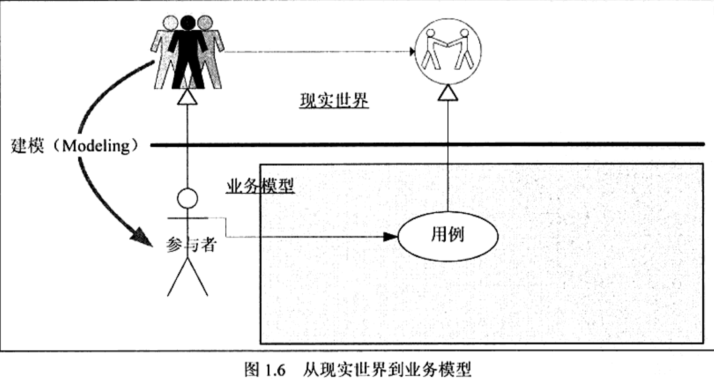
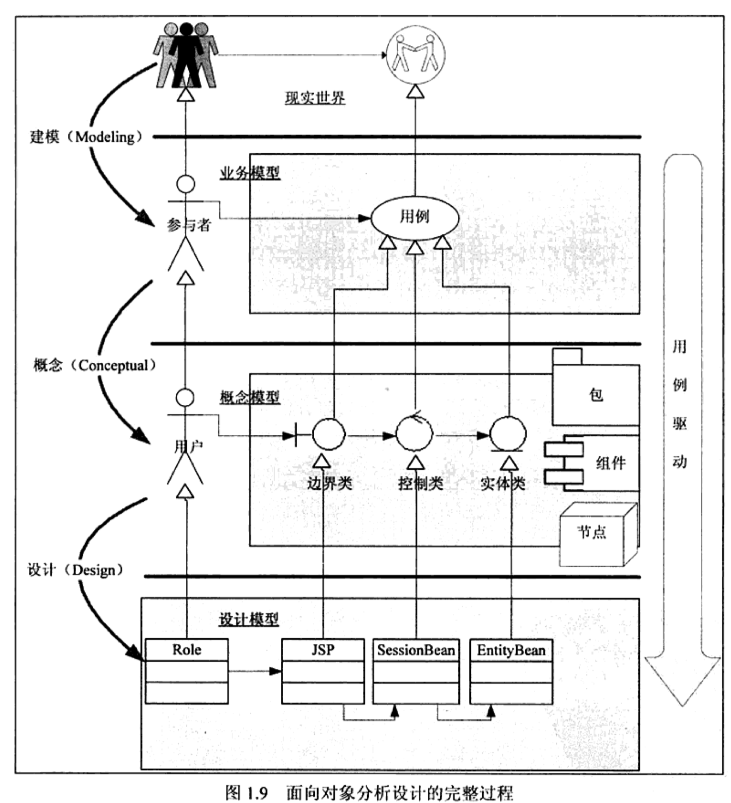
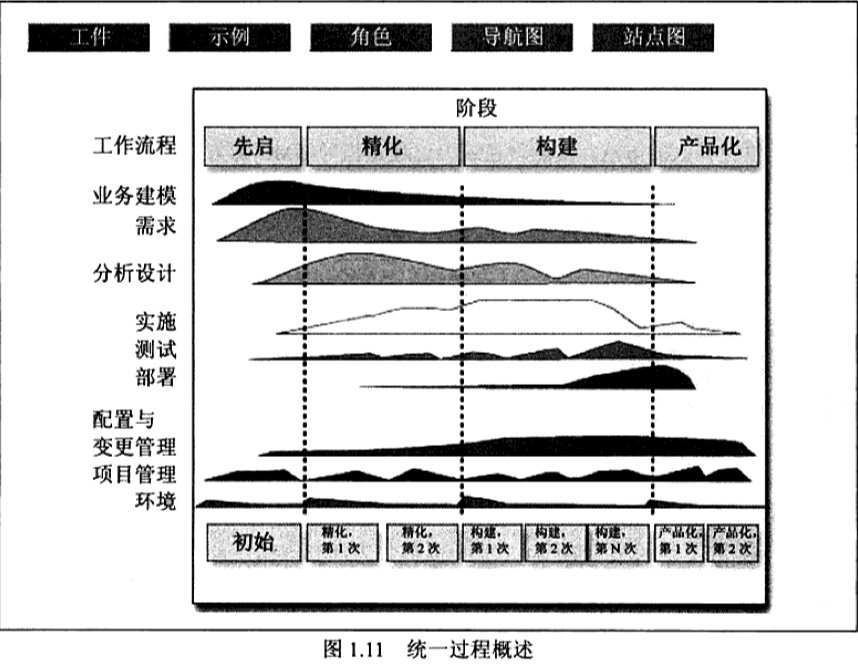
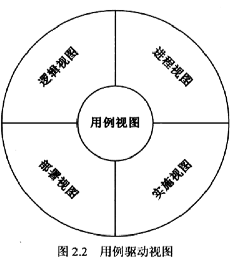
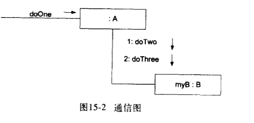

# UML（Unified Modeling Language）

思维导图： 

## 前言

统一建模语言（UML）是软件工程师领域中的一种通用的、开发性的建模语言，旨在提供一种`可视化系`统设计的标准方法。

- UML 是什么
- 为什么要用 UML
- 什么时候用 UML
- 如何用 UML

## 入门

抽象：可以从低到高，也可以从高到低。

### 为什么需要 UML

### UML 带来了什么

从现实世界到业务模型



从概念模型到设计模型


从业务模型到概念模型




### 统一过程简介

RUP（Rational Unified Process）统一过程



统一过程将软件生产分为了四个阶段和九个核心工作流（y 轴为工作流，x 轴为阶段），每个工作流在不同的阶段有不同的工作量比重。

统一过程和 UML 是不同的两个领域。UML 是一种语言，用来描述软件生产过程中要产生的文档，统一过程则是指导如何产生这些文档以及这些文档要讲述什么的方法。
### 建模基础

具体来说，做需求的时候，首要目标不是要弄清楚业务是如何一步步完成的，而是要弄清楚有多少业务的参与者？每个参与者的目标是什么？**参与者的目标就是你的抽象角度**。

第二个问题是“模是什么”，则依赖于确定了抽象角度下的场景模拟。找出场景下的事物。

1. 抽象角度：比如意见征询模块，有管理者、意见者、评论者，每个角色的目标都不同。
2. 业务用例：而其中的场景涉及到任务、意见、评论等事物。

什么是模？一个由抽象角度确定了的目标需要由静态的事物加上特定条件下产生的一个特定的场景来完成，即静态的事物（物） + 特定的条件（规则）+特定的动作（参与者的驱动） = 特定的场景（事件）。

模就是“人”、“事”、“物”、“规则”。


要解决问题领域就要归纳出所有必要的抽象角度（用例），为这些用例描述出可能的特定场景，并找到实现这些场景的事物、规则和行为。

#### 用例驱动



#### 抽象层次

软件抽象层次
- 自顶向下（主）
- 自底向上（次）


#### 视图
### 历史

### 设计

UML 提供了一种在图中可视化系统架构蓝图的方法，包括元素：

- 任何活动（工作）
- 独立的系统组件
  - 以及它们是如何与其他软件组件交互
- 系统如何工作
- 实体之间是如何交互（组件和接口）
- 外部的用户界面

即使 UML 最初旨在用于面向对象分析和设计（OOA/D），但已扩展到更大的一组设计稳定，并且在许多情况下都非常有用。UML 并不是 OOA/D，也不是方法，它只是图形表示法。

RUP 和 XP（极限编程）不是非此即彼的关系，比如在整体一个大的项目架构中可以采用 RUP 适合，而具体到某个功能时又可以 XP 一把。

无论采用 RUP 还是 XP，都不妨碍使用 UML 来做软件的分析和设计。（比如规划分析评价）

对于软件产品来说，最佳实践来自两个方面：一方面是技术类的，如设计模式；另一方面的是过程类的，如需求方法、分析方法、设计方法等。


### 模型

区别 UML 模型（model）和系统图集（diagrams）很重要。图表是系统模型的部分图形表示。

### 应用 UML 的三种方式

- **UML 作为草图——非正式的、不完整的图**（通常是白板上手绘草图），借助可视化语言的功能，用于探讨问题或解决方案空间的复杂部分。
- **UML 作为蓝图——相对详细的设计图**，用于：1）逆向工程，即以 UML 图的方式对现有代码进行可视化，使其易于理解。2）`代码生成`（向前工程）
  - 对于`逆向工程`，UML 工具读取源文件或二进制文件，并生成 UML 包图、类图和顺序图（一般情况下）。这些“蓝图”能够帮助读者从整体上理解元素、结构和协作。
  - 无论是人工还是使用自动工具生成代码（例如，Java 代码），在此之前绘制一些详细的图都能够为生成代码的工作 提供指导。一般情况下，代码生成工具使用图生成一些嗲吗，然后由开发者编写并填充其他代码（或许应用了 UML 草图）
- **UML 作为编程语言**——用 UML 完成软件系统可执行规格说明。可执行代码能够被自动生成，并不像通常一样为开发者所见或修改；人们仅使用 UML “编程语言”工作。如此应用 UML 需要有将所有行为或逻辑进行图形化表示的实用方法。

**敏捷建模（agile modeling）**强调了 UML 作为草图的防水，这也是使用 UML 的普通方式，而且通常对时间投入具有高回报。

### 应用 UML 的三种透视图

- **概念透视图**：用图来描述现实世界或关注领域中的事物。
  - 
- **规格说明（软件）透视图**：用图来描述软件的抽象事物或具有规格说明和接口的构件，但是并不约定特定实现（例如，非特定为 C# 或 Java 中的类）
- **实现（软件）透视图**：用图来描述特定技术（例如，Java）
  - 

不同透视图中“类”的含义

- **概念类**（conceptual class）—— 现实世界中的概念或事物。在概念或本质透视图中使用。UP 领域模型中包含概念类。
- **软件类**（software class）—— 无论是在过程还是方法中，都表示软件构件在规格说明或实现透视图中的类。
- **实现类**（implementation class）—— 特定 OO 语言（如 Java ）中的类。

### 可视化建模的优点

- <u>用符号来表示说明问题所冒的风险是显而易见的</u>，绘制或阅读 UML 意味着我们要以更加可视化的方式工作，开发我们的脑力，以便更快地掌握（主流）二维框——线表示法中的符号、单元及关系。
- 图可以帮助我们更为便利地观察全景，发现软件元素或分析之间的联系，同时允许我们忽略或隐藏旁枝末节。

## 基础单元

### 类

**依赖(Dependency)关系**是类与类之间的联接。依赖关系表示一个类依赖于另一个类的定义。例如，一个人(Person)可以买车(car)和房子(House)，Person 类依赖于 Car 类和 House 类的定义，因为 Person 类引用了 Car 和 House。与关联不同的是，Person 类里并没有 Car 和 House 类型的属性，Car 和 House 的实例是以参量的方式传入到 buy()方法中去的。**一般而言，依赖关系在 Java 语言中体现为局域变量、方法的形参，或者对静态方法的调用。**

**关联(Association**）关系是类与类之间的联接，它使一个类知道另一个类的属性和方法。**关联可以是双向的，也可以是单向的**。

在 Java 语言中，关联关系一般使用成员变量来实现。有时也用方法形参的形式实现。依然使用 Driver 和 Car 的例子，使用方法参数形式可以表示依赖关系，也可以表示关联关系，毕竟我们无法在程序中太准确的表达语义。在本例中，使用成员变量表达这个意思：车是我自己的车，我“拥有”这个车。使用方法参数表达：车不是我的，我只是个司机，别人给我什么车我就开什么车，我使用这个车。

```java
classDriver {

  //使用成员变量形式实现关联

  Car mycar;

  publicvoiddrive(){

    mycar.run();

  }

  ...

  //使用方法参数形式实现关联

  publicvoiddrive(Car car){

    car.run();

  }

}

```

**聚合**(Aggregation) 关系是关联关系的一种，**是强的关联关系**。聚合是整体和个体之间的关系。例如，汽车类与引擎类、轮胎类，以及其它的零件类之间的关系便整体和个体的关系。与关联关系一样，聚合关系也是通过实例变量实现的。但是关联关系所涉及的两个类是处在同一层次上的，而在聚合关系中，两个类是处在不平等层次上的，一个代表整体，另一个代表部分。

组合(Composition) 关系是关联关系的一种，是**比聚合关系强的关系**。**它要求普通的聚合关系中代表整体的对象负责代表部分对象的生命周期，组合关系是不能共享的**。代表整体的对象需要负责保持部分对象和存活，在一些情况下将负责代表部分的对象湮灭掉。代表整体的对象可以将代表部分的对象传递给另一个对象，由后者负责此对象的生命周期。换言之，代表部分的对象在每一个时刻只能与一个对象发生组合关系，由后者排他地负责生命周期。部分和整体的生命周期一样。

- https://zhuanlan.zhihu.com/p/33369911

## 图表


## 结构化图类型（Structural UML diagrams）

静态图

### Class diagram


### Composite structure diagram

### Object diagram

### Package diagram

包图

### Component diagram

### Profile diagram

### 部署图/配置图（Deployment diagram）

部署图用来建模系统的物理部署。例如计算机。

部署图包括节点和连接。

## 行为图类型（Behavioral UML diagrams）（常用）

动态图

### Activity diagram

状态图是描述一个实体基于

- entry
- do
- exit

### Interaction overview diagram

### Sequence diagram 顺序图/时许图

时序图是用来显示参与者如何以一系列顺序的步骤与系统的对象交互的模型。时许图可以用来展示对象之间是如何交互的。

时序图将显示的重点放在消息序列上，即强调消息是如何在对象之间被发送和接收的。

消息序列，着重时间顺序。


四个元素（对象，生命线，消息，激活）

- 对象
  消息的发送和接收者
- 生命线
  表示对象的存在，能存在多久的时间。
- 消息
  对象之间的单路通信。
- 激活
  表示这个时间，对象实现的操作。


### Communication diagram 通信图

对象的交互



| 类型   | 优势                                       | 劣势                                 |
| ------ | ------------------------------------------ | ------------------------------------ |
| 顺序图 | 能够清晰表示消息的顺序和时间顺序           | 强制在右侧增加新对象，消耗水平空间   |
| 通信图 | 空间效用——能够在二维空间内灵活地增加新对象 | 不易查阅消息的顺序，表示法选项较少｜ |

### Timing diagram

### Use Case diagram

活动图

## 画图工具

- EA 工具（Enterprise Architect）
- processon
- vscode 插件

### mac 安装 EA 工具

- [https://www.anxz.com/down/66703.html](https://www.anxz.com/down/66703.html)

## EA

### 绘制通信图

## 应用场景

- 如何通过代码自动生成 UML 图

## 参考资料

- [《Thing in UML 大象》](https://book.douban.com/subject/10549583/) 推荐大家看下《大象 Thinking in UML》这本书，深入了讨论了从领域设计到库表设计整个链
- 《UML 和模式应用》
- 《UML 精粹》
- [Unified Modeling Language](https://en.wikipedia.org/wiki/Unified_Modeling_Language)
- [领域驱动设计在前端中的应用](https://mp.weixin.qq.com/s/pROCXZNZ7RKeYDlDUJng_Q)

- [一键生成数据库文档，堪称数据库界的 Swagger，有点厉害](https://juejin.im/post/6865485568038404103)
