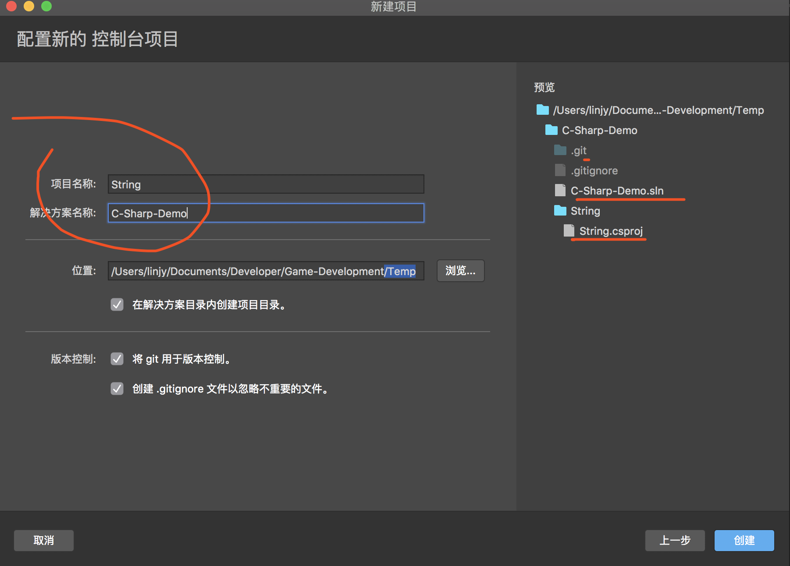

# visula studio

## 解决方案和项目

### 项目

在 Visual studio for Mac 中创建的应用程序、网站等内容时，要从项目开始。项目包括`编译可执行文件`、`库`或网站中所需的全部文件（源代码、图形、数据文件等）。

项目由包含 `xml` 的文件（如 C# 项目的 `.csproj`）定义，其中 xml 定义文件和文件夹层次结构、文件路径以及项目特定设置（如生成设置）。

当 Visual Studio for Mac 加载项目时，Solution Pad 使用项目文件显示项目中的文件和文件夹。编译期间，MSBuild 读取项目中的设置以创建可执行文件。

### 解决方案

（解决方案是将一个或多个项目分组到一起的容器。）解决方案由格式唯一的文本文件（扩展名为 `.sln`）描述；不应对其进行手动编辑。

## 运行程序

### 依赖项（.Net core）

生成包含多个项目的解决方案时，可能需要首先生成某些项目，然后才能生成由其他项目使用的代码。当一个项目使用另一个项目生成的`可执行代码`时，生成代码的项目则称为使用代码的项目的`项目依赖项`。

### 添加引用

- 添加 using 指令
- 添加对程序集的引用
- 安装 NuGet

上图中，引入的程序会放在引用文件夹下。而包文件加主要放置 NuGet 包。
- 引用”节点包含属于 NuGet 包的所有程序集列表 
- “包”节点显示每个已下载的 NuGet 包 。 可以更新该列表中的包，或从列表中删除包

Nuget 它就是一个`包（package）管理平台`，确切的说是 .net平台的包管理工具，它提供了一系列客户端用于生成，上传和使用包（package），以及一个用于存储所有包的中心库即 NuGet Gallery，如果有需要也可以搭建自己的私有NuGet库。类似于 npm。（node package manager）

#### 缺少 using 指令

using 可以使用系统程序集，也可以使用自定义编写的程序集（DLL）

#### 缺少程序集引用

.NET 引用可以是程序集或 NuGet 包。

1. 选择 Solution Explorer，并在该项目名下找到 References 目录。References 目录包含项目使用的程序集的列表。
2. 右键单击 References 目录并选择 Add Reference。有 5 个可以从中选择的标签页，允许你以不同的方法找到类库。
3. 对于我们的程序，选择 Browser 标签，浏览到包含 xxxx 类定义的 DLL 文件，并选择它。
4. 点击 OK 按钮，引用就被加入到项目了。

#### 缺少 NuGet 包

如果 Visual Studio 检测到缺少 NuGet 包，则会出现一个灯泡，并提供安装的选项。

## 快捷键

- command + F：
  - 快速在当前文件搜索关键词，并可以进行替换。
  - 也可以选中某一关键词，每敲击一次便可以把光标导航到下一个相同的关键词上面。

## 单元测试

1. 在单元测试项目中，右键单击“引用”或“依赖项”，然后选择“添加引用”，添加对要测试的项目的引用 。
2. 选择包含待测试代码的项目，单击“确定” 

单元测试项目与引用的项目，框架必须一致才能进行引用。例如两者都是 .Net Core 或者都是 .Net Framework ，不能混淆使用。

- .Net FrameWork 创建的项目（如控制台应用），采用 NUnit 项目。
- ASP .Net Core 项目（如 web 项目），可以使用 MSUnit 或 XUnit

## 调试

### 调试版

在菜单栏执行 View > Debug Windows > Call Stack 命令。

## 参考资料

- [visual studio中的快捷键大全](https://blog.csdn.net/qq_36318234/article/details/80574312?depth_1-utm_source=distribute.pc_relevant.none-task-blog-BlogCommendFromBaidu-2&utm_source=distribute.pc_relevant.none-task-blog-BlogCommendFromBaidu-2)
- [visual studio for mac](https://docs.microsoft.com/zh-cn/visualstudio/mac/create-new-projects?view=vsmac-2019)
- [NuGet是什么？理解与使用（上）](https://zhuanlan.zhihu.com/p/36207092)