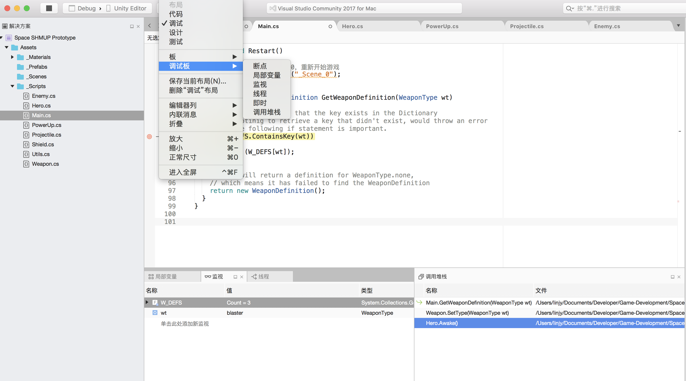

# visula studio

## 快捷键

- command + F：
  - 快速在当前文件搜索关键词，并可以进行替换。
  - 也可以选中某一关键词，每敲击一次便可以把光标导航到下一个相同的关键词上面。

## 调试

### 调试版

在菜单栏执行 View > Debug Windows > Call Stack 命令。

## 参考资料

- [visual studio中的快捷键大全](https://blog.csdn.net/qq_36318234/article/details/80574312?depth_1-utm_source=distribute.pc_relevant.none-task-blog-BlogCommendFromBaidu-2&utm_source=distribute.pc_relevant.none-task-blog-BlogCommendFromBaidu-2)