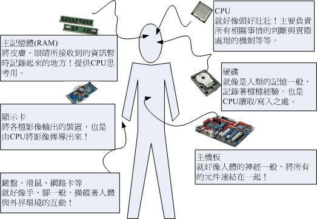
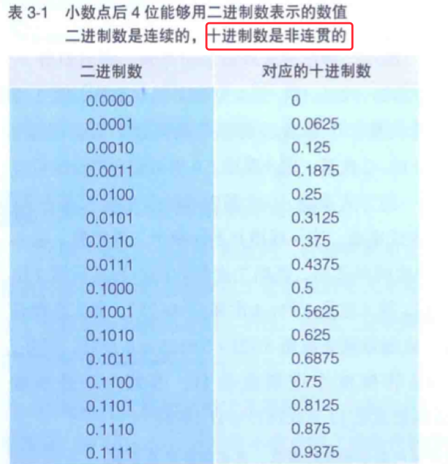
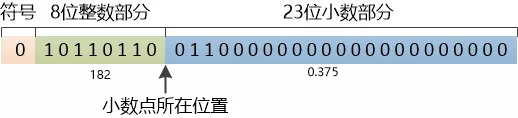

# 计算机概论

- 实践出真知：如何从零开始实现一个小型 OS 内核 https://mp.weixin.qq.com/s?__biz=MzU4NTIxODYwMQ==&mid=2247486783&idx=1&sn=a7293a390f7f2c045de3c51c00e08f39&chksm=fd8ca279cafb2b6ff2f2d4050dbdc5a53fb6e803d6e6393b67bd00b05db8fb52436240664d5e&token=29281815&lang=zh_CN#rd
- http://web.stanford.edu/~ouster/cgi-bin/cs140-spring20/lectures.php

所谓电脑就是一种计算机，所谓计算机其实是：「接受使用者输入指令与资料，经由中央处理器的数学与逻辑单元运算处理后，以产生或储存」

## 计算机概论

### 电脑硬件的五大单元


整部主机的重点在于中央处理器（Central Processing Unit，CPU），CPU 为一个具有特定功能的晶片，里头含有`微指令集`，如果你想要让主机进行什么特异的功能，就要参考这颗 CPU 是否有相关内建的微指令集才可以。由于 CPU 的工作主要在于管理与运算，因此在 CPU 内又可分为两个主要的单元，分别是：算数逻辑单元与控制单元。其中算法逻辑单元主要负责程序运算与逻辑判断，控制单元则主要在协调各周边元件与各单元间的工作。

- 系统单元：包括 CPU （控制单元、算数逻辑单元）与记忆体及主机板。
- 记忆单元：包括主存（main memory，RAM）与辅。助记忆体（硬碟、软碟、光碟、磁带）
- 输入、输出单元

### 架构


计算机是进行`数据`处理的设备。

- 存放`数据`和`指令`的`内存部件`
- 对数据执行`算术`和`逻辑运算`的`算术逻辑部件`
- 把`数据`从外部世界`转移`到计算机中的`输入部件`
- 把`结果`从计算机内部转移到外部世界的`输出部件`
- 担当舞台`监督`，确保其他部件都参与了表演的`控制器`。

我们所使用的软件都要经过 CPU 内部的微指令集来达成才行。那这些指令集的设计又被分为两种设计理念，这就是目前世界上常见的两种主要 CPU 架构，分别是：`精简指令集（RISC）` 和`复杂指令集（CISC）系统`。

#### 精简指令集（Reduced Instruction Set Computer，RISC）

微指令集较为精简，每个指令的执行时间都很短，完成的动作也很单纯，指令的执行效能较佳；但是若要做复杂的事情，就要由多个指令来完成。常见的 RISC 指令集 CPU 主要例如甲骨文（Oracle）公司的 SPARC 系列、IBM 公司的 Power Architecture（包括 PowerPC）系统、与安谋公司（ARM Holdiing）的 ARM CPU 系列等。

#### 复杂指令集（Complex Instruction Set Computer，CISC）

与 RISC 不同的，CISC 在微指令集的每个小指令可以执行一些较低阶的硬件操作，指令数目多而且复杂，每条指令的长度并不相同。因为指令执行较为复杂所以每条指令花费的时间较长，但每条指令可以处理的工作较为丰富。<u>常见的 CISC 微指令集 CPU 主要有 AMD、Intel、VIA 等的 x86 架构的 CPU。</u>

最早的 Intel CPU 代号称为 8086，后续又开发 80286，80386...，因此这种架构的 CPU 就被称为 `x86` 架构了。

在 2003 年以前由 Intel 所开发的 x86 架构 CPU 又 8 位元升级到 16、32 位元，后来 AMD 依此架构修改新一代的 CPU 为 64 位元，为了区别两者的差异，因此 64 位元的个人电脑 CPU 又被称为 `x86_64` 的架构。

不同的 x86 架构的 CPU 差异主要在于`微指令集的不同`，先进的微指令集可以加速多媒体程序的运行，也能加强虚拟化的效能，节省电量，降低发热。

### 运作流程



- `CPU= 脑袋瓜子`：每个人会做的事情都不一样（微指令集的差异），但主要都是透过脑袋瓜子来进行判断与控制身各部分的活动；
- `主记忆体=脑袋中放置正正在被思考的资料的区块`：在实际活动过程中，我们的脑袋瓜子需要有外界刺激的资料（例如光线、环境、语言等）来分析，那这些互动资料暂时存放的地方就是主记忆体，主要用来提供给脑袋瓜子判断用的资讯。
- `硬碟=脑袋中放置回忆的记忆区块`：跟刚刚的主记忆体不同，主记忆体是提供脑袋目前要思考与处理的资讯，但是有些生活琐事或其他没有要立刻处理的事情，就当成回忆先放置到脑袋的记忆深处吧！那就是硬碟。主要的目的是将重要的资料记录起来，以便未来将这些重要的经验再次使用。
- `主机板=神经系统`：好像人类的神经一样，将所有重要的元件连接起来，包括手脚的活动都是脑袋瓜子发布命令后，透过神经（主机板）传导给手脚来进行活动。
- `各项周边设备=人体与外界沟通的手、脚、皮肤、眼睛等`：就好像手脚一般，是人体与外界互动的重要关键。
- `显示卡=脑袋中的影像`：将来自眼睛的刺激转成脑袋中呈现，所以显示卡中所产生的资料来源也是 CPU 控制的。
- 电源供应器（Power）=心脏：所有的元件要能运作得要有足够的电力供应才行。这电力供给就好像心脏一样，如果心脏不够力，那么全身也就无法动弹的。心脏不稳定呢？那你的身体当然可能是断断续续的。

由于这样的关系当中，我们知道整个活动中最重要的就是脑袋。而脑袋当中与现在正在进行的工作有关的就是 CPU 与主记忆体。任何外界的接触都必须要由脑袋中的主记忆体记录下来，然后给脑袋中的 CPU 依据这些资料进行判断后，再发布命令给各周边设备。如果需要用到过去的经验，就得由过去的经验（硬碟）当中读取。

也就是说，整个人体最重要的地方就是脑袋，同样的，整部主机当中最重要的就是 CPU 与主记忆体，而 CPU 的资料来源通通来自于`主记忆体`。`如果由过去的经验来判断事情时，也要将经验（硬碟）挪到目前的记忆（主记忆体）当中，再交由 CPU 来判断。`

### 电脑用途的分类

- 超级电脑（Supercomputer）
  - 国防
- 大型电脑（Mainframe Computer）
  - 企业主机
- 迷你电脑（Minicomputer）
  - 科学研究
- 工作站（Workstation）
  - 学术研究
- 微电脑（Microcomputer）
  - 个人电脑

### 电脑上面常用的计量单位（容量、速度等）

#### 容量单位

| 进位制 | Kilo | Mega  | Giga  | Tera  | Peta  | Exa   | Zetta |
| ------ | ---- | ----- | ----- | ----- | ----- | ----- | ----- |
| 二进位 | 1024 | 1024K | 1024M | 1024G | 1024T | 1024P | 1024E |
| 十进位 | 1000 | 1000K | 1000M | 1000G | 1000T | 1000P | 1000E |

一般来说，档案容量使用的是二进位的方式，所以 1 GBytes 的档案大小实际上为：1024 x 1024 x 1024 Bytes 这么大。速度单位则常使用十进位，例如 1 GHz 就是 1000 x 1000 x 1000Hz 的意思。

#### 速度单位

CPU 的運算速度常使用 `MHz` 或者是 `GHz` 之類的單位，這個 `Hz` 其實就是秒分之一。而在網路傳輸方面，由於網路使用的是 `bit` 為單位，因此網路常使用的單位為 `Mbps` 是`Mbits per second`，亦即是每秒多少 Mbit。舉例來說，大家常聽到的 20M/5M 光世代傳輸速度，如果轉成檔案容量的 byte 時，其實理論最大傳輸值為：每秒 2.5Mbyte/ 每秒 625Kbyte 的下載/上傳速度。

这个是一个单位换算问题。20M/5M 光纤传输速度是表示下行及上行带宽 zhi，单位是每秒兆位。由于一个字节是 8 位二进制数，如果转换成数据容量字节时其要除以 8，因此其理论最大传输值为:下行速率每秒 2.5MB(20/8=2.5MB)，上行速率每秒 625KB(5/8=0.625MB=625KB)。

例題：

假設你今天購買了 500GB 的硬碟一顆，但是格式化完畢後卻只剩下 460GB 左右的容量，這是什麼原因？

答：
因為一般硬碟製造商會`使用十進位`的單位，所以 500GByte 代表為 500*1000*1000\*1000Byte 之意。 轉成檔案的容量單位時使用`二進位(1024 為底)`，所以就成為 `466GB` 左右的容量了。（这个跟以前的认识是错误的，认为消失的容量是因为硬盘本身的占用。）

硬碟廠商並非要騙人，只是因為硬碟的最小物理量為 512Bytes，最小的組成單位為磁區(sector)， 通常硬碟容量的計算採用『多少個 sector』，所以才會使用`十進位`來處理的。

## 个人电脑架构与相关设备元件

一般消费者常说的电脑通常指的就是 x86 的个人电脑，因此我们有必要来了解以下这个架构的各个元件。事实上，Linux 最早在发展的时候，就是依据个人电脑的架构来发展的。早期两大主流 x86 开发商（Inter、AMD）的 CPU 架构与设计理念都有些许差异。不过互相学对方长处的结果，就是两者间的架构已经比较类岁了。由于市场占有率还是以 Inter 为大宗，因此底下以目前（2015）相对较新的 Intel 主机板架构来谈谈：


由于主机板是连接各元件的一个重要项目，因此在主机板上面沟通各部元件的晶片组设计优劣，就会影响性能不少。早期的晶片组通常分为两个桥接器来控制各元件的沟通，分别是：<u>（1）北桥：负责连接速度较快的CPU、主记忆体与显示卡界面等元件；（2）南侨：负责练级诶速度较慢的装置介面，包括硬碟、USB、网路卡等等。</u>（晶片组的南北桥与三国的大小乔没有关系）。不过由于北桥最重要的就是 CPU 与主记忆体之间的桥接，因此目前主流架构中，大多将<u>北桥记忆体控制器整合到 CPU 封装当中了。</u>所以上图你只会看到 CPU 而没有看到以往的北桥晶片。

> Tips：早期晶片组分南北桥，北桥可以连接 CPU、主记忆体与显示卡。只是 CPU 要读写到主记忆体的动作，还需要北桥的支援，也就是 CPU 与主记忆体的交流，会瓜分掉北桥的总可用频宽，真浪费。因此，目前将记忆控制器整合到 CPU 后，CPU 与主记忆体之间的沟通就是直接交流，速度较快之外，也不会消耗更多的频宽。

我们以华硕公司出的主机板，型号：Asus Z97-AR 作为一个说明的范例，搭配着主机板晶片组逻辑图的说明，主机板各元件如下所示：


上述的图片中，主机板上面设计的插槽主要有 CPU (Intel LGA 1150 Socket)、主记忆体（DDR3 3200 support）、显示卡界面（PCIe3.0）、SATA磁碟插槽（SATA express）等等。底下的元件在解说的时候，请参考上述两张图示来验证。


### 执行脑袋运算与判断的 CPU

如同华硕主机板示意图上半部的中央部分，那就是 CPU 插槽。由于 CPU 负责大量运算，因此 CPU 通常是具有相当高热量的元件。所以如果你曾经拆开过主机板，应该就会看到 CPU 上面通常会安插一颗风扇来主动散热的。

#### CPU 的工作时脉：外频与倍频

#### 32 位元与64位元的 CPU 与汇流排「宽度」

#### CPU 等级

#### 超执行绪（Hyper-Threading, HT）

### 记忆体

### 显示卡

### 硬碟与储存设备

### 括充卡与界面

### 主机板

### 电源供应器

### 选购须知

## 资料表示方式

### 数字系统

### 文字编码系统

## 软体程式运作

### 机器程式与编译程式

### 作业系统

### 应用程序

## 重点回顾

## 独立的计算机部件

## 计算机硬件

## 内存

计算机是进行`数据`处理的设备，而程序表示的是`处理顺序`和`数据结构`。由于处理`对象数据`是存储在内存和磁盘上，因此程序必须能自由地使用`内存`和`磁盘`。因此，大家有必要对内存和磁盘的构造有一个`物理`上的（硬件的）和`逻辑`上的（软件的）认识。

从物理上来看，内存的构造非常简单。只要在程序上花一些心思，就可以将内存变换成各种各样的数据结构来使用。

### 内存的物理机制

为了能够对内存有一个整体把握，首先让我们来看一下内存的物理机制。<u>内存实际上是一种名为 内存 IC 的电子元件。</u>虽然内存包括 DRAM、SRAM、ROM 等多种形式，当从外部来看，其基本脊椎都是一样的。<u>`内存 IC` 中有`电源`、`地址信号`、`数据信号`、`控制信号`等用语输入输出的大量引脚（IC 的引脚），通过为其指定地址（address），来进行数据的读写。</u>

> ROM（Read Only Memory） 是一种只能用来读取的内存。
> <br>RAM（Random Access Memory）是可被读取和写入的内存，分为需要经常刷新（refre ）以保存数据的 DRAM（Dynamic RAM），以及不需要刷新电路即能保存数据 SRAM（Staic RAM）。
> <br>主存通常包括一些 ROM 和通用的 RAM。注意，ROM 也是随机访问的。

图 4-1 是内存呢 IC（在这里假设它为 RAM）的引脚配置示例。


VCC 和 GND 是电源，<u>A0 ～ A9 是地址信号的引脚，D0 ～ D7 是数据信号的引脚，RD 和 WR 是控制信号的引脚。</u>将电源连接到 VCC 和 GND 后，就可以给其他引脚传递比如 0 或者 1 这样的信号。大多数情况下，+5 V 的直流电压表示 1，0V 表示 0。

那么，这个内存 IC 中能存储多少数据呢？`数据信号`引脚有 D0 ～ D7 共八个，<u>表示一次可以输入输出 8 位（= 1 字节）的数据。</u>此外，`地址信号`引脚有 A0 ～ A9 共十个，<u>表示可以指定 0000000000 ～ 1111111111 共 1024 个地址。</u>而地址用来表示数据的存储场所，因此我们可以得出<u>这个内存 IC 中可以存储 1024 个 1 字节的数据。</u>因为 1024 = 1K（大写字母 K 表示 2 的 10 次幂），所以该内存 IC 的容量就是 1KB。

现在大家使用的计算机至少有 512 M 的内存。这就相当于 512000 个 （512 MB / 1KB = 512 K ）1 KB 的内存 IC。当然，一台计算机不太可能放入如此多的内存 IC。<u>通常情况下，计算机使用的内存 IC 中会有更多的地址信号引脚，这样就能在一个内存 IC 中存储数十兆字节的数据。</u>因此，只用数个内存 IC，就可以达到 512 MB 的容量。

下面让我们继续来看刚才所说的 1 KB 的内存 IC。首先，我们假设要往该内存 IC 中写入 1 字节的数据。为了实现该目的，可以给 VCC 接入 + 5V，给 GND 接入 0V 的电源，并使用 A0 ～ A9 的地址信号来指定数据的存储场所，然后再把数据的值输入给 D0 ～ D7 的`数据信号`，<u>并把 WR （Write = 写入的简写）信号设定为 1。执行完成这些操作，就可以在内存 IC 内部写入数据了。</u>

`读出数据`时，只需通过 A0 ～ A9 的`地址信号`指定数据的存储场所，然后再将 RD（read = 读出的简写）信号设为 1 即可。执行完这些操作，指定地址中存储的数据就会被输出到 D0 ～ D7 的``数据信号`引脚中中。另外，像 WR 和 RD 这样可以让 IC 运行的信号称为`控制信号`。其中，当 WR 和 RD 同时为 0 时，写入和读出的操作都无法进行。

由此可见，内存 IC 的物理机制实质上是很简单的。总体来讲，<u>内存 IC 内部有大量可以存储 8 位数据的地方，通过地址指定这些场所，之后即可进行数据的读写。</u>


### 内存的逻辑模式

在介绍程序时，大部分参考书都会用类似于`楼房的图形`来表示`内存`。在这个楼房中，<u>1 层可以存储 1 个 字节的数据，楼层号表示的就是地址。对于程序员来说，这种形象的解说有助于了解内存。</u>

虽然<u>内存的实体是内存 IC，不过从程序员的角度来看，也可以把它假想成每层都存储着数据的楼房，并不需要过多地关注内存 IC 的电源和控制信号等。</u>因此，之后的讲解中我们也同样会使用楼房图（或者与楼房相似的图）。内存为 1KB 时，表示的是如图 4-3 所示的有 1024 层的楼房。（这里地址的值是从上往下逐渐变大，不过也有与此相反的情况。）


（备注：大多数计算机都是地址都是一个字节单位编址的。）

不过，程序员眼里的内存模型中，还包含着物理内存不存在的概念，那就是`数据类型`。编程语言中的`数据类型`表示存储的是何种类型的数据。<u>从内存来看，就是占用的内存大小（占有的楼层数）的意思。即使是物理上以 1 个字节为单位来逐一读写数据的内存，在程序中，通过指定其类型（变量的数据类型等），也能实现以特定字节数为单位来进行读写。</u>

下面我们来看一个具体的示例。这是一个往 a、b、c 这 3 个变量中写入数据 123 的 C 语言程序。这 3 个变量表示的是内存的特定区域。<u>通过使用变量，即便不指定物理地址，也可以在程序中对内存进行读写。</u>这是因为，在程序运行时，Windows 等<u>操作系统会自动决定变量的物理地址。</u>

```c
// 定义变量
char a;
short b;
long c;

// 给变量赋值
a = 123;
b = 123;
c = 123;
```

这三个变量的数据类型分别是，表示 1 字节长度的 char，标水 2 字节长度的 short，以及表示 4 字节长度的 long。<u>因此，虽然同样是数据 123，存储时其所占用的内存大小是不一样的。</u>这里，我们假定采用的是将数据低位存储在内存低位地址的低字节序列方式。


仔细思考一下就会发现，根据程序中所指定的变量的数据类型的不同，读写的物流内存大小也会随之发生变化，这其实是非常方便的。大家不妨想一想，假如程序中只能逐个字节对内存进行读写，那该那么不方便。在处理超过 1 个字节的数据时，还必须编写分割程序。

### 数组是高效使用内存的基础

### 一个完整的程序

内存存储：

- 程序的指令区域
- 程序的数据区域
- 程序的栈区域（调用栈）

## 术语

### Cache 和 Buffer 都是缓存，区别是什么

举个例子，Cache 是把最常用的工具放在手边，Buffer 是你家的垃圾桶，你平时的垃圾先扔在垃圾桶里，等垃圾桶满了再扔垃圾。

#### 区别 1：cache 是空间，buffer 是速率

<u>`cache` 的存在原因是对资源调用的空间局部性，</u>你现在在看一本数学书，那么极有可能你一会儿还要再去图书馆的数学架上找同类型的书，所以你在图书馆找了一个离数学区很近的位置坐下，你微信和一些人聊天，聊的最多的那个往往在微信信息列表靠顶部的位置，因为聊的最多，很有可能你一会还要和她聊，你上午访问知乎，很有可能最近几天你都要访问，所以浏览器就把知乎网站的静态资源先缓存下来，下次访问无需再次下载，这是 cache。

<u>`buffer` 的存在原因是`生产者`和`消费者`对资源的生产/效率速率不一致</u>，通常是为了消费者读的时候，能够以稳定的速率的读取，而不受生产者的生产速率影响。比如你看视频，视频控件会先`预加载`几秒的视频资源到缓冲区，看视频的你是资源消费者，但是你下载视频的速率可能时快时慢。如果刚开始先预加载几秒资源缓冲区，就算有一两秒网络拥塞了，视频还能顺畅播放，如果网速给力，则会有更多的资源被下载进来，这时资源会越积越多，这时可能缓冲区满了，就暂时停止加载，等你的资源消费的缓冲区空出一部分了，再继续开始加载，这样虽然视频的下载速度是波动的，<u>但是你看的视频是稳定等速率播放的。</u>当你有资源要写入硬盘时，硬盘的最小写入大小往往是一个 block，一般是 4KB，但是你准备写入数据的时候，有可能是一大堆字符，所以这时，你要把数据写到内存里，就要先准备好 4KB 的数据，然后写 4KB，再准备 4KB 数据，<u>而不是每次准备好了一个 `byte` 的数据，就要写到磁盘里</u>，这时，你是生产者，磁盘是消费者，磁盘是每次 4KB 的速率消费数据，而你生产数据是`字节流`方式生产，这时就需要一个缓冲区，暂时存放那些还没攒够 4KB 的数据。网络连接过程中，内核中保持的 TCP 连接，因为网速和对面生产者的原因，<u>可能会有大量呢数据写入 TCP 的缓冲区，一方面因为数据可能 seq 对不上，需要等待，另一方面是因为对应 socket 的应用程序并不一定能及时地把这些数据取走（消费）（类似内存和硬盘）</u>

#### 区别 2：cache 是`随机访问`，buffer 往往是`顺序访问`。

为了说明这个问题，我们可以分为：

- read cache（读缓存）
- read buffer（读缓冲）
- write cache（写缓存）
- write buffer（写缓冲）

无论是缓冲还是缓冲，<u>其实本质上解决的都是读写速度不匹配的问题，</u>从这个角度，他们非常相似。

**首先讨论`读缓存`跟`读缓冲`**

读缓存跟读缓冲的最大区别在与，<u>读缓存的目标数据是始终有效的，</u>如果不从缓存中读取，也可以直接读取实际数据，只不过实际数据会慢一些，当这个数据在缓存中，读取速度将会变快。<u>当一个缓存中的数据被多次读取，实际上就减少了该数据从慢速设备中读取的量，这就存在某种算法去选择“什么数据需要保存在 cache 中”，</u>因为尽可能多的让 cache 命中能提高性能。<u>先进去 cache 的数据不一定先被读取</u>，甚至说进入 cache 的数据有可能永远不被读取就被清除了，因此 read cache 呈现出非常明显的`随机访问性`。

而读缓冲 buffer 的数据则不是始终有效，<u>而是实时生产的数据流（byte）</u>，每当 `buffer 满`或者主动 `flush buffer` 的时候触发一次读取，对于小数据，这样可以减少读取次数，对于大数据，这可以控制单次读取的数据量。换句话说，<u>无论数据量大还是小，单次读取数据量都按照 buffer 尺寸进行`归一化`了。</u>通常来说，先喂给 buffer 的数据一定会先被读取，所有 buffer 的数据几乎一定会被读取，这是很明显的`顺序访问特性`。

从上面的情况看到，读缓存以及读缓冲很明确的反应了随机和顺序的表面特性。而其本质特性在于<u>cache 的目标是减少读取总量每次 cache 命中都减少了读取总量。而 buffer 并不能减少了读取总量，只能规整化每次读取数据的尺寸大小。</u>

在性能方面上，cache 提高性能，可以快速从缓读取，而 buffer 也间接提高了性能，减少读的次数。

**要说到 write cache 跟 write buffer？**

我们先说 write buffer，write buffer 是 read buffer 的对应，对于小数据的写入，它需要填满 write buffer 再进行一次写入，对于大数据，大数据会被分割到 buffer 尺寸的大小分批写入。因此，<u>write buffer 的用处在于使得每次写入的数据量相对固定。</u>如果一次写入 4K 对某个设备来说效率最高，那么把 buffer 定为 4K，小数据积攒到 4K 写一次，大数据分割到每个碎片 4K 多次写入，这样就是 write buffer 的用处。

最后我们来说 write cache。所谓 write cache，<u>就是要设法减少写入次数</u>。也就是说，如果某些数据需要产生多次写入，那么使用 cache 就可以只将`最终数据`写入，导致最终写入数据减少。

在实际应用中，我们有时会使用到 write buffer 跟 write cache 的合体形态。buffer 本身需要规整尺寸，与此同时，buffer 还允许多次随机写入，使得多次写入的数据只用到写入的最后一次，这属于 cache 的特性。BT 软件使用的缓冲往往具有类似特性，因此<u>这种形态既是 buffer 又是 cache。</u>

##### 小结：

在 read（读取）的场合，`cache` 通常被用于减少重复读取数据时的开销，而 `buffer` 则用于规整化每次读取数据的尺寸，在读取场合两者用途差别很大。

在 write（写入）的场合，两者功能依然没变，但由于 `cache` 跟 `buffer` 的功能在写入场合可以融合使用，写入缓冲跟写入缓存往往会同时担当规整化写入尺寸以及减少写入次数的功能，所以两者有时会被混淆，但这是个名称问题，没有原则性关系。

1. 大部分场景中，Buffer 是特指内存中临时存放的 IO 设备数据——包括读取和写入；而 Cache 的用处很多——很多 IO 设备（例如硬盘、RAID 卡）上都有 Cache，CPU 内部也有 Cache，浏览器也有 Cache。
2. 除了用于临时存放 IO 设备上的数据，Buffer 通常还有其它几种用途：

   1. 把多次小量数据传输合并为更少次数的批量数据传输，减少传输过程本身的额外开销。（例如班车等够一批人再开车）
   2. 为两个不能直接交换数据的传输进程提供临时中介存储
   3. 确保组成单次传输规定的最小单位
   4. 对大块数据进行组装或者分解

#### 编码实现 cache 和 buffer

缓存函数

```js
// 缓存函数
const memoize = function(f) {
  const cache = {};
  return function() {
    // 这里的函数利用了 cache 值，因为cache 也一直存储在 这个函数里
    const arg_str = JSON.stringify(arguments);
    cache[arg_str] = cache[arg_str] || f.apply(f, arguments);
    return cache[arg_str];
  };
};

const superNumber = memoize(function(x) {
  return x * x;
});
const result = superNumber(4);
const cache = superNumber(4);
console.log("result =>", result);
console.log("cache =>", cache);
```

##### js 操作 buffer

应用：上传图片读取图片显示，或者把 canvas 转成图片下载，通常需要用到 Blob 对象，Blob 对象的参数类型就是 arrayBuffer。

```js
let buffer = new ArrayBuffer(8); // 开启一个8个字节长度的 buffer
let int8Array = new Int8Array(buffer); // 使用 int8Array 操作 buffer
int8Array[0] = 30; // 写入 buffer
int8Array[1] = 41;
const buffer1 = int8Array[0]; // 读取 buffer
console.log("buffer", buffer);
console.log("int8Array", int8Array);
```


为什么要有 arrayBuffer，就是一个缓冲区用来处理二进制字节流，解决生产者与消费者的资源读写不一致速率。因为从 XHR、Websocket、File API、Canvas 等等各种地方，<u>往往需要连续读取了一大串字节流。</u> arrayBuffer 正好可以解决读写速率的问题。

获取 md5 值

```js
 // 验证文件md5
  private async GetFileMD5(file: File, chunkSize = 2097152) {
    return new Promise((resolve, reject) => {
      const blobSlice =
        File.prototype.slice ||
        (File.prototype as any).mozSlice ||
        (File.prototype as any).webkitSlice;
      const chunks = Math.ceil(file.size / chunkSize);
      let currentChunk = 0;
      const spark = new SparkMD5.ArrayBuffer();
      const fileReader = new FileReader();
      let md5 = "";

      const loadNext = () => {
        const start = currentChunk * chunkSize,
          end = start + chunkSize >= file.size ? file.size : start + chunkSize;
          // 以二进制字符串（10 序列） 的形式读取出来，并转为255之内的数字。
        fileReader.readAsArrayBuffer(blobSlice.call(file, start, end));
      };

      fileReader.onload = function(e: Event) {
        console.log("read chunk nr", currentChunk + 1, "of", chunks);
        if (e.target) {
          spark.append((e.target as any).result); // Append array buffer
        }
        currentChunk++;

        if (currentChunk < chunks) {
          loadNext();
        } else {
          console.log("finished loading");
          md5 = spark.end();
          resolve(md5);
          console.info("computed hash", spark.end()); // Compute hash
        }
      };

      fileReader.onerror = function(err) {
        console.warn("oops, something went wrong.");
        reject(err);
      };

      loadNext();
    });
  }
```

### 32 位与 64 位

- 32 CPU 与 64 位 CPU
- 32 操作系统与 64 位操作系统
- 32 位软件与 64 位软件

#### 32 位 CPU 与 64 位 CPU 的区别

我们的 CPU 从原来的 8 位，16 位，到现在的 32 位和 64 位。

CPU 处理计算的时候`“数据”`和`“指令”`是不同对待的。

8 位的 CPU，一次只能处理一个 8 位的“数据”或者一个 8 位的“指令”。比如‘00001101’。又比如：“+1”这个运算，<u>你要先`指示` CPU 做“+”，完成后再输入“1” `数据`给 CPU。</u>

- 8 位的 CPU 优点是设计简单，处理速度比较快。
- 缺点就是软件设计复杂，繁琐。不利于计算机的发展。

后来推出了 16 位的 CPU，我们就可以<u>一次处理两个字节（16 位）的数据了，</u>比如“加 1”这个命令。“加”是一个`指令`，占用 8 个位，余下的 8 位 ，我们可以存放`数据`“1”了。

32 位的 CPU 就更加方便了，我们就可以一次处理一个 `a = a + b` 这样的命令 了。

- 优点：简化了软件设计的复杂度。
- 缺点：硬件设计更加复杂，计算速度下降。

一般来讲 32 位的 CPU 对于我们来讲是最理性的 CPU，对于软件开发量讲足够了。

但是 2 的 32 次方 = 4294967296bit = 4G 左右
很显然 32 位 CPU 只有 4G 左右的`内存寻址`空间，对于一些`服务器`来讲 4G 的内存远远不够的。我们需要更加大的`内存寻址空间`的话，就需要对 CPU 升级。64 位 CPU 就这样诞生了。

#### 32 位电脑与 64 位电脑有什么不同

我们通常说的 64 位技术是相对于 32 位而言的，这个位数指的是 CPU GPRs（General-Purpose Registers，`通用寄存器`）的数据宽度位 64 位，<u>64 位指令集就是运行 64 位数据的指令，也就是说处理器一次可以运行 64 bit 数据。</u>

64 位平台不管是在性能上，还是在功能上，都要领先于目前的 32 位平台，目前主流的 32 位处理器在性能执行模式方面存在一个严重的缺陷：<u>当面临大量的数据流时，32 位的`寄存器`和`指令集`不能及时进行相应的处理运算。32 位处理器一次只能处理 32 位，也就是 4 个字节的数据（32B）</u>。而 64 位处理器一次就能处理 64 位，即 8 个字节的数据。如果将总长 128 位的指令分别按 16 位、32 位、64 位单位进行编辑的话，32 位的处理器需要 4 个指令，而 64 位处理器则只要两个指令。显然，在工作效率相同的情况下，64 位处理器的处理速度比 32 位的更快。除了`运算能力`之外，与 32 位处理器相比，64 位处理器的优势还体现在<u>系统对内存的控制上</u>。由于地址使用的是特殊的整数，而 64 位处理器的 ALU（算术逻辑运算器）和寄存器可以处理更大的整数，也就是更大的地址。传统 32 位处理器的`寻址空间`（主存中的每个字节或字有一个对应的地址，唯一标识了内存中的一个特定部分，`寻址`通俗地讲就是 CPU 搜索某条指令在内存中的物理地址。32 位处理器无法找到超过 4GB 主存的数据或指令）最大位 4GB，而 64 位的处理器在理论上则可以达到 1800 万个 TB（1TB = 1024GB）。

补充：正在执行的程序都存储在`主存上`，CPU 从`主存`读取数据和加载指令。即使主存很大，CPU 每次也只能处理 32 位或 64 位的数据，但是 CPU 的处理速度很快。

从 32 位到 64 位，表面上好像只是 CPU 字长增大了一倍，实际上它使`寻址范围`、`最大内存容量`、`数据传输和处理速度`、`数值精度`等指标也成倍增加，带来的结果就是 CPU 的处理能力得到大幅提升，尤其是对强烈依赖`数值运算`、存在`巨量数据吞吐`和需要`超大并发处理`的应用提升效果非常明显，如<u>科学计算、人工智能、平面设计、视频处理、`3D 动画`和`游戏、数据库以及各种`网络服务`等。</u>

#### 32 位操作系统和 64 位操作系统的区别

首先排除一个误区并不是 64 位就好 ，也并不是 64 位就比 32 位 快，内存为 4G 或以上者可以考虑 64 位，但并不能说明就一定能发挥 64 位所优势。

操作系统只是硬件和应用软件中间的一个平台。

- 32 位操作系统是针对的 `32 位的 CPU` 设计。
- 64 位操作系统是针对的 `64 位的 CPU` 设计。

64 位操作是指特别为 64 位架构的计算机而设计的操作系统, 能够利用 64 位处理器的优势.

但是 64 位机器既可以使用 64 位操作系统, 也可以使用 32 位操作系统.而 32 位处理器是无法使用 64 位操作系统的.

#### 32 位操作软件与 64 位操作软件的区别

32 位应用程序对主存的寻址空间限制在了 4GB 内，因此在内存管理方面只能使用 4GB 以内的内存空间，而 64 位应用程序可以使用超过 4GB 以上的内存空间，当需要操作的数据量非常多的时候，一定要选择 64 位软件。当然，还要注意与操作系统的想匹配，32 位的操作系统就安装 32 位的软件，64 位的操作软件则要安装到 64 位的操作系统上。

**原理**：程序编写出来之后编译出来的`字节码`，实际上就是<u>真实的要在 CPU 上跑的`指令`。</u>程序执行实际上真的就是直接利用 CPU 来跑，需要借助于操作系统的地方就是`系统调用`和`运行库`的支持。也就是说，<u>对于不同的`CPU 指令集`，我们需要编译出不同的`二进制程序`。</u>显然，<u>32 位和 64 位 CPU 的指令集是不同的。这就是需要区分 32 位和 64 位版本的原因。</u>

那么如果操作系统是 32 位的，硬件是 64 位的 CPU，能否运行 64 位的程序呢？也是不行的，因为程序要完成的功能总是要<u>借助操作系统提供的`系统调用`和`运行库`的支持。</u>而我们现在看到的 64 位 Windows 上也可以运行 32 位程序，实际上是在 64 位系统上提供了一个 32 位的子系统（WoW，Windows on Windows），<u>32 位程序运行的时候实际上使用这个子系统做了系统调用和运行库的支持。</u> Java 和.Net 这样的语言，由于编译出来的程序并不是实际的机器指令，而是`中间`表示。运行的时候使用 JVM 虚拟机来将<u>中间指令编译成机器指令</u>，于是才能做到和硬件无关。

#### 面对 32 位 / 64 位操作系统和 32 位/ 64 位常用软件如何根据电脑硬件配置进行取舍呢？

满足复杂的机械分析设计、三维动画视频编辑创作和“大型”数据高性能计算机等领域需要 4G 以上`内存`和`浮点性能` 的客户特殊需求。那么，就普通用户来说，面对 32 位/ 64 位操作系统和 32 位/ 64 位常用软件，如果根据电脑硬件配置进行取舍呢？

1. 安装 64 位操作系统，必须建立在 64 位 CPU 基础之上；安装 64 位常用软件，必须建立在 64 位操作系统基础之上。换句话说就是：理想的“64 位”，是 <u>CPU、系统、软件的“三位一体”。</u>
2. 64 位 CPU 能够向下兼容 32 位操作系统。但是按照“向下兼容”安装运行 32 位操作系统，就会使 64 位 CPU “运算处理快”的优势大打折扣甚至无从发挥。
3. 64 位操作系统向下兼容绝大部分 32 位常用软件。但是运行 32 位常用软件时，64 位 CPU “运算处理快”的优势同样会大打折扣。
4. 在下载软件时，先看操作系统的位数的，因为即使 CPU 是 64 位，而操作系统是 32 位，也安装运行不了 64 位的 软件。

### 计算机进行小数运算时出错的原因

#### 前言

理清计算机处理小数的机制，探索为什么 0.1 + 0.2 ≠ 0.3 的原因，什么是单精度（32 位）、双精度（64 位）。

#### 将 0.1 累加 100 次也得不到 10

```c
#include <stdio.h>
void main() {
  float sum;
  int i;
  // 将保存总和的变量清空
  sum = 0;
  for (i = 1; i <= 100; i++) {
      sum += 0.1;
  }
  // 显示结果
  printf("%f\n", sum);  //  => 10.000002
}

```

为什么会出现 10.000002 的情况，这就需要我们考虑一下计算机是如何处理小数的问题。

#### 用二进制表示小数

在说明计算机如何用二进制数表示小数的具体方法前，我们先做个热身，把 1011.0011 这个有小数点的二进制数转换成十进制数。<u>只需将各数位数值和位权相乘，然后再将相乘的结果相加即可实现。</u>


#### 十进制数转换为二进制数

##### 十进制整数转换为二进制数

十进制整数转换为二进制整数采用“`除2取余，逆序排列`”。具体做法是：用 2 去除十进制整数，可以得到一个商和余数；再用 2 去除商，又会得到一个商和余数，如此进行，直到商为零时为止，然后把先得到的余数作为二进制的低位有效位，后得到的余数作为二进制数的高位有效位，依次排列起来。

例如，把（173）转换为二进制数。

```bash
2|173...........余 1
 2|86...........余 0
  2|43..........余 1
   2|21.........余 1
    2|10........余 0
     2|5........余 1
      2|2.......余 0
      2|1.......余 1
        0
```

##### 十进制小数转换二进制小数

十进制小数转换成二进制小数采用“`乘2取整，顺序排列`”。具体做法是：用 2 乘十进制小树，可以得到积，将积的整数部分取出，再用 2 乘余下的小数部分，又得到一个积，再将积的整数部分取出，如此进行，直到积中的小数部分为零，或者达到所要求的精度为止。然后把取出的整数部分按顺序排列起来，先取的整数作为二进制小数的高位，后取的整数作为低位有效位。

例如，把 0.625=（0.101）B 转换为二进制小数。

```bash
0.625*2=1.25======取出整数部分1
0.25*2=0.5========取出整数部分0
0.5*2=1==========取出整数部分1
```

##### 计算机运算出错的原因

在了解如何将二进制表示的小数相互转换十进制数的方法后，计算机出错的原因也就容易理解了。计算机之所以会出现运算错误，是因为<u>“有一些十进制数的小数无法转换成二进制数。”</u>例如，十进制数 0.1，就无法用二进制数正确表示，小数点后面即使有几百位也无法表示。接下来，我们就来看一下不能正确表示的原因。

图 3-2 中，小数点后 4 位用二进制数表示时的数值范围为 `0.0000~0.1111`。因此，这里只能表示 0.5、0.25、0.125、0.0625 这四个二进制小数点后面的位权组成而成（相加总和）的小数。



上表中，<u>十进制数 0 的下一位是 0.0625。因此，这中间的小数，就无法用小数点后 4 位数的二进制数来表示。</u>同样，0.0625 的下一位数一下子变成了 0.125。这时，如果增加二进制小数点后面的位数，与其相对应的十进制数的个数也会增加，但不管增加多少位，2 的 -xx 次幂都无法得到 0.1 这个结果。<u>实际上，十进制数 0.1 转换成二进制后， 会变成 0.00011001100...（1100 循环）这样的`循环小数`。</u>这和无法用十进制数来表示 1/3 是一样的道理，1/3 就是 0.3333... ，同样是循环小数。

至此，前面的 0.1 相加 100 次等于 10.000002 的原因在于此了。<u>因为无法正确表示的数值，最后都变成了近似值。计算机这个功能有限的机器设备，是无法处理无限循环的小数的。</u>因此，遇到循环小数时，<u>计算机就会根据变量数据类型所对应的长度将数值从中间截断或者四舍五入。</u>我们知道，将 0.3333...这样的循环小数从中间截断会变成 0.333333，这时它的 3 倍是无法得出 1 的（结果是 0.999999），计算机运算出错的原因也是同样的道理。

#### 定点数

假设有一个 32 bit 的计算机，需要你来设计一个支持存储“小数”的方案，你会怎么办呢？

最简单的方法就是把这 32 位存储分成若干部分，例如三个部分：

1. 用 1 位来表达正负位，0 为正，1 为负。
2. 再划出 8 位来表示整数部分。
3. 剩下的 23 位表示小数部分。

就像这样：



上图表示的数值就是 182.375，<u>由于小数点固定了在第 23 位和第 24 位之间，这种方式可以称为`“定点数”`。</u>

很明显，由于整数部分的长度比较短，所能表示的数据的范围就比较小。小数部分比较长，所能表示的精度就比较高。

我们暂时把这种数据类型叫做 fixed Number A。

如果想要表达更大范围的数怎么办？我们还可以定义一个新的数据类型：fixed number B。让整数部分扩大一些。


 用 23 位表示整数，这`范围`比 8 位大多了，但是`精度`又会受到损失了，可见用这种定点数的表示法，范围和精度是一对儿矛盾。

如果再定义 fixed number C，fixed number D，程序员简直就不知道用哪个了，并且实现他们之间的计算也很麻烦。

所以定点数并不是完美的解决方案。

#### 浮点数

怎么解决定点数的“僵化”问题呢？

我们都知道科学计数法，例如 368.79 用科学计数法表示就是 3.6879 \* 10^2。

其中 3.6879 就是`尾数`，10 是`基数`，2 是`指数`。

为什么叫做浮点数，<u>浮点数就是利用指数达到小数点“浮动”的效果。</u>从而可以灵活地表达更大范围内的数，比如：

```bash
3.7879 * 10 ^ 2 = 368.79
1.2345 * 10 ^ 3 = 1234.5
7.89 * 10 ^ 2 = 789
```

小数点的位置是不固定的。

不过对于同一个浮点数，也有很多表达式，368.79 可以表达为：

```bash
3.6879 * 10 ^ 2
0.36879 * 10 ^ 3
36.879 * 10 ^ 1
```

由于其多样性，很多计算机厂商都设计了自己的表示浮点数的规则，以及对浮点数运算的细节。<u>多样的规则对于程序的`可靠性`和`移植性`都是不利的。</u>

1976 年，一家叫 Intel 的公司要设计一个叫做 8087 的芯片，这个芯片在 8086 处理器上增加了浮点数的功能。他们请加州大学伯克利分校的 William Kahan 教授作为顾问，帮助设计 8087 芯片。

Intel 还支持 Kahan 教授加入 IEEE 资助的制定工业标准的委员会，最终这个委员会采纳的标准非常接近于 Kahan 为 Intel 设计的标准，这就是大名鼎鼎的 IEEE 754 标准。

综上所述，像 1011.0011 这样带小数点的表现形式，完全是纸面上的二进制数表现形式，在计算机内部是无法使用的。

很多编程语言中都提供了两种表示小数的数据类型，分别是双精度浮点数和单精度浮点数。<u>双精度浮点数类型用 64 位、单精度浮点数类型用 32 位来表示全体小数。</u>

`浮点数`是指用符号、尾数、基数和指数这四部分来表示的小数。因为计算机内部使用的是二进制数，所以基数自然就是 2。因此，实际的数据中往往不考虑基数，只用符号、尾数、指数这三部分即可表示浮点数。


`双精度`浮点数能够表示的正数范围是 4.94065645841247 _ 10 ^ -324 ~ 1.79769313486232 _ 10 ^ 308，

负数范围是 -1.79769313486232 _ 10 ^ 308 ~ 4.94065645841247 _ 10 ^ -324

`单精度`浮点数能够表示的正数范围是 1.401298 _ 10 ^ -45 ~ 3.402823 _ 10 ^38，负数范围是 -3.402823 _ 10 ^ 38 ~ -1.401298 _ 10 ^ -45。

不过，正如前面所说，在这些范围中，有些数值是无法正确表示的。


双精度在浮点数和单精度浮点数在标水同一个数值时使用的位数不同。此外，双精度浮点数能够表示的数值范围要大于单精度浮点数。

#### 如何避免计算机计算出错

计算机计算出错的原因之一是，采用浮点数来处理小数。（另外，也有因“位溢出”而造成计算错误的情况）。作为程序的数据类型，不管是使用单精度浮点数还是双精度浮点数，都存在计算出错的可能性。接下来将介绍两种避免该问题的方法。

首先是`回避策略`，即无视这些错误。根据程序的目的不同，有时一些微笑的偏差并不会造成什么问题。例如，假设使用计算机设计工业制品。将 100 个长 0.1 毫米的零件连接起来后，其长度并非一定要是 10 毫米，10.000002 毫米也没有任何问题。一般来讲，在科学技术计算领域，计算机的计算结果只要能得到近似值就足够了。那些微小的误差完全可以忽略掉。

另一个策略是`把小数转换成整数计算`。计算机在进行小数计算时可能会出错，但进行整数计算（只要不超过可处理的数值范围）时一定不会出现问题。因此，进行小数的计算时可以暂时使用整数，然后再把计算结果用小数表示出来即可。

```c
#include <stdio.h>
void main() {
  float sum;
  int i;
  // 将保存总和的变量清空
  sum = 0;
  for (i = 1; i <= 100; i++) {
//      sum += 0.1;
    sum += 1;
  }
  sum /= 10;
  // 显示结果
  printf("%f\n", sum);
}

```

#### 计算机多少位跟浮点数的关系

指明了数据类型为单精度的占用 4 个字节（32 位），数据类型为双精度的占用 8 个字节（64 位）。

64 位操作系统，可以一次处理“8 个字节”的数值，那如果给双精度更多的字节呢，为什么一定是 8 个字节呢？这样是为了符合操作系统每次可以处理的字节数跟该浮点类型数据的总字节一致呢？

在程序员的眼里的内存模型中，还包含着`物理内存`中不存在的概念，那就是`数据类型`。编程语言中的`数据类型`表示存储的是何种类型的数据。从内存来看，就是占用的内存大小的意思。<u>即使物理上以 `1 字节`为单位来逐一读写数据的内存，在程序中，通过指定类型（变量的数据类型等），也能实现以`特定字节数`为单位来进行`读写`。</u>

因此，指明了 float 单位的数据类型后，就可以让 CPU 对内存进行 4 字节为单位来进行读写。并且 32 位对内存的读写最大为 4G。

#### 应用场景

## 参考资料

- CS61 课程 https://www.bilibili.com/video/av20538548/?p=1
- [电脑硬件入门——基础之计算机架构](https://zhuanlan.zhihu.com/p/63322067)
- Cache 和 Buffer
  - [Cache 和 Buffer 都是缓存，主要区别是什么？](https://www.zhihu.com/question/26190832)
  - [缓冲区](https://zh.wikipedia.org/wiki/%E7%B7%A9%E8%A1%9D%E5%8D%80)
  - [缓冲区(buffer)与缓存(cache)](https://www.cnblogs.com/mlgjb/p/7991903.html)
  - [Cache 和 Buffer 都是缓存，主要区别是什么？ - 木头龙的回答 - 知乎](https://www.zhihu.com/question/26190832/answer/825301105)
  - [二进制数组](https://javascript.ruanyifeng.com/stdlib/arraybuffer.html) javaScript 标准参考教程
- 位
  - [操作系统 64 位和 32 位的区别及原理](https://blog.51cto.com/zliang90/1282301)
  - [32 位 64 位最大内存、寻址空间等问题](https://blog.csdn.net/yangjiancool/article/details/17055759)
  - [CPU，操作系统，应用软件，安装时的 32 位与 64 位区别收集总结](https://blog.csdn.net/william_n/article/details/88880883)
- [看完这篇文章，你肯定理解什么是浮点数了！](https://mp.weixin.qq.com/s/34Fg9GSqRDoBbGFPzOt_ow)
- [十进制小数转化为二进制小数](https://www.runoob.com/w3cnote/decimal-decimals-are-converted-to-binary-fractions.html)
  - 软件为什么会区分 32 位与 64 位版本？ - 何钦尧的回答 - 知乎
    https://www.zhihu.com/question/22525237/answer/109142177
- 书籍
  - 《码农翻身：用故事给技术加点料》
  - 《深入理解计算机系统》
  - 《计算机科学概论》
  - 《程序是怎么跑起来的》
- 文章
  - [苹果电脑为什么要换 CPU：Intel 与 ARM 的战争](https://mp.weixin.qq.com/s/_KlhqBFunU9AT96KASORUA)
- [鸟哥的 Linux 私房菜](http://linux.vbird.org/linux_basic/0105computers.php#)
