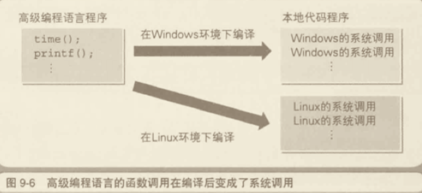

# 计算机基础

## CPU

CPU、寄存器、内存、内存地址、程序计算器、累计寄存器、标志寄存器、基址寄存器

**一、程序是什么？**

指示计算机的每一步动作的一组指令。（音乐会的程序，“行事的先后次序”）

**二、程序是由什么组成的？**

指令和数据。“printf(“你好”)”

**三、 什么是机器语言？**

CPU 可以直接识别并使用的语言。使用 C、Java 等语言编写的程序，最后都会转化成机器语言。

> 机器语言（machine language）是一种指令集的体系。这种指令集称为机器代码（machine code），是计算机的CPU可直接解读的数据。[机器语言](https://zh.wikipedia.org/wiki/%E6%9C%BA%E5%99%A8%E8%AF%AD%E8%A8%80) —— 维基百科

**四、正在运行的程序存储在什么位置？**

答案：内存。

解析：硬盘和磁盘等媒介上保存的程序被复制到内存后才能运行。

**五、什么是内存地址？**

答案：内存中，用来表示命令和数据存储位置的数值。

解析：**内存中保存命令和数据的场所，通过地址来标记和指定。**地址由整数值表示。

**六、计算机的构成元件中，负责程序的解释和运行的是哪个？**

CPU。

### CPU 的内部构成

计算机的构成元件中，根据程序的指令来进行数据运算，并控制整个计算机的设备称作 CPU。


<u>CPU 的内部由寄存器、控制器、运算器和时钟四个部分构成。</u>**控制器**负责把内存上的指令、数据等读入**寄存器**，并根据指令的执行结果来控制整个计算机。**运算器**负责运算从内存读入寄存器的数据。**时钟**负责发出 CPU 开始计时的时钟信号。（2 GHz 表示时钟信号的频率为 2 GHz（1 GHz = 10 亿次/秒））。


程序运行流程，使用高级语言编写的程序会在编译后转化成机器语言，然后再通过 CPU 内部的寄存器来处理。


### CPU 是寄存器的集合体

| 种类 | 功能 |
|-|-|
|累加寄存器|存储执行运算的数据和运算后的数据|
|标志寄存器|存储运算处理后的 CPU 的状态|
|程序计数器|存储下一条指令所有内存的地址|
|基址寄存器|存储数据内存的起始地址|
|变址寄存器|存储基址寄存器的相对地址|
|通用寄存器|存储任意数据|
|指令寄存器|存储指令。CPU 内部使用，程序员无法通过程序对该寄存器进行读写操作|
|栈寄存器|存储栈区域的起始地址|

### 决定程序流程的程序计数器

用户发出启动程序的指示后，Windows 等操作系统会把硬盘中保存的程序复制到内存中，会将程序计数器设定为 0100，然后程序开始运行。
程序的流程分为顺序执行、条件分支和循环三种。
- 顺序执行是指按照地址内容的顺序执行指令。
- 条件分支是指根据条件执行任意地址的指令。
- 循环是指重复执行同一地址的指令。

程序中存在条件分支和循环，机器语言的指令就可以将程序计数器的值设定为任意地址。（不是 + 1）

### 函数的调用机制

函数的调用是通过把程序计数器的值设定成函数的存储地址来实现的，**函数的调用需要在完成函数内部的处理后，处理流程再返回到函数调用点**。（函数调用指令的下一个地址。）


#### 调用栈


**函数调用会使用栈来保存临时变量。**栈的数据结构是后进先出，每调用一个函数，都会将临时变量封装为栈帧压入内存栈，等函数执行完成返回时才出栈。

爆栈：系统栈或虚拟机栈空间一版都不大。如果递归求解的数据规模很大，调用层次很深，一直压入栈，就会有堆栈溢出的风险。（树节点）
例子：十一去车站排队取票，假设这是个无敌长队，可能以及排了1000人(嘿嘿，请注意是个假设)，这个时候如果栈的大小为1KiB。 递归未考虑爆栈时代码如下：
```js
function f(n) {
  if (n === 1) return 1;
  return f(n-1) + 1;
}
```
修改例子，超过1000抛出异常。（超过 1000 的深度，还是要考虑其他的实现方式）
```js
// 全局变量，表示递归的深度。
let depth = 0;

function f(n) {
  ++depth；
  if (depth > 1000) throw exception;
  
  if (n == 1) return 1;
  return f(n-1) + 1;
}
```

### CPU 的处理其实很简单

机器语言指令的主要类型和功能：

|类型|功能|
|--|--|
|数据转送指令|寄存器和内存、内存和内存、寄存器和外围设备（键盘、鼠标、显示器）之间的数据读写操作。|
|运算指令|用累加寄存器执行算法运算、逻辑运算、比较运算和移位匀速。|
|跳转指令|实现条件分支、循环、强制跳转等|
|call/return指令|函数的调用/返回调用前的地址|

## 二进制

带着如下问题阅读：
- 32位是几个字节？
- 二进制是 01011100 转换成十进制是多少？
- 二进制数 00001111 左移两位后，会变成原数的几倍？

### 用二进制数表示计算机信息的原因

计算机内部是由IC（Intergrated Circuir 集成电路）电子部件构成的。CPU（微处理器）和内存也是 IC 的一种。IC的所有引脚，只有直流电压 OV 或 5V 两个状态。IC 的一个引脚只能用二进制数来处理。


计算机处理信息的最小单位——**位**，就相当于二进制中的一位。二进制数的位数一般是8位、16位、32位......也就是8的倍数，这是因为计算机所处理的信息的基本单位是8位二进制数。<u>8位二进制数被称为一个**字节**。字节是最基本的信息计量单位，内存和磁盘都使用字节单位来存储和读写数据，使用位单位则无法读写数据。</u>

奔腾等32位微处理器，具有32个引脚以用于信息的输入和输出。也就是说，奔腾一次可以处理32位（32位=4字节）的二进制数信息。

程序中，即使是用十进制数和文字等记述信息，在编译后也会转换成二进制数的值。所以，程序运行时计算机内部处理的也是用二进制数表示的信息。
**对于用二进制数表示的信息，计算机不会区分它是数值、文字、还是某种图片的模式等，而是根据编写程序的各位对计算机发出的指示来进行信息的处理（运算）。**

```bash
39（十进制数） --编译➡ 00100111（二进制数）
'A'（文字） --编译➡ 01000001（二进制数）
```

### 什么是二进制数

十进制转二进制
```bash
39/2 = 19 ...1
19/2 = 9 ...1
9/2 = 4 ...1
4/2 = 2 ...0
2/2 = 1 ...0
1/2 = 0 ...1
➡ 100111 补了两个0，组成8位。
```
二进制转十进制，将二进制数的各数位的值和位权相乘，然后将相乘的结果相加。
```bash
00100111(二进制数)
(0*2^7) + (0*2^6) + (1*2^5) + (0*2^4) + (0*2^3) + (1*2^2) + (1*2^1) + (1*2^0) 
= 0 + 0 + 32 + 0 + 0 + 4 + 2 + 1
= 39(十进制)
```
其中二进制基数是2，十进制的基数是10。（39=3 * 10^1 + 9*10^0）位权根据位的不同而不同。）（2^(数的位数-1 幂)）

### 移位运算和乘除运算的关系

四则运算同样也可以使用在二进制数中，只要注意逢2进位即可。移位运算指的是将二进制数值的各数位进行左右移位（shift）的运算。
移位有左移（向高位方向）和右移（向低位方向）两种。`<<` 表示左移，`>>`表示右移。运算符左侧是被移位的值，右侧表示要移位的位数。
```js
a = 39;
b = a << 2; // 156 = 39 x 4
```
十进制数 39 用 8 位的二进制表示是 00100111，左移两位后是 10011100。**左移后，低位补0**，右移则看情况。）


十进制数左移后会变成原来的 10 倍、100倍、1000 倍......同样，二进制数左移后则会变成原来的2倍、4倍、8倍......反之，二进制数右移后则会变成原来的 1/2、1/4、1/8，这样一来，就能够解释为什么移位运算能代替乘法运算和除法了。

### 便于计算机处理的“补数”

**补数**就是用正数来表示负数。

用来填充右移后空出来的高位的数值，有 0 和 1 两形式。二进制数中表示负数值时，一般会把最高位作为符号来使用。**符号位是0时表示正数，符号位是1时表示负数。**

计算机在做减法运算的时候，实际上内部是在做加法运算。在表示负数时就需要使用“二进制的补数”。为了获得补数，我们需要将二进制的各数位的数值全部取反，然后再将结果加1。

用 8 位二进制数表示 -1 ，只需求 1 的二进制 00000001 的补数即可。
1 + (-1) = 0
```bash
0000 0001 原始数值
1111 1110 取反
1111 1111 加1，获取补数完成。
```
验证
```bash
# 最高位溢出，计算机会直接忽略。
0000 0001
1111 1111 +
___________
0000 0000
```

3-5 的运算，通过二进制的话，可以先求得3的8位二进制 00000011，而 5 = 00000101，5的补数也就是“取反+1”，也就是 11111011，因此 3 - 5的运算如下：
```bash
 00000011 ... 3
+11111011 ... 用补数表示的 -5
_________
 11111110 ... 用补数表示的运算结果 -2（首先求这个二进制的补数，得出正数 00000010，最后转十进制为2，因此 1111110 的结果就是 -2.） 
```

KiB（1024B） 与 KB（1000B）

### 逻辑右移和算数右移的区别

#### 逻辑右移

右移由移位后在最高位补 0 和补 1 两种情况，当二进制数的值表示图形模式而非数值时，移位后需要在最高位补 0，这就称为**逻辑右移。**


#### 算数右移

将二进制数作为带符号的数值进行运算时，移位后要在最高位填充移位前符号位的值（0 或 1），这就称为算法右移。
如果数值是用补数表示的负数值，那么右移后在空出来的最高位补1。如果是正数，只需在最高位补0即可。

只有在右移时才必须区分呢逻辑位移和算数位移。左移时，无论是图形模式（逻辑左移）还是相乘运算（算术左移），都只需在空出来的低位补 0 即可。


#### 符号扩充

符号扩充就是指在保持值不变的前提下将其转换成 16 位和32位的二进制数。不管是正数还是用补数表示的负数，都只需用符号位的值（0或者1）填充高位即可。

### 掌握逻辑运算的窍门

将二进制数表示的信息作为四则运算的数值来处理就是算术。而像图形模式那样，将数值处理为单纯的0和1和罗列就是逻辑。计算机能处理的运算，大体可分为算术运算和逻辑运算。算术运算是指加减乘除四则运算。

逻辑运算是指对二进制歌数字位的0和1分别进行处理的运算。不管是几位的二进制树，在进行逻辑运算时，都是对相对应的各数位分别进行运算。

- 逻辑非：0 变成 1、1 变成0的取反操作。
- 逻辑与：两个都是1，运算结果为1，其他情况下运算结果都为0的。
- 逻辑或：至少有一方是1时，运算结果为1，其他情况下运算结果为0。
- 逻辑异或：排斥相同数值的运算。其中一方是1，另一方是0时运算结果是1，其他情况下运算结果都是0。

### 本章疑问&应用

#### 疑问

- 问：什么时候用 8 位二进制表示，什么时候用16位二进制表示数值呢？

答：计算就处理的信息的基本单位是8位二进制数，8位为一个字节。字节是最基本的信息计量单位。无论是一开始是利用16位，还是32位，最终都可以转为8位计算。

- 问：编程语言的数据类型长度，如 C 预言的 short 类型（16位，2字xc节）

最后回到开头的问题进行回顾。

#### 应用

- JS 逻辑右移。

## 计算机进行小数运算时出错的原因


热身问题：

1. 二进制数 0.1，用十进制表示的话是多少？

### 用二进制数表示小数

使用二进制数来表示整数和小数的方法不同，0次幂前面的位的位权按照 1 次幂、2次幂......的方式递增，0次幂以后的位的位权按照 -1 次幂、-2次幂......的方式递减。这一规律并不仅限于二进制数，在十进制数和十六进制数中也同样适用。


#### 应用

1. 0.1 + 0.2 为什么不等于 0.3?（前端面试题）
答：

## 内存

## 从源文件到可执行文件

### 计算机只能运行本地代码

### DLL 文件及其导入库

Window 中，API 的目标文件，并不是存储再通常的库文件中，而是存储再名为 DLL（Dynamic Link Library）文件的特殊库文件中。DLL 文件是程序运行时动态结合的文件。


### 可执行文件运行时的必要条件

EXE 文件是作为单独的文件储存存储在硬盘中。通过资源管理器并双击 EXE 文件，就会把 EXE 文件的内容加载到内存中运行。本地代码在对程序中记述变量进行读写时，是参照数据存储的内存地址来运行命令的。在调用函数时，承诺许的处理流程就会跳转到存储着函数处理内容的内存地址上。

EXE 文件作为本地代码的程序，并没有制定变量及函数的实际内存地址。那么，在 EXE 文件中，变量和函数的内存地址的值，是如何来表示的呢？

那就是 EXE 文件中给变量及函数分配了虚拟的内存地址。在程序运行时，虚拟的内存地址会转换成实际的内存地址。链接器会在 EXE 文件的开头，追加转换内存地址所需的必要信息，这个信息称为<strong>再配置信息。</strong>


### 程序加载时会生成栈和堆

EXE 文件的内容分为再配置信息、变量组和函数组。当程序加载到内存后，除此之外还会额外生成两个组，那就是栈和堆。栈是用来存储函数内部临时使用的变量（局部变量），以及函数调用时所用的参数的内存区域。堆是用来存储程序运行时的任意数据及对象的内存区域。

EXE 文件中并不存在栈及堆的组。栈和堆需要的内存空间是在 EXE 文件加载到内存后开始运行时得到分配的。因而，内存中的程序就是由用于变量的内存空间、用于函数的内存空间、用于栈的内存空间、用于堆的内存空间这4部分构成的。


栈及堆的相似之处在于，他们的内存空间那都是在程序运行时得到申请分配的。区别是，栈中堆数据进行存储和舍弃（清理处理）的代码，是由编译器自动生成的。因此不需要程序员的参与。使用栈的数据的内存空间，每当函数被调用你时都会得到申请分配，并在函数处理完毕后自动释放。与此相对，堆的内存空间，则要根据程序员编写的程序，来明确进行申请分配或释放。（不管是什么程序，程序的内容都是由处理和数据构成的。大多数编程语言都是用函数来表示处理、用变量来表示数据。）

如果没有在程序中明确释放堆的内存空间，那么即使在处理完毕后，该内存空间仍会一直残留。这个现象称为“内存泄漏”（memory leak）。

#### 和内存管理相关的“垃圾回收机制”（garbage collection）

指的是<u>对处理完毕后不再需要的堆内存空间的数据和对象进行清理，释放它们所使用的内存空间。</u>这里把不需要的数据比喻成了垃圾。进行该处理时，C 语言用的是 `free()` 函数，C++ 用的是 `delete` 运算符。在 C++的基础上开发出来的 Java 及 C# 这些编程语言中，程序运行环境会自动进行垃圾回收。这样就可以避免由于程序员的疏忽（忘记了内存的释放处理）而造成内存泄漏了。

#### 编译器和解释器有什么不同？

编译器是在运行前对所有源代码进行解释处理的。而解释器则在运行时对源代码的内容一行一行地进行解释处理的。

## 操作系统与应用的关系

类似于文件处理软件级及表格计算软件这样，为了提供特定处理效率的程序总称为“应用”。程序员的工作就是编写各种各样的应用来提高业务效率。而应用的运行环境，也就是操作系统，程序员是通过利用操作系统提供的功能来编写应用的。

### 操作系统功能的历史

> 操作系统（Operating System）也称为基础软件。操作系统是计算机运行时不可或缺的控制程序，以及在控制程序下运转的为其他软件运行提供操作环境的软件的统称。

在计算机中尚不存在操作系统的年代，完全没有任何程序，因此程序员就需要编写处理相关的所有程序。<u>用机器语言编写程序，然后再使用开关将程序输入</u> (cpu 运行)，这一过程非常麻烦。于是，有人开发出了仅<u>具有加载和运行功能的监控程序</u>，这就是操作系统的原型。通过事先启动监控程序，程序员就可以根据需要将各种程序加载到内存中运行。虽然依旧比较麻烦，但比起在没有任何程序下的状态下进行开发，工作量得到了很大的缓解。


随着时代的发展，<u>人们在利用监控程序编写程序的过程中，发现很多程序都有共通的部分。</u>例如，通过键盘输入文字数据、往显示器输出文字数据等。这些处理，在任何程序下都是的。而如每编写一个新的程序都要记述相同的处理的话，那真是太浪费时间了。因此，<u>基本的输入输出部分就被追加到了监控程序中。初期的操作系统就这样诞生了。</u>


之后，随着时代的进一步发展，开始有更多的功能被追加到监控程序中。因此，操作系统本身并不是单独的程序，而是多个程序的集合体。


### 要意识到操作系统的存在

制作应用的程序员，制作的不是硬件，而是利用操作系统功能的应用。因为操作系统呢诞生以后，就没有必要再编写直接控制硬件了。

应用的可执行文件指的是，计算机的 CPU 可以直接解释并运行的本地代码。不过这些代码是无法戒指计算机中配置的时钟 IC 及显示器用的 I/O 等硬件的。

表示当前时间的应用
```c
#include <stdio.h>
#include <time.h>

int main(int argc, const char * argv[]) {
    time_t tm; // 保存当前日期和时间信息的变量
    time(&tm); // 取得当前的日期和时间
    printf("%s\n", ctime(&tm)); // 在显示器上显示日期和时间
}
```
1. 通过 `time_t tm;` 为 `time_t` 类型的变量申请分配内存空间。
2. 通过 `time(&tm);` 将当前的日期和时间数据保存到变量的内存空间中。
3. 通过 ` printf("%s\n", ctime(&tm));`；把变量内存空间的内容输出到显示器上。

在操作系统这个运行环境下，应用并不是直接控制硬件，而是通过操作系统来间接控制硬件的。变量定义中涉及的内存的申请分配，以及`time()` 和 `printf()`函数的运行结果，都不是面向硬件而是面向操作系统的。<u>操作系统收到应用发出的指令后，首先会对该指令进行解释，然后会对对应的硬件时钟 IC（实时时钟）和显示器用的 I/O 进行控制。</u>


### 系统调用和高级编程语言的移植性

操作系统的硬件控制功能，通常是通过一些小的函数集合体的形式来提供的。这些函数及调用函数统称为系统调用。（system call），也就是应用对操作系统（system）的功能进行调用（call）的意思。

在前面的程序中用到了 `time()` 及 `printf()` 等函数，这些函数内部也都使用了系统调用。之所以在内部执行的，那是因为 C 语言等高级程序编程语言并不依存于特定的操作系统。这是因为人们希望不管你是 Window 还是 Linux，都能使用几乎相同的源代码。因此，<u>高级编程语言的机制就是，使用独自的函数名，然后再在编译时将转换相应操作系统的系统调用（也有可能是多个系统调用的组合）。也就是说，用高级编程语言编写的应用在编译后，就转换成了利用系统调用的本地代码。</u>



### 操作系统和高级编程语言使硬件抽象化

通过使用操作系统提供的系统调用，程序员就没必要编写直接控制硬件的程序了。而且，通过使用高级编程语言，有时甚至也无需考虑系统调用的存在。这是因为操作系统和高级编程语言能够使硬件抽象化。

```c
#include <stdio.h>

int main(int argc, const char * argv[]) {
    FILE *fp = fopen("MyFile.txt", "w"); // 打开文件
    
    fputs("你好", fp); // 写入文件
    
    fclose(fp); // 关闭文件
    return 0;
}

```
该应用在编译运行后，MyFile.txt 文件中就会被写入“你好”字符串。文件是操作系统对磁盘媒介空间的抽象化。磁盘媒介的读写采用了文件这个概念，将整个流程抽象化成了打开文件用的 `fopen()`、写入文件用的 `fputs()`、关闭文件用 `fclose()`。


变量 `fp` 中被赋予的是 `fopen()` 函数的返回值。**该值称为文件指针。**应用打开文件后，操作系统就会自动申请分配用来管理文件读写的内存空间。这个内存空间的地址可以通过 `fopen()` 函数的返回值获得。用 `fopen()`打开文件后，接下来就是通过制定文件指针来对文件进行操作。正因为如此， `fputs()`及 `fclose()` 的参数中都指定了文件指针（变量 fp）。

### Windows 操作系统的特征

- 32 位操作系统（也有64 位版本）
- 通过 API 函数集来提供系统调用
- 提供采用了图形用户界面的用户界面
- 通过 WYSIWYG 实现打印输出
- 提供多任务功能
- 提供网络功能及数据库功能
- 通过即插即用实现设备驱动的自动设定

#### 32 位操作系统

这里的32位表示的是处理效率最高的数据大小。Window 处理数据的基本单位是32位。在16位操作系统中处理32位的数据时，因为要处理两次16位的数据看，因此会多花一些时间。而如果是32位操作系统的话，那么只需要1次就可以完成32位的数据的处理了。所以说，凡是在Window 上运行的应用，都可以毫无顾虑地尽可能地实用 32位的数据。

例如，用 C 语言来处理整数数据时，有 8 位的 char 类型、16位的 short 类型，以及 32 位 的 long 类型（还有 int 类型）三个选项。使用位数大的 long 类型的话，虽然内存及磁盘的开销较大，但应用的运行速度并不会下降。这在其他编程语言中也是同样的。

#### 通过 API 函数集来提供系统调用

Windows 是通过名为 API（Application Programming Interface，应该程序接口） 的函数集来提供系统调用的。API 是联系作成应用的程序员和操作系统之间的接口。Win32 API 中，各函数的参数及返回值的数据大小，基本上都是32位。

API 通过多个 DLL 文件来提供。各 API 的实体都是用 C 语言编写的函数。

#### 提供采用了 GUI 的用户界面

GUI（Graphical User Interface，图形用户界面）指的是通过点击显示器中显示的窗口及图标等即可进行可视化操作的用户界面。

在像 MS-DOS 这种没有实用 GUI 的操作系统中，应用的处理流程由程序员决定，用户按照定好的流程来进行操作即可。而采用 GUI 的操作系统中运行的应用，则是由用户决定处理流程，程序员就必须要制作出在任何操作顺序下都能运行的应用。

#### 通过 WYSIWYG 实现打印输出

WYSIWYG 指的是显示器上显示的内容可以直接通过打印机打印输出。

#### 提供多任务功能

多任务指的是同时运行多个程序的功能。Windows 是通过<strong>时钟分割技术</strong>来实现多任务功能的。

<u>时钟分割指的是在短时间间隔内，多个程序切换运行的方式。</u>在用户看来，就是多个程序在同时运行。也就是说，Windows 会自动你切换多个程序的运行。此外，Windows 中还具有以程序中的函数为单位进行时钟分割的<strong>多线程</strong>功能。


#### 提供网络功能及数据库功能

#### 通过即插即用实现设备驱动的自动设定

即插即用（Plug-and-Play）指的是新的设备连接（Plug）后立刻就可以实用（Play）的机制。新的设备连接到计算机后，系统就会自动安装和设定用来控制该设备的<u>设备驱动</u>程序。

设备驱动是操作系统的一部分，提供了同硬件进行基本的输入输出的功能。键盘、鼠标、显示器、磁盘装置等，这些计算机必备的硬件的设备驱动，一般都是随操作系统一起安装的。如果之后再追究新的网卡（NIC）等硬件的话，就需要向操作系统追究该硬件专用的设备驱动。

有时 DLL 文件也会同设备驱动文件一起安装。这些 DLL 文件中存储着用来利用该新追加硬件的 API（函数集）。通过 API，可以制作出该新硬件的应用。

## 硬件控制方法

### 文字及图片的现实机制


虽然计算机领域的新技术在不断涌现，但计算机能处理的事情，始终只是对输入的数据进行运算，并把结果输出，这一点是不会发生人任何变化的。不管程序内容是什么，最终都是数据的输入输出和运算。

## 操作系统层：CPU 线程与进程、阻塞与非阻塞、并发与并行、同步与异步、io 读写

### CPU 与操作系统

操作系统的各种角色都围绕着一个中心思想“良好的共享”。<u>操作系统负责管理计算机的资源，而这些资源通常是由使用它们的程序共享的。多个并发执行的程序将共享主存，依次使用 CPU，竞争使用输入/输出设备的机会。</u>操作系统将担任现场监视器，确保每个程序都能够得到执行的机会。


### 内存、进程和 CPU 管理

正在执行的程序都驻留在主存中，其中的指令以读取-解码-执行这种周期性方式被一个接一个地处理。<strong>多道程序设计</strong>是在主存中同事驻留多个程序的技术；这些程序为了能够执行，将竞争 CPU 资源。所有现代操作系统都采用多道程序设计技术，因此，操作系统必须执行<strong>内存管理</strong>，以明确内存中有哪些程序，以及它们驻留在内存的什么位置。

操作系统的另一个关键观念是进程，可以将它定义为正在执行的程序。<u>程序只是一套静态指令，进程则是动态的实体，表示正在执行的程序。</u>。无论如何，下一条要执行的都是一条明确的指令。中间值将被计算出来。在执行过程中，进程可能会被打断，因此操作系统还要执行<strong>进程管理，</strong>以跟踪进程的进展以及所有中间状态。

内存管理和进程管理都需要<strong>>CPU 调度。</strong> 即确定某个时刻 CPU 要执行内存中的哪个进程。记住，操作系统本身也是必须执行的程序，所以在内存中也要和其他系统软件及应用程序一起管理和维护 OS 进程。执行 OS 的 CPU 就是执行其他程序的 CPU，因此也要把 OS 进程进入竞争 CPU 的队列中。

#### CPU 调度

所谓 CPU 调度，就是确定把哪个处于准备就绪状态的进程移入运行状态。也就是说，CPU 调度算法将决定把 CPU 给予哪个进程，以便它能够运行。

- 先到先服务
- 最短作业优先
- 循环调度法

### 进程与线程

#### 进程

> 进程（Process）是计算机中的程序关于某数据集合上的一次运行活动，是系统进行资源分配和调度的基本单位，是操作系统结构的基础。进程是程序的基本执行实体，进程是线程的容器。程序是指令、数据及其组织形式的描述，进程是程序的实体。

用一句简单的话来说，你在 Windows 中看到的后缀为 `.exe` 的文件都是程序。不过程序是“死”的，静态的。当你双击这个 `.exe` 的时候，这个 `.exe` 文件中的指令就会被加载，那么你就能得到一个有关这个 `.exe` 程序的进程。进程是“活”的，或者说是正在被执行的。如下图：

CPU 正在执行的程序叫`进程`，它代表 CPU 所能处理的单个任务。
- `进程`之间相互独立，任一时刻，CPU 总是运行一个`进程`，其他`进程`处于非运行状态。
- CPU 使用时间片轮转进度算法来是心安同时运行多个`进程`。
- `进程`是 cpu 资源分配的最小单位。（是能拥有资源和独立运行的最小单位）
- 不同进程间也可以通信，不过代价较大。

**进程管理**

操作系统必须管理的另一个重要资源是每个进程使用的 CPU 事件。要理解操作系统是如何管理进程的，必须了解进程在生存周期中的各个阶段，理解进程在计算机系统中正确运行所要管理的信息。

**进程状态**

在计算机系统的管理下，进程会历经几种状态：即进入系统、准备执行、执行、等待资源以及执行结束。


注意，可能同时有多个进程处于准备就绪或等待状态，但只有一个进程处于运行状态。

#### 线程

进程是线程的容器。进程中可以容纳若干个线程。它们并不是看不见、摸不着的，可以使用工具看到它们。
- 线程就是轻量级进程，是 cpu 调度的最小单位（线程是建立在进程的基础上的一次程序运行单位，一个进程中可以有多个线程）。
- 现在，一般通用的叫法：单线程与多线程，都是指在一个进程内的单和多。
- 使用多线程而不是用多进程去进行并发程序的设计，是因为线程间的切换和调度的成本远远小于进程。
  


**单线程与多线程**

在单线程程序中，“在某一时间点执行的处理”只有一个，即“正在执行程序的主体”只有一个。

多线程：由多个线程组成的程序就称为多线程。
- 耗时的 I/O 处理。一般来说，文件与网络的 I/O 处理都非常消耗时间，如果在 I/O 处理期间，程序基本上无法执行其他处理，那么性能将会下降。在这种情况下，就可以使用多线程来解决。如果将执行 I/O 处理的线程和执行其他处理的线程分开，那么在 I/O 处理期间，其他处理也可以同时执行。

#### 进程与线程的关系比喻

房子的比喻：

一间漂亮的小别墅，别墅里有卧室、厨房、书房、洗手间等。当然，还有一家三口住在里面。当妈妈带女儿外出游玩时，爸爸一个人在家。这时爸爸一个人在家里爱去哪里去哪里，爱干什么干什么，这时爸爸就像一个线程。（这个进程中只有一个活动线程），小别墅就像一个进程，家里的厨房、书房就像这个进程占有的资源。当三个人住在一起时（相当于三个线程），有时候可能就会有些小冲突，比如，当女儿占着电视机看动画片时，爸爸就不能看体育频道了，这就是线程间的资源竞争。当然，大部分时候，线程之间还是协作关系。比如，妈妈在厨房位爸爸和女儿做饭，爸爸在书房工作赚钱养家糊口，女儿在写作业，各司其职，那么这个家就其乐融融，相应地，这个进程也就在健康地执行。

工厂的比喻：

- 工厂的资源 -> 系统分配的内存（独立的一块内存）

- 工厂之间的相互独立 -> 进程之间相互独立

- 多个工人协作完成任务 -> 多个线程在进程中协作完成任务

- 工厂内有一个或多个工人 -> 一个进程由一个或多个线程组成

- 工人之间共享空间 -> 同一进程下的各个线程之间共享程序的内存空间（包括代码段、数据集、堆等）


### 进程 vs 线程

进程和线程是包含关系，但是多任务既可以由多进程实现，也可以由单进程内的多线程实现，还可以混合多进程+多线程。
和多线程相比，多进程的缺点在于：
- 创建进程比创建线程开销大，尤其是在 Windows 系统上；
- 进程间通信比线程间通信要慢，因为线程间通信就是读写同一个变量，速度很快。

而多进程的优点在于：
多进程稳定性比多线程高，因为在多进程的情况下，一个进程崩溃不会影响其他进程，而多线程的情况下，任何一个线程崩溃会直接导致整个进程崩溃。


#### 多线程

Java 语言内置了多线程：一个 Java 程序实际上是一个 JVM 进程，JVM 进程用一个主线程来执行 `main()`方法，在`main()`方法内部，我们又可以启动多个线程。此外，JVM 还有负责垃圾回收的其他工作线程等。

因此，对于大多数 Java 程序员来说，我们说多任务，实际上是说如何使用多线程实现多任务。

和单线程相比，多线程编程的特点在于：多线程经常需要读写共享数据，并且需要同步。例如，播放电影时，就必须由一个线程播放视频，另一个线程播放音频，两个线程需要协调运行，否则画面和声音就不同步。因此，多线程编程的复杂度高，调试更困难。

Java 多线程编程的特点又在于：
- 多线程模式是Java程序最基本的并发模型；
- 后续读写网络、数据库、Web 开发等都依赖 Java 多线程模型。


### 同步（Synchronous）与异步（Asyncronous）

同步和异步通常用来形容一次方法调用。同步方法调用你一旦开始，调用者必须等到方法调用返回后，才能继续后续的行为。异步方法调用更像一个一个消息传递，一旦开始，方法调用就会立即返回，调用者就可以继续后续的操作。而异步方法通常会在另外一个线程中“真实”地执行。整个过程不会阻碍调用者的工作。


对于调用者来说，异步调用似乎是一瞬间就完成的。如果异步调用需要返回结果，那么当这个异步调用真实完成时，则会通知调用者。

打个比方，比如购物，如果你商场买空调，当你到了商场看中了一款空调，你就向售货员下单，售货员去仓库帮你调配物品。这天你热得是实在不行了，你催着商家赶紧给你送货，于是你就在商店里候着他们，直到商家把你和空调一起送回家，一次愉快的购物就结束了。<u>这是同步调用。</u>

不过，如果我们直接在网上订购了一台空调，当你完成网上支付的时候，对你来说购物过程已经结束了。虽然空调还没送到家，但是你的任务已经完成了。商家接到了你的订单后，就会加紧安排送货，当然这一切已经跟你无关了。您已经支付完成，想干什么就干什么，出去溜几圈都不成问题，等送货上面的时候，接到商家的电话，回家一趟签收就完事了。<u>这就是异步调用。</u>

#### 并发（Concurrency）和并行（Parallelism）、串行

并发和并行都可以表示两个或者多个任务一起执行，但是侧重点有所不同。并发偏重于多个任务<strong>交替执行，</strong>，而多个任务之间可能还是串行的，而并行是真正意义上的“同时执行”。


从严格意义上来说，并行的多个任务是真的同时执行，而对于并发来说，这个过程只是交替的，一会儿执行任务A，一会执行任务B，系统回不停地在两者之间切换。但对于外部观察者来说，及时多个任务之间是串行并发的，也会造成多任务间并行执行的错觉。

并发比喻：“走路不看景，看景不走路”。为了安全起见，就要求游客看景的时候停下脚步，走路的时候能够专心看着地面，管好双脚，这就是“并发”。
并行：坐缆车上山。缆车可以代替步行，你坐在缆车上才能专心欣赏沿途风景。

实际上，<u>如果系统内只有一个 CPU，而使用多进程或者多线程任务，那么真实环境下这些任务不可能是真实执行的，毕竟一个 CPU 一次只能执行一条指令，在这种清空下多进程或多线程就是并发的，而不是并行的（</u>操作系统会不停地切换多个任务）。真实的并行也只可能出现在拥有多个 CPU 的系统中（比如多核 CPU）。

面对复杂业务模型，并行程序会比串行更容易适合业务需求，更容易模拟我们的现实世界。毕竟，我们的世界本质上是并行的。比如，当你开开心心地上学的时候，妈妈可能在家里忙着家务，爸爸在外打工赚钱，一家人其乐融融。如果有一天，你需要使用你的计算机来模拟这个场景，你会怎么做呢？<u>如果你在一个线程里，既做了你你自己，又做了妈妈，又做了爸爸，显然这不是一种好的解决方案。但如果你使用三个线程，分别模拟这三个人，一切看起来那么自然，而且容易被人理解。</u>

并行适用于图像处理和服务端程序（Java 主要占领着服务端市场）。

### 临界区

临界区用来表示一种公共资源或者说共享数据，可以被多个线程使用。但是每一次，只能有一个线程使用它，一旦临界区资源被占用，其他线程要想使用这个资源就必须等待。

比如，在一个办公室里又一台打印机，打印机一次只能执行一个任务。如果小王和小明同时需要打印文件，很显然，如果小王先下发了打印任务，打印机就开始打印小王的文件。小明的任务就只能等待小王打印结束后才能打印。

在并行程序中，临界区资源是保护的对象，如果意外出现打印机同时执行两个打印任务的情况，那么最可能的结果就是打印出来的文件是损坏的文件。它既不是小王想要的，也不是小明想要的。

由于临界区的存在，多线程之间的并发必须受到控制。根据控制并发的策略，我们可以把兵法的级别分为阻塞、无饥饿、无障碍、无锁、无等待集中几种。

浏览器 JS 线程与GUI 线程互斥。（JS 阻塞页面）

### 阻塞（Blocking）与非阻塞（Non-Blocking）

<u>阻塞和非阻塞通常用来形容多线程间的相互影响。</u>比如一个线程占用了临界区资源，那么其他所有需要这个资源的线程就必须在这个临界区中等待。等待回导致线程挂起，这种情况就是阻塞。此时，如果占用资源的线程一直不愿意释放资源，那么其他所有阻塞在这个临界区上的线程都不能工作。

非阻塞的意思与之相反，它强调没有个线程可以妨碍其他线程执行，所有的线程都会尝试不断前向执行。

####  同步、异步、阻塞与非阻塞可以有以下4种的排列:

同步和异步关注的是消息通信机制，阻塞和非阻塞关注的是程序在等待调用结果时的状态。

1. 同步阻塞
2. 同步非阻塞
3. 异步阻塞
4. 异步非阻塞

下面通过一个例子来说明：

老张爱喝茶，废话不说，煮开水。出场人物：老张，水壶两把（普通呢水壶，简称水壶；会响的水壶，简称响水壶）。
1. 老张把水壶放到火上，立等水开。<strong>（同步阻塞）</strong>老张觉得自己有点傻。
2. 老张把水壶放到火上，去客厅看电视，时不时去厨房看水开没有。<strong>（同步非阻塞）</strong>老张觉得自己有点傻，于是变高端了，买了把会响笛的那种水壶。水开之后，能大声发出嘀～～～的噪音。
3. 老张把响水壶放到火上，立等水开。（<strong>异步阻塞）</strong>老张觉得这样傻等意义不大。
4. 老张把响水壶放到火上，去客厅看电视，水壶响之前不再去看它了，响了再去拿壶。<strong>（异步非阻塞）</strong>老张觉得自己聪明了。

所谓同步异步，只是对水壶而言。普通水壶，同步；响水壶，异步。虽然都能干活但响水壶可以在自己完工之后，提示老张水开了。这是普通水壶所不能及的。同步只能让调用者去轮询自己（情况2中），造成老张效率的低下。

所谓阻塞非阻塞，仅仅对于老张而言。立等的老张，阻塞；看电视的老张，非阻塞。情况1和情况3中老张是阻塞的，媳妇喊他都不知道。虽然3中响水壶是异步的，可对于立等的老张没有太大的意义。所以一般异步是配合非阻塞使用的，这样才能发挥异步的效用。

### IO 编程

IO 在计算机中指 Input/Output，也就是输入和输出。由于程序和运行时数据是在内存中驻留，由CPU这个超快的计算核心执行，涉及到数据交换的地方，通常是磁盘、网络等，就需要 IO 接口。

比如你打开浏览器，访问新浪首页，浏览器这个程序就需要通过网络 IO 获取新浪的网页。浏览器首先会发送数据给新浪服务器，告诉它我想要首页的 HTML，这个动作是往外发数据，叫 Output，随后新浪服务器把网页发过来，这个动作是从外面接收数据，叫 Input。所以，通常，程序完成 IO 操作会有 Input 和 Output 两个数据流。当然也有只用一个的情况，比如，从磁盘你读取文件到内存，就只有 Input 操作，反过来，把数据写到磁盘文件里，就只是一个 Output 操作。

IO 编程中，Stream（流）是一个很重要的概念，可以把流想象成一个水管，数据就是水管里的水，但是只能单向流动。**Input Stream** 就是数据从外面（磁盘、网络）流进内存，**Output Stream** 就是数据从内存流到外面去。对于浏览网页来说，浏览器和新浪服务器之间至少需要建立两个水管，才可以既能发数据，又能收数据。

**由于 CPU 和内存的速度远远高于外设的速度**，所以，在 IO 编程中，就存在速度严重不匹配的问题。举个例子来说，比如要把 100M 的数据写入磁盘，CPU 输出 100M 的数据只需要0.01 秒，可是磁盘要接收这100M 数据可能需要10秒，怎么办呢？有两种办法：

第一种是 CPU 等着，也就是程序暂停执行后续代码，等100M的数据在10秒后写入磁盘，再接着往下执行，这种模式成为同步 IO；
第二种是 CPU 不等待，只是告诉磁盘，“您老慢慢写，不着急，我接着干别的事去了”，于是，后续代码可以立刻接着执行难，这种模式称为异步IO。

同步和异步的区别在于是否等待 IO 执行的结果，同步和异步的区别就在于是否等待IO执行的结果。好比你去麦当劳点餐，你说“来个汉堡”，服务员告诉你，对不起，汉堡要现做，需要等5分钟，于是你站在收银台前面等了5分钟，拿到汉堡再去逛商场，这是同步IO。

你说“来个汉堡”，服务员告诉你，汉堡需要等5分钟，你可以先去逛商场，等做好了，我们再通知你，这样你可以立刻去干别的事情（逛商场），这是异步IO。

如上面的老张煮水。很明显，使用异步IO来编写程序性能会远远高于同步IO，但是异步IO的缺点是编程模型复杂。想想看，你得知道什么时候通知你“汉堡做好了”，而通知你的方法也各不相同。如果是服务员跑过来找到你，这是<strong>回调模式，</strong>如果服务员发短信通知你，你就得不停地检查手机，<strong>这是轮询模式</strong>。总之，异步IO的复杂度远远高于同步IO。

计算机系统所有的输入输出操作（也称为 I/O 操作）都要通过操作系统来完成，每一种编程语言都会把操作系统提供的低级 C 接口封装起来方便使用。

小结：
1. 基本概念：input，output，stream
2. 存在问题：输入和接收速度不匹配。
3. 解决方法：同步、异步（回调--好了叫我；轮询--好了没，好了没）。
4. 收获新知：编程语言都会把操作系统的低级 C 接口封装起来方便使用。
  

<!-- ### 同步、异步、阻塞与非阻塞可以有以下4种的排列:

1、同步阻塞
2、同步非阻塞
3、异步阻塞
4、异步非阻塞

在使用普通的InputStream、OutputStream时，就是同步阻塞，因为执行当前读写任务一直是当前进程，并且读不到或者写不到数据，就会一直是阻塞的状态。
阻塞的意思就是方法不返回，直到读到数据或者写入数据为止。

NIO技术属于同步非阻塞。即使当执行“serverSocketChannel.configureBlocking(false)”后，也是一直由当前的线程在执行读写操作，但是读不到数据或者
写不出数据时，读写方法就返回了（并不会进入阻塞状态），执行继续之后的代码。

而异步就是多个线程之间的通信，例如，A线程发起了一个读操作，这个读操作需要B线程进行实现。A线程和B线程就是异步执行，A线程继续做接下来的事情，
这时B线程开始读操作，如果读不到数据，B就进入阻塞状态了，如果读到数据，就通知A线程，并把读到的数据返回给A线程，这个过程就是异步阻塞。

异步非阻塞就是指，A线程发起了一个读操作，这个读操作需要B线程进行实现。A线程和B线程就是异步执行，A线程继续做接下来的事情，这时B线程开始读操作，
如果读不到数据，但是B线程没有进入阻塞状态，而是继续之后的步骤，直到读到数据，然后B线程通知A线程，并把读到的数据给A线程，这个过程就是异步非阻塞。

从大的概念来说，同步和异步关注的是消息通信机制，阻塞和非阻塞关注的是程序在等待调用结果时的状态。文件通道永远是阻塞的，不能设置成非阻塞模式。

首先一个IO操作其实分成了两个步骤：
1、发起IO请求
2、实际的IO操作

同步IO和异步IO的区别就在于第二个步骤是否阻塞。如果实际的IO读写阻塞了请求进程，那么就是同步IO。因此，阻塞IO，非阻塞IO，IO复用，信号驱动IO都是同步IO
（上述的IO自始至终都是由一个线程去做的），如果不阻塞，而是OS（操作系统）帮用户做完了IO操作再将结果返回给用户，那么就是异步IO（AIO）。

阻塞IO和非阻塞IO的区别在于第一步，即发起IO请求时，是否会被阻塞。如果阻塞直到完成，那么就是传统的阻塞IO，如果不阻塞，就是就是非阻塞IO（NIO）。

多线程总结：

1，进程和线程的概念。
	|--进程：
	|--线程：

2，jvm中的多线程体现。
	|--主线程，垃圾回收线程，自定义线程。以及他们运行的代码的位置。

3，什么时候使用多线程，多线程的好处是什么？创建线程的目的？
	|--当需要多部分代码同时执行的时候，可以使用。

4，创建线程的两种方式。★★★★★
	|--继承Thread
		|--步骤
	|--实现Runnable
		|--步骤
	|--两种方式的区别？

5，线程的5种状态。
	对于执行资格和执行权在状态中的具体特点。
	|--被创建：
	|--运行：
	|--冻结：
	|--临时阻塞：
	|--消亡：

6，线程的安全问题。★★★★★
	|--安全问题的原因：
	|--解决的思想：
	|--解决的体现：synchronized
	|--同步的前提：但是加上同步还出现安全问题，就需要用前提来思考。
	|--同步的两种表现方法和区别：
	|--同步的好处和弊端：
	|--单例的懒汉式。
	|--死锁。
	

7，线程间的通信。等待/唤醒机制。
	|--概念：多个线程，不同任务，处理同一资源。 
	|--等待唤醒机制。使用了锁上的 wait notify notifyAll.  ★★★★★
	|--生产者/消费者的问题。并多生产和多消费的问题。  while判断标记。用notifyAll唤醒对方。 ★★★★★
	|--JDK1.5以后出现了更好的方案，★★★
		Lock接口替代了synchronized  
		Condition接口替代了Object中的监视方法，并将监视器方法封装成了Condition
		和以前不同的是，以前一个锁上只能有一组监视器方法。现在，一个Lock锁上可以多组监视器方法对象。
		可以实现一组负责生产者，一组负责消费者。 
	|--wait和sleep的区别。★★★★★

	

8，停止线程的方式。
	|--原理：
	|--表现：--中断。

9，线程常见的一些方法。
	|--setDaemon()
	|--join();
	|--优先级
	|--yield();
	|--在开发时，可以使用匿名内部类来完成局部的路径开辟。 

-->

## 参考资料

- [深入理解计算机系统](https://zhuanlan.zhihu.com/p/37479652)—— 作者针对《深入理解计算机系统》书籍写的总结
- [南京大学的计算机基础课程](https://www.coursera.org/lecture/jisuanji-xitong/w1-1-cyu-yan-cheng-xu-ju-li-jMDYB) —— 阅读《深入理解计算机系统》配合这个课程，相信能够更快地理解计算机的原理。

